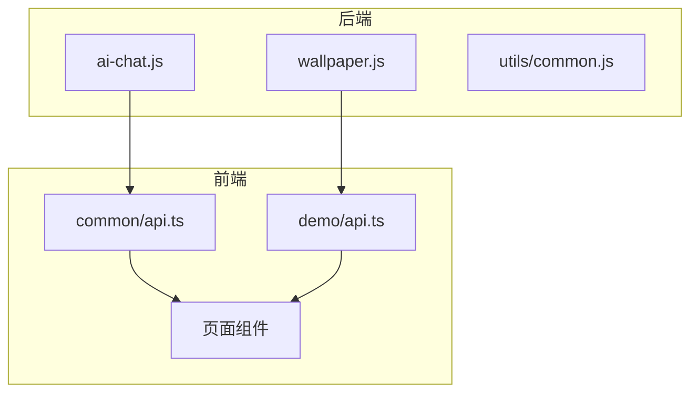
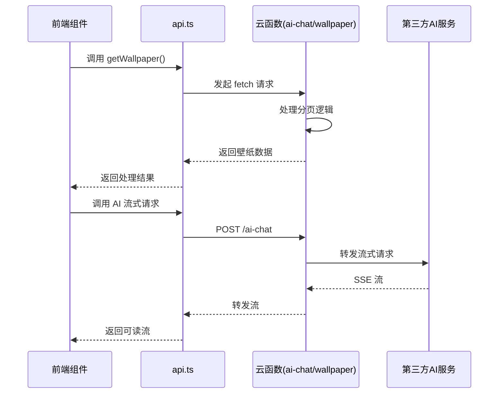
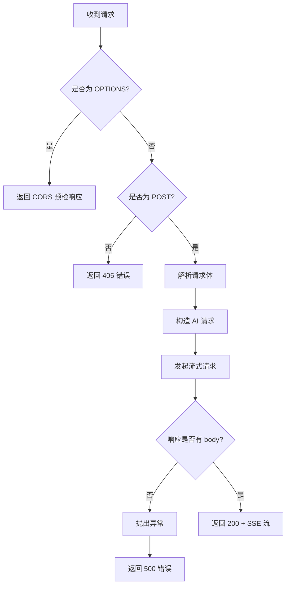
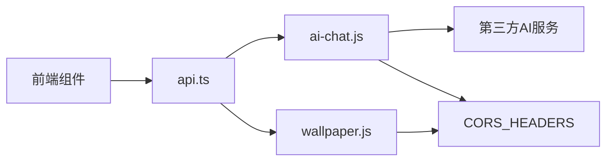

# API 集成层

<cite>
**本文档引用的文件**  
- [ai-chat.js](file://functions/ai-chat.js)
- [wallpaper.js](file://functions/wallpaper.js)
- [common.js](file://functions/utils/common.js)
- [api.ts](file://src/app/common/api.ts)
- [api.ts](file://src/app/demo/api.ts)
</cite>

## 目录
1. [简介](#简介)
2. [项目结构](#项目结构)
3. [核心组件](#核心组件)
4. [架构概览](#架构概览)
5. [详细组件分析](#详细组件分析)
6. [依赖分析](#依赖分析)
7. [性能考虑](#性能考虑)
8. [故障排除指南](#故障排除指南)
9. [结论](#结论)

## 简介
本文档旨在全面描述项目中云函数接口的实现与前端调用机制。重点涵盖 `ai-chat.js` 的流式响应处理逻辑、`wallpaper.js` 提供的壁纸服务接口，以及前端如何通过统一请求函数进行调用。文档还说明了错误处理和加载状态管理机制，为开发者提供清晰的集成指导。

## 项目结构
项目采用分层架构，主要分为后端云函数（`functions`）、前端应用（`src/app`）和工具插件（`plugins`）三大模块。云函数暴露 RESTful 接口供前端调用，前端通过统一的 API 层进行通信。



**图示来源**  
- [ai-chat.js](file://functions/ai-chat.js#L1-L89)
- [wallpaper.js](file://functions/wallpaper.js#L1-L100)
- [api.ts](file://src/app/common/api.ts#L1-L17)
- [api.ts](file://src/app/demo/api.ts#L1-L28)

**本节来源**  
- [functions](file://functions)
- [src/app](file://src/app)

## 核心组件
系统核心由两个云函数构成：`ai-chat.js` 负责处理 AI 对话请求并返回流式响应，`wallpaper.js` 提供分页壁纸数据服务。前端通过 `api.ts` 中封装的函数调用这些接口，实现功能解耦与统一管理。

**本节来源**  
- [ai-chat.js](file://functions/ai-chat.js#L1-L89)
- [wallpaper.js](file://functions/wallpaper.js#L1-L100)
- [api.ts](file://src/app/common/api.ts#L1-L17)

## 架构概览
系统采用前后端分离架构，前端通过 HTTP 请求调用部署在 Netlify 上的云函数。云函数处理业务逻辑并返回 JSON 或流式数据，前端统一处理响应、错误和加载状态。



**图示来源**  
- [ai-chat.js](file://functions/ai-chat.js#L1-L89)
- [wallpaper.js](file://functions/wallpaper.js#L1-L100)
- [api.ts](file://src/app/demo/api.ts#L11-L27)

## 详细组件分析

### ai-chat.js 分析
该云函数处理 POST 请求，验证方法类型后，将请求体中的 `messages` 数组转发至第三方 AI 服务，并启用流式传输（`stream: true`）。响应头设置为 `text/event-stream`，实现服务器发送事件（SSE），前端可逐段接收响应。



**图示来源**  
- [ai-chat.js](file://functions/ai-chat.js#L1-L89)

**本节来源**  
- [ai-chat.js](file://functions/ai-chat.js#L1-L89)

### wallpaper.js 分析
该函数提供分页壁纸数据服务。支持 `page` 和 `pageSize` 查询参数，对内置壁纸数组进行分页处理，并返回包含分页信息的 JSON 响应。支持 CORS 预检请求。

```mermaid
classDiagram
class wallpaperHandler {
+handler(event, context)
-data : Array
-page : number
-pageSize : number
-startIndex : number
-endIndex : number
}
wallpaperHandler : +statusCode : 200
wallpaperHandler : +headers : CORS_HEADERS
wallpaperHandler : +body : JSON.stringify(result)
```

**图示来源**  
- [wallpaper.js](file://functions/wallpaper.js#L1-L100)

**本节来源**  
- [wallpaper.js](file://functions/wallpaper.js#L1-L100)

### 前端 API 调用分析
前端通过 `src/app/common/api.ts` 和 `src/app/demo/api.ts` 中的函数统一调用后端接口。`getBaseUrl()` 根据环境变量自动切换开发与生产地址，实现无缝集成。

```mermaid
flowchart LR
A[调用 getWallpaper()] --> B[生成多个 fetch 请求]
B --> C[并发请求壁纸]
C --> D[Promise.all 汇总结果]
D --> E[返回聚合数据]
```

**图示来源**  
- [api.ts](file://src/app/demo/api.ts#L11-L27)

**本节来源**  
- [api.ts](file://src/app/demo/api.ts#L1-L28)
- [api.ts](file://src/app/common/api.ts#L1-L17)

## 依赖分析
系统依赖关系清晰，前端依赖云函数接口，云函数依赖第三方 AI 服务。CORS 配置统一在 `common.js` 中定义，确保跨域请求安全。



**图示来源**  
- [common.js](file://functions/utils/common.js#L1-L5)
- [ai-chat.js](file://functions/ai-chat.js#L1-L89)
- [wallpaper.js](file://functions/wallpaper.js#L1-L100)

**本节来源**  
- [functions/utils/common.js](file://functions/utils/common.js#L1-L5)

## 性能考虑
- `ai-chat.js` 使用流式响应，减少用户等待时间，提升交互体验。
- `wallpaper.js` 使用本地数据模拟分页，避免外部依赖，提高响应速度。
- 前端并发请求壁纸数据，利用 `Promise.all` 提升加载效率。

## 故障排除指南
- **CORS 错误**：确保云函数返回 `CORS_HEADERS`，已通过 `common.js` 统一处理。
- **流式响应中断**：检查第三方 AI 服务可用性及网络连接。
- **分页数据为空**：确认 `page` 和 `pageSize` 参数正确传递。

**本节来源**  
- [ai-chat.js](file://functions/ai-chat.js#L1-L89)
- [wallpaper.js](file://functions/wallpaper.js#L1-L100)

## 结论
本文档详细描述了云函数接口的实现与前端集成方式。系统设计合理，前后端职责分明，具备良好的可维护性和扩展性。通过统一的 API 层和流式响应机制，为用户提供高效、流畅的交互体验。