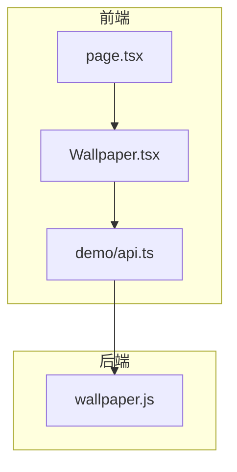
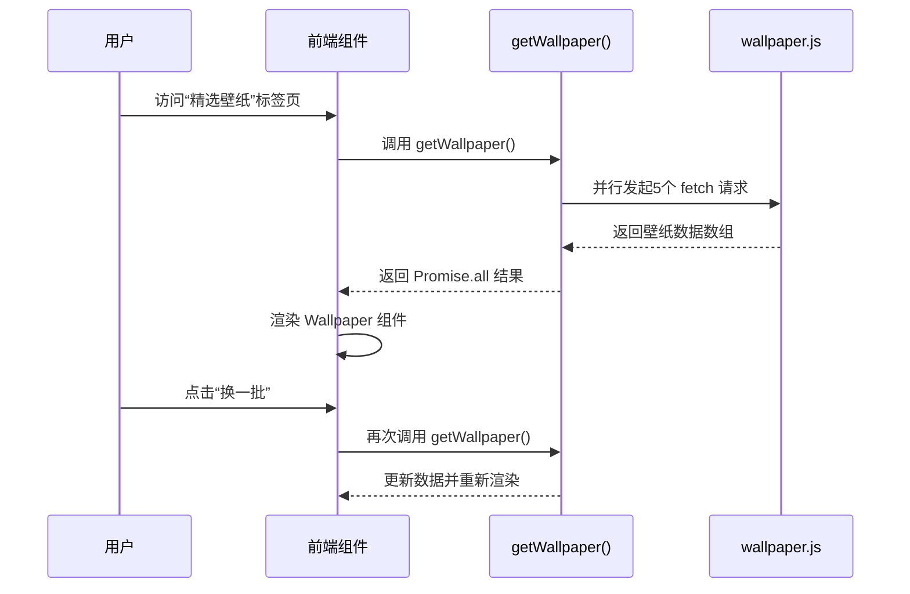
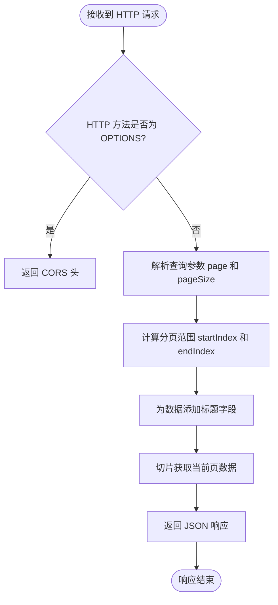
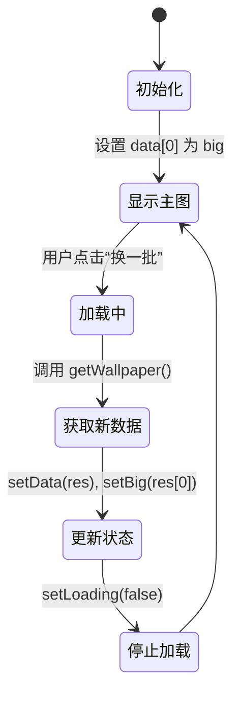
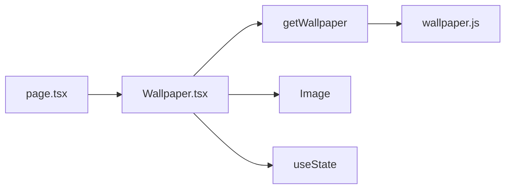

# 壁纸服务接口

<cite>
**本文档引用的文件**  
- [wallpaper.js](file://functions/wallpaper.js)
- [demo/page.tsx](file://src/app/demo/page.tsx)
- [Wallpaper.tsx](file://src/app/demo/_components/Wallpaper.tsx)
- [api.ts](file://src/app/common/api.ts)
- [demo/api.ts](file://src/app/demo/api.ts)
</cite>

## 目录
1. [简介](#简介)
2. [项目结构](#项目结构)
3. [核心组件](#核心组件)
4. [架构概览](#架构概览)
5. [详细组件分析](#详细组件分析)
6. [依赖分析](#依赖分析)
7. [性能考虑](#性能考虑)
8. [故障排除指南](#故障排除指南)
9. [结论](#结论)

## 简介
本文档详细记录了 `wallpaper.js` 云函数提供的壁纸服务接口，涵盖其 HTTP GET 请求的响应格式、动态资源获取机制、设备适配策略，以及前端如何通过封装函数调用该接口并处理加载与错误状态。同时提供实际请求示例、响应结构说明，并提出缓存与性能优化建议。

## 项目结构
项目采用模块化设计，主要分为函数逻辑（`functions/`）、前端页面（`src/app/`）和公共工具（`src/app/common/`）。壁纸服务由云函数 `wallpaper.js` 提供，前端通过 `demo/api.ts` 封装请求，在 `Wallpaper.tsx` 组件中展示。



**图示来源**  
- [wallpaper.js](file://functions/wallpaper.js#L1-L100)
- [demo/api.ts](file://src/app/demo/api.ts#L11-L27)
- [demo/page.tsx](file://src/app/demo/page.tsx#L1-L35)

**本节来源**  
- [functions/wallpaper.js](file://functions/wallpaper.js#L1-L100)
- [src/app/demo/page.tsx](file://src/app/demo/page.tsx#L1-L35)
- [src/app/demo/_components/Wallpaper.tsx](file://src/app/demo/_components/Wallpaper.tsx#L1-L113)

## 核心组件
`wallpaper.js` 云函数模拟返回一组壁纸数据，支持分页查询。前端通过 `getWallpaper()` 函数并行请求多个壁纸接口，实现资源轮换。`Wallpaper.tsx` 组件负责渲染大图预览、缩略图列表及“换一批”功能。

**本节来源**  
- [wallpaper.js](file://functions/wallpaper.js#L73-L99)
- [demo/api.ts](file://src/app/demo/api.ts#L11-L27)
- [Wallpaper.tsx](file://src/app/demo/_components/Wallpaper.tsx#L8-L38)

## 架构概览
系统采用前后端分离架构，前端通过 API 调用云函数获取壁纸数据。云函数返回分页数据，前端组件负责状态管理与用户交互。



**图示来源**  
- [wallpaper.js](file://functions/wallpaper.js#L1-L100)
- [demo/api.ts](file://src/app/demo/api.ts#L11-L27)
- [Wallpaper.tsx](file://src/app/demo/_components/Wallpaper.tsx#L38-L60)

## 详细组件分析

### 云函数 wallpaper.js 分析
该云函数模拟从远程 API 获取壁纸数据，实际使用静态数组 `arr` 模拟响应。支持 `page` 和 `pageSize` 查询参数实现分页功能，返回标准化的 JSON 响应结构。



**图示来源**  
- [wallpaper.js](file://functions/wallpaper.js#L73-L99)

**本节来源**  
- [wallpaper.js](file://functions/wallpaper.js#L1-L100)

### 前端组件 Wallpaper.tsx 分析
该组件接收壁纸数据数组，支持点击缩略图切换主图、点击主图下载、点击“换一批”刷新数据。使用 `useState` 管理当前主图、壁纸列表和加载状态。

#### 状态管理流程


**图示来源**  
- [Wallpaper.tsx](file://src/app/demo/_components/Wallpaper.tsx#L8-L60)

**本节来源**  
- [Wallpaper.tsx](file://src/app/demo/_components/Wallpaper.tsx#L1-L113)

### API 封装函数 getWallpaper 分析
`getWallpaper` 函数通过并行请求多个壁纸接口（`v=0` 到 `v=4`），提升资源获取效率。使用 `Promise.all` 等待所有请求完成，返回合并后的壁纸数据。

```mermaid
flowchart LR
A[调用 getWallpaper()] --> B[创建5个 URL]
B --> C[map 生成5个 fetch 请求]
C --> D[每个请求解析 JSON 并提取 data]
D --> E[Promise.all 等待所有完成]
E --> F[返回壁纸数组]
```

**图示来源**  
- [demo/api.ts](file://src/app/demo/api.ts#L11-L27)

**本节来源**  
- [demo/api.ts](file://src/app/demo/api.ts#L11-L27)

## 依赖分析
系统依赖关系清晰，前端页面依赖组件，组件依赖 API 封装，API 封装依赖云函数接口。无循环依赖，模块职责分明。



**图示来源**  
- [page.tsx](file://src/app/demo/page.tsx#L1-L35)
- [Wallpaper.tsx](file://src/app/demo/_components/Wallpaper.tsx#L1-L113)
- [demo/api.ts](file://src/app/demo/api.ts#L11-L27)
- [wallpaper.js](file://functions/wallpaper.js#L1-L100)

**本节来源**  
- [page.tsx](file://src/app/demo/page.tsx#L1-L35)
- [Wallpaper.tsx](file://src/app/demo/_components/Wallpaper.tsx#L1-L113)
- [demo/api.ts](file://src/app/demo/api.ts#L11-L27)

## 性能考虑
- **并行请求**：`getWallpaper` 使用 `Promise.all` 并行获取多组壁纸，减少总等待时间。
- **图片懒加载**：缩略图未使用 `loading="lazy"`，建议添加以优化性能。
- **预加载建议**：可在用户悬停“换一批”按钮时预触发 `getWallpaper`，提升交互流畅性。
- **缓存策略**：云函数未设置响应缓存头，建议添加 `Cache-Control` 提升 CDN 缓存效率。

## 故障排除指南
- **壁纸无法加载**：检查 `v2.xxapi.cn` 是否可访问，确认网络策略允许跨域请求。
- **“换一批”无响应**：确认 `getWallpaper` 返回的 Promise 被正确 await，检查 `loading` 状态是否正确更新。
- **图片下载失败**：确保浏览器支持 `URL.createObjectURL` 和 `a.click()` 下载机制，部分移动端浏览器可能受限。

**本节来源**  
- [Wallpaper.tsx](file://src/app/demo/_components/Wallpaper.tsx#L40-L60)
- [demo/api.ts](file://src/app/demo/api.ts#L11-L27)

## 结论
`wallpaper.js` 云函数与前端组件协同工作，实现了壁纸的动态获取与展示。系统结构清晰，具备良好的扩展性。建议优化缓存策略与图片加载方式，进一步提升用户体验。