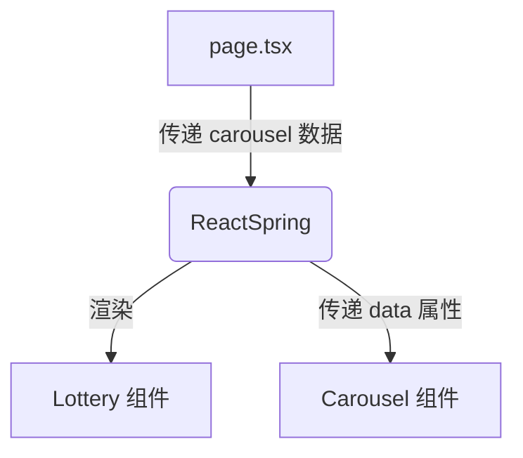
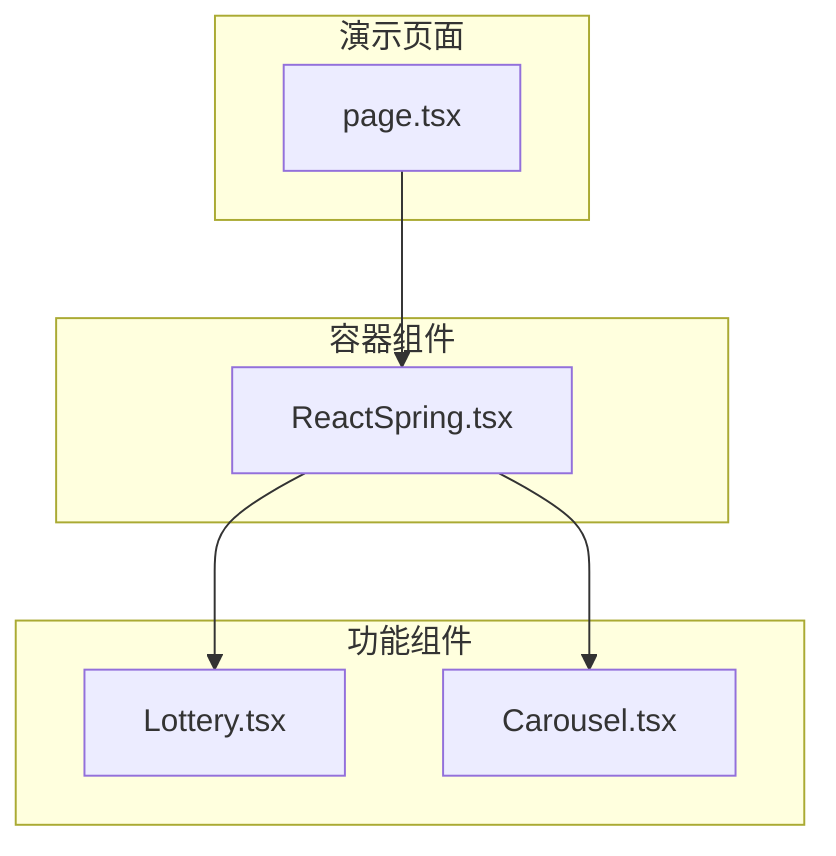

<cite>
**本文档中引用的文件**  
- [ReactSpring.tsx](file://src/app/demo/_components/ReactSpring.tsx)
- [Carousel.tsx](file://src/app/demo/_components/Carousel.tsx)
- [Lottery.tsx](file://src/app/demo/_components/Lottery.tsx)
- [page.tsx](file://src/app/demo/page.tsx)
</cite>

## 目录
1. [简介](#简介)
2. [核心组件分析](#核心组件分析)
3. [ReactSpring 组件详解](#reactspring-组件详解)
4. [数据流与组件集成](#数据流与组件集成)
5. [布局与动画实现](#布局与动画实现)
6. [依赖关系图](#依赖关系图)

## 简介
本文档旨在说明 `ReactSpring` 组件作为组合式容器的作用，展示如何将 `Lottery` 与 `Carousel` 两个独立组件集成在同一页面中。重点阐述其作为演示布局组织者的角色，而非具体动效实现者。通过分析其接收 `carousel` 数据并传递给子组件的模式，体现组件复用与数据流传递的最佳实践。

## 核心组件分析

`ReactSpring` 组件的核心功能是作为一个布局容器，将两个功能独立的组件——抽奖组件（`Lottery`）和轮播组件（`Carousel`）——进行集成展示。该组件本身不实现具体的动画逻辑，而是通过组合现有组件来构建演示界面。

**Section sources**
- [ReactSpring.tsx](file://src/app/demo/_components/ReactSpring.tsx#L1-L16)
- [Lottery.tsx](file://src/app/demo/_components/Lottery.tsx#L1-L96)
- [Carousel.tsx](file://src/app/demo/_components/Carousel.tsx#L1-L57)

## ReactSpring 组件详解

`ReactSpring` 组件是一个典型的组合式容器组件，其主要职责是组织布局和协调数据流。它接收一个名为 `carousel` 的字符串数组作为属性（props），并将该数据传递给 `Carousel` 子组件。

该组件通过导入并组合 `Lottery` 和 `Carousel` 两个独立的功能组件，实现了功能的复用。这种设计模式遵循了单一职责原则，每个子组件负责自己的业务逻辑，而 `ReactSpring` 仅负责将它们集成到一个统一的布局中。

**Section sources**
- [ReactSpring.tsx](file://src/app/demo/_components/ReactSpring.tsx#L1-L16)

## 数据流与组件集成

`ReactSpring` 组件展示了清晰的数据流传递模式。父组件 `page.tsx` 将从 API 获取的壁纸数据 `wallpapers` 作为 `carousel` 属性传递给 `ReactSpring`。`ReactSpring` 再将此数据通过 `data` 属性传递给 `Carousel` 组件，实现了数据从顶层页面到具体展示组件的单向流动。

这种模式体现了 React 中组件复用与数据流传递的最佳实践：父组件负责数据获取与分发，子组件负责数据展示与交互，容器组件负责布局组织。

**Diagram sources**
- [page.tsx](file://src/app/demo/page.tsx#L10-L30)
- [ReactSpring.tsx](file://src/app/demo/_components/ReactSpring.tsx#L6-L13)

## 布局与动画实现

`ReactSpring` 组件使用 Tailwind CSS 的 `grid` 布局系统，将两个子组件并排显示（在小屏幕上堆叠）。通过添加 `animate__animated animate__fadeInUp` CSS 类，为整个容器实现了进入页面时的淡入上滑动画效果。

值得注意的是，`ReactSpring` 本身并不处理复杂的动画逻辑，这些工作由 `@react-spring/web` 库在 `Carousel` 和 `Lottery` 组件内部实现。`ReactSpring` 仅负责应用简单的 CSS 动画类，体现了其作为布局组织者的角色。

**Section sources**
- [ReactSpring.tsx](file://src/app/demo/_components/ReactSpring.tsx#L6-L13)

## 依赖关系图

**Diagram sources**
- [page.tsx](file://src/app/demo/page.tsx#L10-L30)
- [ReactSpring.tsx](file://src/app/demo/_components/ReactSpring.tsx#L1-L16)