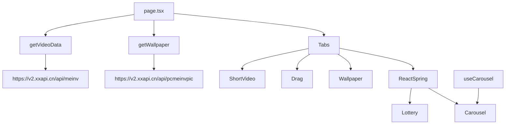

# 交互式演示模块

<cite>
**本文档引用文件**  
- [Carousel.tsx](file://src/app/demo/_components/Carousel.tsx)
- [Drag.tsx](file://src/app/demo/_components/Drag.tsx)
- [Lottery.tsx](file://src/app/demo/_components/Lottery.tsx)
- [ReactSpring.tsx](file://src/app/demo/_components/ReactSpring.tsx)
- [ShortVideo.tsx](file://src/app/demo/_components/ShortVideo.tsx)
- [Tabs.tsx](file://src/app/demo/_components/Tabs.tsx)
- [Wallpaper.tsx](file://src/app/demo/_components/Wallpaper.tsx)
- [page.tsx](file://src/app/demo/page.tsx)
- [api.ts](file://src/app/demo/api.ts)
- [useCarousel.ts](file://src/app/hooks/useCarousel.ts)
</cite>

## 目录
1. [简介](#简介)
2. [项目结构](#项目结构)
3. [核心组件功能说明](#核心组件功能说明)
4. [组件技术实现解析](#组件技术实现解析)
5. [依赖与集成分析](#依赖与集成分析)
6. [使用示例与最佳实践](#使用示例与最佳实践)
7. [总结](#总结)

## 简介
本项目 `/demo` 页面集成了多个交互式前端组件，涵盖轮播图、拖拽上传、动画抽奖、物理动效、短视频播放、标签切换和壁纸展示等常见交互场景。本文档旨在全面解析各组件的技术实现原理，帮助开发者理解其内部逻辑与设计思路。

## 项目结构
`/demo` 页面位于 `src/app/demo` 目录下，采用模块化设计，每个交互组件独立封装于 `_components` 子目录中。主页面通过 `Tabs` 组件实现标签页切换，动态渲染不同功能模块。

```mermaid
graph TB
A[/demo/page.tsx] --> B[Carousel]
A --> C[Drag]
A --> D[Lottery]
A --> E[ReactSpring]
A --> F[ShortVideo]
A --> G[Tabs]
A --> H[Wallpaper]
A --> I[api.ts]
J[src/app/hooks/useCarousel.ts] --> B
```

**图示来源**  
- [page.tsx](file://src/app/demo/page.tsx#L1-L35)
- [useCarousel.ts](file://src/app/hooks/useCarousel.ts#L1-L71)

## 核心组件功能说明
`/demo` 页面包含以下交互式组件：

- **Carousel**: 图片轮播展示，支持自动播放与手动切换
- **Drag**: 文件拖拽上传，支持本地文件与模拟文件拖入
- **Lottery**: 动画抽奖功能，模拟真实抽奖过程
- **ReactSpring**: 集成 `react-spring` 实现流畅动效
- **ShortVideo**: 短视频上下滑动切换播放
- **Tabs**: 标签页切换，支持 URL 参数同步
- **Wallpaper**: 壁纸预览与下载，支持刷新获取新图

**本节来源**  
- [page.tsx](file://src/app/demo/page.tsx#L1-L35)

## 组件技术实现解析

### Carousel 轮播图实现
`Carousel` 组件基于 `useCarousel` 自定义 Hook 实现轮播逻辑，结合 `useTransition` 提供动画效果。

#### 轮播逻辑
- 使用 `useState` 管理当前页码 `page`
- 通过 `next()` 和 `prev()` 方法实现前后切换
- 利用 `setInterval` 实现自动播放（移动端默认关闭）
- 通过 `ref` 监听滚动事件，同步页面状态

#### 动画实现
- 使用 `@react-spring/web` 的 `useTransition` 创建滑动动画
- 定义 `from`、`enter`、`leave` 三种状态实现平滑过渡
- 结合 `Swiper` 组件完成视图渲染

#### 移动端适配
- 通过 `useMobile` Hook 检测设备类型
- 动态调整高度与自动播放策略
- 支持 Touch Move 手势操作

**本节来源**  
- [Carousel.tsx](file://src/app/demo/_components/Carousel.tsx#L8-L53)
- [useCarousel.ts](file://src/app/hooks/useCarousel.ts#L1-L71)

### Drag 拖拽组件实现
`Drag` 组件实现了完整的文件拖拽上传交互，支持真实文件与模拟数据拖入。

#### 拖拽事件处理
- `onDragStart`: 记录拖拽源数据，设置拖拽状态
- `onDragEnter` / `onDragLeave`: 显示拖拽进入提示
- `onDragOver`: 阻止默认行为，允许放置
- `onDrop`: 接收文件对象或模拟数据，更新状态

#### 状态管理
- `select`: 存储选中文件信息
- `file`: 存储原始 `File` 对象
- `isDrag` / `isEnter`: 控制 UI 样式与提示

#### UI 反馈
- 拖拽时显示 `cursor-grabbing` 光标
- 进入区域显示提示文字
- 成功拖入后展示文件名与类型

**本节来源**  
- [Drag.tsx](file://src/app/demo/_components/Drag.tsx#L11-L93)

### Lottery 抽奖动画实现
`Lottery` 组件通过定时器与状态变化模拟抽奖动画效果。

#### 抽奖流程
1. 点击"点击抽奖"按钮触发 `onLottery`
2. 扣除5元余额，启动抽奖
3. 分三阶段加速：200ms → 300ms → 500ms
4. 每阶段随机持续1000-3000ms
5. 停止后根据最终位置发放奖励

#### 动画控制
- 使用 `setInterval` 控制数字滚动
- `dataRef.current` 记录当前索引
- `count` 状态驱动高亮显示

#### 余额动效
- 使用 `useSpring` 实现余额数字渐变动画
- `useInView` 检测组件是否可见，优化性能

**本节来源**  
- [Lottery.tsx](file://src/app/demo/_components/Lottery.tsx#L3-L87)

### ReactSpring 物理动效集成
`ReactSpring` 组件展示了 `react-spring` 在真实场景中的应用。

#### 集成方式
- 同时嵌入 `Lottery` 和 `Carousel` 组件
- 使用 `useSpring` 实现数字渐变
- 使用 `useTransition` 实现页面切换动画

#### 动效配置
- `config.slow`: 使用慢速动画配置
- `from` / `to`: 定义起始与结束状态
- `animated.span`: 包装需要动画的元素

**本节来源**  
- [ReactSpring.tsx](file://src/app/demo/_components/ReactSpring.tsx#L6-L13)
- [Lottery.tsx](file://src/app/demo/_components/Lottery.tsx#L3-L87)

### ShortVideo 短视频播放控制
`ShortVideo` 组件实现了类似抖音的上下滑动切换视频体验。

#### 视频切换
- 使用 `useTransition` 实现垂直滑动动画
- `onTouchStart` / `onTouchEnd` 监听触摸事件
- 根据滑动方向调用 `next()` 或 `prev()`

#### 数据加载
- 初始加载一个视频
- 每次下滑时通过 `getVideoData()` 获取新视频
- 动态扩展 `videos` 数组

#### 音量控制
- 提供 `volume` 状态管理音量
- 通过 `Item` 组件传递控制

**本节来源**  
- [ShortVideo.tsx](file://src/app/demo/_components/ShortVideo.tsx#L8-L102)

### Tabs 标签切换行为
`Tabs` 组件实现了标签页切换与 URL 参数同步。

#### 切换逻辑
- `active` 状态记录当前标签索引
- 点击标签调用 `onTab(index)` 更新状态

#### URL 同步
- 使用 `URL` API 修改查询参数
- `window.history.replaceState` 更新地址栏而不刷新页面
- 支持通过 `searchParams` 默认激活指定标签

#### 响应式设计
- 移动端隐藏标签栏（`xs:hidden`）
- 桌面端显示完整标签切换

**本节来源**  
- [Tabs.tsx](file://src/app/demo/_components/Tabs.tsx#L9-L40)

### Wallpaper 背景切换功能
`Wallpaper` 组件提供壁纸预览、切换与下载功能。

#### 图片管理
- `data` 存储壁纸列表
- `big` 记录当前大图
- `loading` 控制加载状态

#### 交互功能
- 点击缩略图切换大图
- 点击大图触发下载
- "换一批"按钮刷新壁纸列表

#### 下载实现
- 使用 `fetch` 获取图片资源
- 转换为 `Blob` 对象
- 创建临时 `<a>` 标签触发下载
- 下载后清理 URL 对象

**本节来源**  
- [Wallpaper.tsx](file://src/app/demo/_components/Wallpaper.tsx#L7-L103)

## 依赖与集成分析
各组件通过 `page.tsx` 统一集成，数据通过 `api.ts` 获取。



**图示来源**  
- [page.tsx](file://src/app/demo/page.tsx#L1-L35)
- [api.ts](file://src/app/demo/api.ts#L1-L28)

## 使用示例与最佳实践

### 组件复用建议
- `useCarousel`: 可提取为通用轮播 Hook
- `useTransition`: 适用于所有需要动画切换的场景
- `fetch + Blob`: 标准文件下载模式

### 性能优化点
- `useInView`: 懒加载动效，避免不必要的计算
- `useMemo` / `useCallback`: 可进一步优化渲染性能
- 图片 `quality` 参数控制加载速度

### 错误处理改进
- 增加网络请求错误处理
- 添加文件类型验证
- 考虑离线缓存机制

**本节来源**  
- [api.ts](file://src/app/demo/api.ts#L1-L28)
- [Wallpaper.tsx](file://src/app/demo/_components/Wallpaper.tsx#L7-L103)

## 总结
`/demo` 页面展示了丰富的前端交互技术，涵盖了状态管理、动画实现、事件处理、网络请求等多个方面。各组件设计清晰，职责分明，具有良好的可维护性与扩展性。建议在实际项目中参考其架构设计与实现模式。