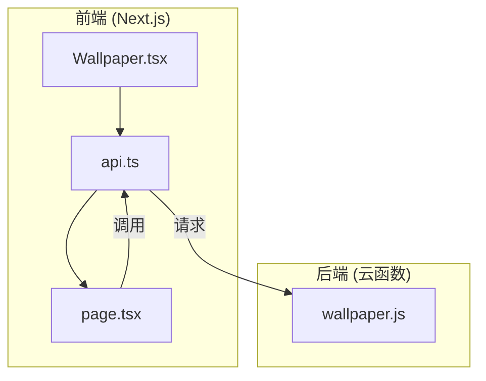
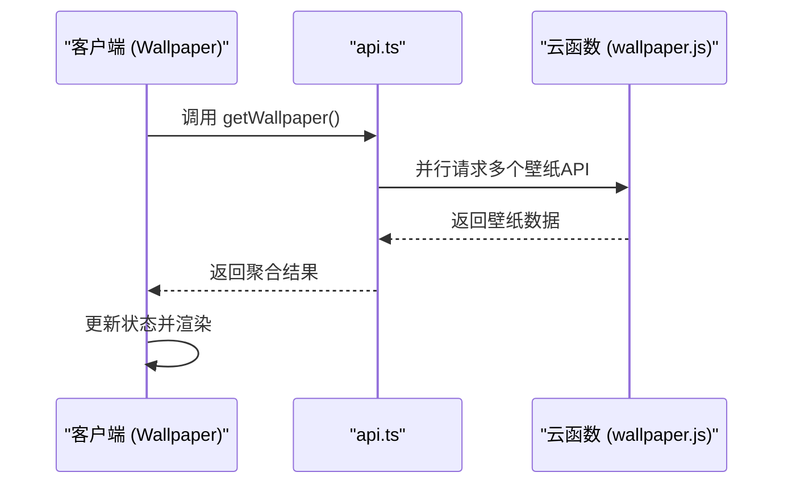
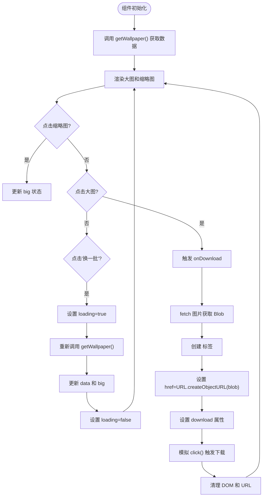
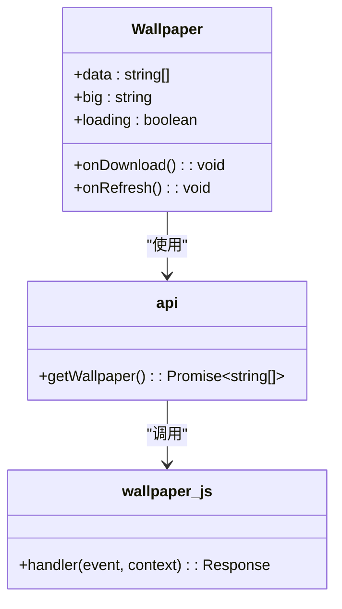

<cite>
**本文档中引用的文件**
- [Wallpaper.tsx](file://src/app/demo/_components/Wallpaper.tsx)
- [wallpaper.js](file://functions/wallpaper.js)
- [api.ts](file://src/app/demo/api.ts)
- [page.tsx](file://src/app/demo/page.tsx)
</cite>

## 目录
1. [简介](#简介)
2. [项目结构](#项目结构)
3. [核心组件](#核心组件)
4. [架构概览](#架构概览)
5. [详细组件分析](#详细组件分析)
6. [依赖分析](#依赖分析)
7. [性能考量](#性能考量)
8. [故障排除指南](#故障排除指南)
9. [结论](#结论)

## 简介
本文档全面介绍 `Wallpaper` 组件的壁纸展示与交互功能。该组件实现了从云函数获取壁纸列表、缩略图预览、大图点击下载以及“换一批”刷新功能。文档详细解析了数据获取流程、前端下载机制及加载状态管理，为开发者提供完整的实现参考。

## 项目结构
项目采用典型的前后端分离架构，前端基于 Next.js 框架构建，后端通过云函数提供 API 接口。壁纸功能主要涉及以下目录：
- `src/app/demo/_components/`: 存放 `Wallpaper` 组件等演示功能
- `src/app/demo/`: 页面入口及 API 定义
- `functions/`: 云函数实现，包括 `wallpaper.js`

**Diagram sources**
- [Wallpaper.tsx](file://src/app/demo/_components/Wallpaper.tsx)
- [api.ts](file://src/app/demo/api.ts)
- [page.tsx](file://src/app/demo/page.tsx)
- [wallpaper.js](file://functions/wallpaper.js)

**Section sources**
- [Wallpaper.tsx](file://src/app/demo/_components/Wallpaper.tsx)
- [wallpaper.js](file://functions/wallpaper.js)

## 核心组件
`Wallpaper` 组件是壁纸功能的核心，负责展示壁纸列表、处理用户交互（预览、下载、刷新）并管理加载状态。它通过 `getWallpaper()` 函数异步获取数据，并利用 React 状态管理实现动态更新。

**Section sources**
- [Wallpaper.tsx](file://src/app/demo/_components/Wallpaper.tsx#L7-L103)
- [api.ts](file://src/app/demo/api.ts#L11-L27)

## 架构概览
系统采用客户端-服务器模式，`Wallpaper` 组件在客户端渲染，通过 API 调用云函数获取壁纸数据。整体流程如下：页面加载时预取数据 → 用户交互触发下载或刷新 → 前端处理并反馈。

**Diagram sources**
- [Wallpaper.tsx](file://src/app/demo/_components/Wallpaper.tsx)
- [api.ts](file://src/app/demo/api.ts)
- [wallpaper.js](file://functions/wallpaper.js)

## 详细组件分析

### Wallpaper 组件分析
`Wallpaper` 组件使用 React 函数式组件和 Hooks 实现，包含三个核心状态：`data`（壁纸列表）、`big`（当前大图）、`loading`（加载状态）。

#### 功能流程图

**Diagram sources**
- [Wallpaper.tsx](file://src/app/demo/_components/Wallpaper.tsx#L13-L31)
- [api.ts](file://src/app/demo/api.ts#L11-L27)

#### 下载功能实现
`onDownload` 函数通过 `fetch` 获取图片 Blob 数据，利用 `URL.createObjectURL` 创建临时 URL，并通过动态创建的 `<a>` 标签实现下载。`download` 属性被设置为图片文件名（不含扩展名），确保下载时使用语义化名称。

**Section sources**
- [Wallpaper.tsx](file://src/app/demo/_components/Wallpaper.tsx#L13-L31)

#### 数据刷新机制
“换一批”按钮通过 `onRefresh` 函数实现，该函数在调用 `getWallpaper()` 前后管理 `loading` 状态，确保 UI 在数据加载期间显示加载动画，提供良好的用户体验。

**Section sources**
- [Wallpaper.tsx](file://src/app/demo/_components/Wallpaper.tsx#L32-L38)

## 依赖分析
组件间依赖关系清晰，`Wallpaper` 组件依赖 `api.ts` 中的 `getWallpaper` 函数，而该函数又依赖外部壁纸 API。云函数 `wallpaper.js` 作为数据源，但当前前端实际调用的是第三方 API，而非本地云函数。

**Diagram sources**
- [Wallpaper.tsx](file://src/app/demo/_components/Wallpaper.tsx)
- [api.ts](file://src/app/demo/api.ts)
- [wallpaper.js](file://functions/wallpaper.js)

**Section sources**
- [Wallpaper.tsx](file://src/app/demo/_components/Wallpaper.tsx)
- [api.ts](file://src/app/demo/api.ts)

## 性能考量
- **并行请求**：`getWallpaper` 函数使用 `Promise.all` 并行请求多个壁纸源，显著提升数据获取速度。
- **图片优化**：组件使用 `blurDataURL` 实现模糊占位，`quality` 参数控制图片质量，平衡清晰度与加载性能。
- **状态管理**：合理使用 `useState` 管理组件状态，避免不必要的重渲染。

## 故障排除指南
- **下载失败**：检查图片 URL 是否有效，确认 CORS 策略允许跨域请求。
- **加载无反应**：验证 `getWallpaper` 函数返回的 Promise 是否正确解析。
- **UI 无反馈**：确保 `loading` 状态在异步操作前后正确更新。

**Section sources**
- [Wallpaper.tsx](file://src/app/demo/_components/Wallpaper.tsx#L32-L38)
- [api.ts](file://src/app/demo/api.ts#L11-L27)

## 结论
`Wallpaper` 组件完整实现了壁纸展示与交互功能，代码结构清晰，功能模块化。通过异步数据获取、前端下载实现和加载状态管理，提供了流畅的用户体验。建议未来统一数据源，将前端调用指向本地云函数以增强架构一致性。