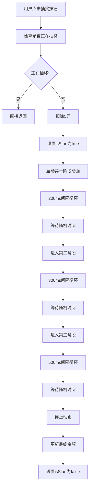
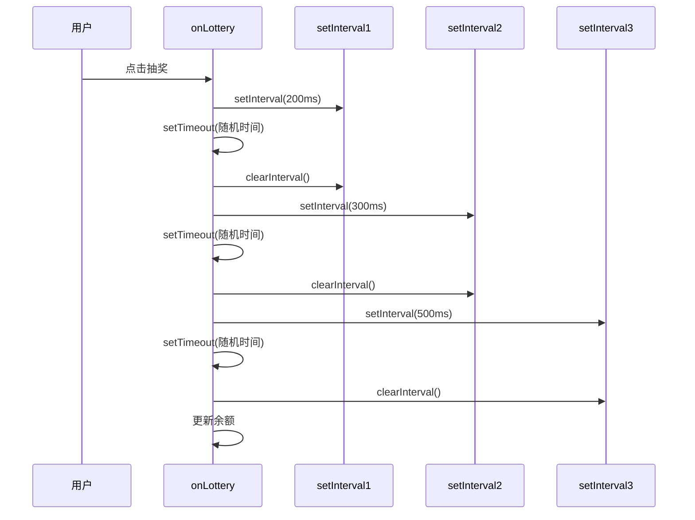
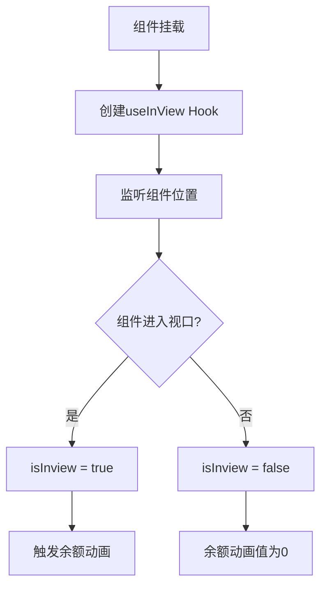
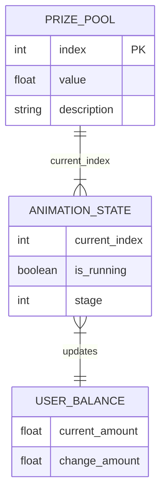
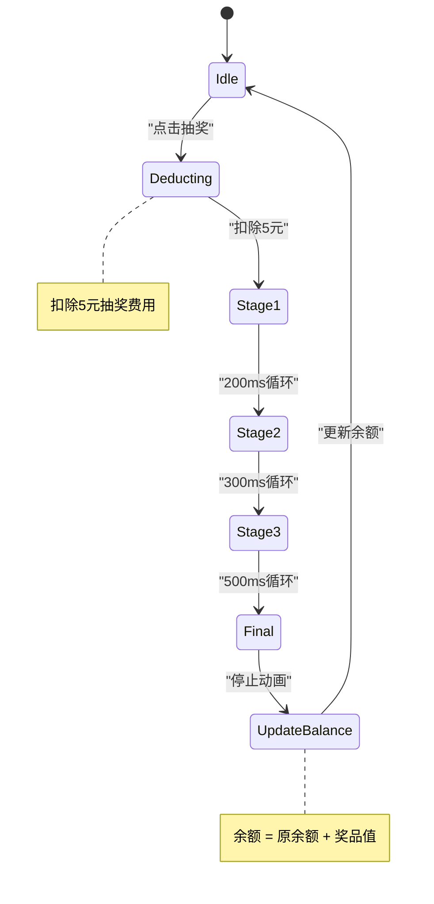

<cite>
**本文档中引用的文件**
- [Lottery.tsx](file://src/app/demo/_components/Lottery.tsx)
- [ReactSpring.tsx](file://src/app/demo/_components/ReactSpring.tsx)
</cite>

## 目录
1. [抽奖动画组件演示](#抽奖动画组件演示)
2. [异步动画抽奖流程分析](#异步动画抽奖流程分析)
3. [三阶段加速逻辑实现](#三阶段加速逻辑实现)
4. [余额数字平滑变化效果](#余额数字平滑变化效果)
5. [视口检测与动画触发机制](#视口检测与动画触发机制)
6. [抽奖结果随机性模拟](#抽奖结果随机性模拟)
7. [状态管理与余额更新](#状态管理与余额更新)
8. [随机延迟函数设计](#随机延迟函数设计)

## 抽奖动画组件演示

本组件展示了完整的抽奖动画流程，包含视觉反馈、状态管理和动画效果。用户点击"点击抽奖"按钮后，系统将扣除5元并启动抽奖动画，最终根据随机结果更新用户余额。

**Section sources**
- [Lottery.tsx](file://src/app/demo/_components/Lottery.tsx#L3-L95)

## 异步动画抽奖流程分析

`Lottery` 组件实现了完整的异步抽奖动画流程，从用户点击抽奖按钮到最终结果显示的全过程。该流程通过 `setInterval` 和 `setTimeout` 的嵌套调用实现精确的时序控制。

当用户点击抽奖按钮时，`onLottery` 函数被触发，首先检查是否已有抽奖正在进行，然后立即扣除5元抽奖费用并设置 `isStart` 状态为 `true`，防止重复抽奖。随后启动第一阶段的快速循环高亮动画。



**Diagram sources**
- [Lottery.tsx](file://src/app/demo/_components/Lottery.tsx#L30-L51)

**Section sources**
- [Lottery.tsx](file://src/app/demo/_components/Lottery.tsx#L30-L51)

## 三阶段加速逻辑实现

抽奖动画采用三阶段减速策略，模拟真实抽奖机的加速到减速过程，增强用户体验的真实感。该逻辑通过 `setInterval` 的三次嵌套 `setTimeout` 实现。

第一阶段以200ms的快速间隔循环高亮奖池格子，创造快速滚动的视觉效果。经过随机延迟后，进入第二阶段，间隔调整为300ms，速度明显减慢。再次经过随机延迟后，进入第三阶段，间隔延长至500ms，速度进一步减缓。最后经过最终随机延迟后，动画停止，显示最终抽奖结果。



**Diagram sources**
- [Lottery.tsx](file://src/app/demo/_components/Lottery.tsx#L36-L50)

**Section sources**
- [Lottery.tsx](file://src/app/demo/_components/Lottery.tsx#L36-L50)

## 余额数字平滑变化效果

组件使用 `@react-spring/web` 库的 `useSpring` Hook 实现余额数字的平滑动画效果。`lastMoney` 变量通过 `useSpring` 创建了一个动画值，从初始值0平滑过渡到当前余额值。

`useSpring` 配置了 `config.slow` 动画参数，确保数字变化过程流畅自然。动画值通过 `animated.span` 组件绑定到DOM，`to` 方法将数值格式化为保留两位小数的字符串，确保显示精度。

```mermaid
classDiagram
class useSpring {
+from : {number : 0}
+to : {number : currentMoney}
+config : config.slow
+return : animatedValue
}
class animated.span {
+ref : viewRef
+children : formattedNumber
}
class NumberFormatter {
+to((n) => n.toFixed(2))
}
useSpring --> animated.span : "绑定动画值"
animated.span --> NumberFormatter : "格式化输出"
```

**Diagram sources**
- [Lottery.tsx](file://src/app/demo/_components/Lottery.tsx#L12-L16)

**Section sources**
- [Lottery.tsx](file://src/app/demo/_components/Lottery.tsx#L12-L16)

## 视口检测与动画触发机制

组件使用 `@react-spring/web` 的 `useInView` Hook 实现视口检测功能。`[ref, isInview] = useInView()` 创建了一个引用和一个布尔值，用于检测组件是否进入用户视口。

当组件进入视口时，`isInview` 变为 `true`，触发余额数字的动画效果。这一机制确保只有当用户能够看到组件时，才执行动画，优化性能并提升用户体验。如果组件不在视口内，动画值将保持为0。



**Diagram sources**
- [Lottery.tsx](file://src/app/demo/_components/Lottery.tsx#L11-L16)

**Section sources**
- [Lottery.tsx](file://src/app/demo/_components/Lottery.tsx#L11-L16)

## 抽奖结果随机性模拟

抽奖结果的随机性通过三阶段减速动画和最终随机延迟实现。奖池数据 `arr` 定义了9个可能的奖品值，包括正向奖励和负向惩罚。

`dataRef` 使用 `useRef` 创建，作为当前高亮格子的索引计数器。`onStart` 函数负责递增计数器，并在达到8后重置为-1，实现循环效果。最终的抽奖结果由最后一次 `onStart` 调用时 `dataRef.current` 的值决定。



**Diagram sources**
- [Lottery.tsx](file://src/app/demo/_components/Lottery.tsx#L10-L11)
- [Lottery.tsx](file://src/app/demo/_components/Lottery.tsx#L88-L90)

**Section sources**
- [Lottery.tsx](file://src/app/demo/_components/Lottery.tsx#L10-L11)
- [Lottery.tsx](file://src/app/demo/_components/Lottery.tsx#L88-L90)

## 状态管理与余额更新

组件使用 React 的 `useState` Hook 管理核心状态，包括用户余额 `money`、抽奖状态 `isStart` 和当前高亮格子索引 `count`。每次抽奖消耗5元，通过 `setMoney(money - 5)` 实现。

抽奖结束后，通过 `setMoney((p) => p + arr[dataRef.current])` 更新余额，其中 `arr[dataRef.current]` 是根据最终高亮格子索引获取的奖品值。`useEffect` Hook 确保组件卸载时清除定时器，避免内存泄漏。



**Diagram sources**
- [Lottery.tsx](file://src/app/demo/_components/Lottery.tsx#L8-L10)
- [Lottery.tsx](file://src/app/demo/_components/Lottery.tsx#L43-L49)
- [Lottery.tsx](file://src/app/demo/_components/Lottery.tsx#L53-L57)

**Section sources**
- [Lottery.tsx](file://src/app/demo/_components/Lottery.tsx#L8-L10)
- [Lottery.tsx](file://src/app/demo/_components/Lottery.tsx#L43-L49)
- [Lottery.tsx](file://src/app/demo/_components/Lottery.tsx#L53-L57)

## 随机延迟函数设计

`getTime` 函数设计用于生成1000至3000毫秒之间的随机延迟，增加抽奖过程的不可预测性和真实感。函数实现为 `Math.floor(Math.random() * 2000) + 1000`，确保每次延迟时间在1到3秒之间随机变化。

这种设计意图是模拟真实抽奖机的不确定性，使每次抽奖过程的持续时间略有不同，增强用户体验的趣味性。三个 `setTimeout` 调用分别使用独立的随机延迟，确保三阶段过渡的时间点不可预测。

```mermaid
flowchart LR
A[Math.random()] --> B[0.0 ~ 1.0]
B --> C[* 2000]
C --> D[0.0 ~ 2000.0]
D --> E[Math.floor()]
E --> F[0 ~ 1999]
F --> G[+ 1000]
G --> H[1000 ~ 2999]
H --> I[返回随机延迟时间]
```

**Diagram sources**
- [Lottery.tsx](file://src/app/demo/_components/Lottery.tsx#L92-L94)

**Section sources**
- [Lottery.tsx](file://src/app/demo/_components/Lottery.tsx#L92-L94)