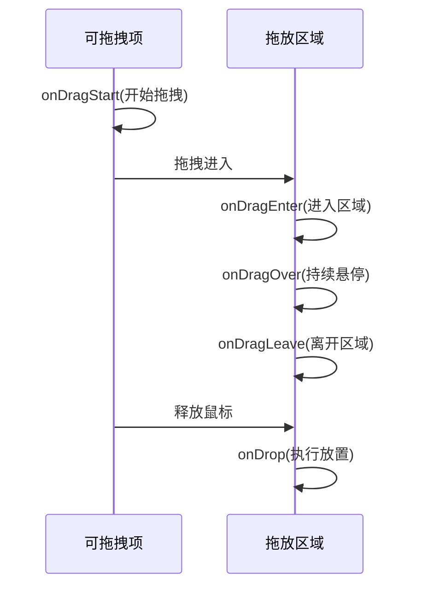
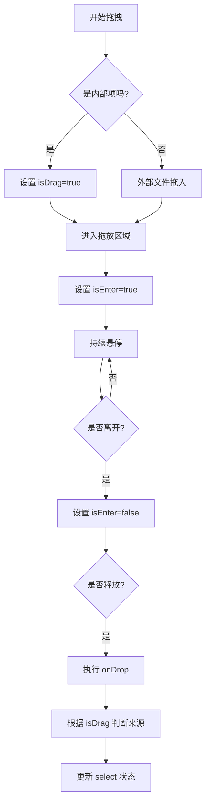
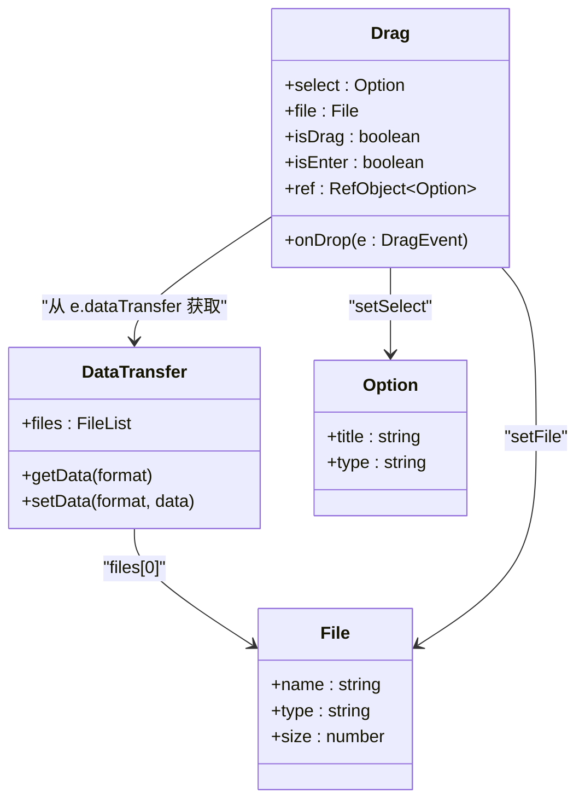

# 拖拽上传组件演示

<cite>
**Referenced Files in This Document**  
- [Drag.tsx](file://src/app/demo/_components/Drag.tsx)
</cite>

## 目录
1. [简介](#简介)
2. [项目结构](#项目结构)
3. [核心组件](#核心组件)
4. [拖拽事件处理机制](#拖拽事件处理机制)
5. [拖拽状态管理](#拖拽状态管理)
6. [数据传递与文件提取](#数据传递与文件提取)
7. [UI交互设计](#ui交互设计)
8. [结论](#结论)

## 简介
本文档深入解析 `Drag` 组件的 HTML5 拖拽 API 实现原理，重点分析 `onDragStart`、`onDragEnter`、`onDragOver` 和 `onDrop` 等事件的处理逻辑。文档将详细说明如何通过 `ref` 和状态管理来跟踪拖拽状态（isDrag、isEnter），实现自定义数据传递，并从 `DataTransfer` 对象中提取文件对象以供后续处理（如上传、读取）。同时，文档将解析左右区域的交互设计：左侧为拖放目标区，右侧为可拖拽源项，以及 UI 反馈（如光标样式变化）的实现方式。

## 项目结构
`Drag` 组件位于 `src/app/demo/_components/Drag.tsx` 路径下，是演示页面中的一个独立功能模块。该组件采用 React 函数式组件形式编写，使用 TypeScript 类型系统，并集成 Next.js 的客户端组件特性。组件结构清晰，分为左侧拖放目标区域和右侧可拖拽源项区域，通过事件监听和状态管理实现完整的拖拽交互功能。

**Section sources**
- [Drag.tsx](file://src/app/demo/_components/Drag.tsx#L1-L96)

## 核心组件

`Drag` 组件是实现拖拽功能的核心，它使用 React 的 `useState` 和 `useRef` 钩子来管理组件的内部状态和引用。组件定义了多个状态变量：`select` 用于存储选中的文件信息，`file` 用于存储实际的 File 对象，`isDrag` 用于标识当前是否处于拖拽状态，`isEnter` 用于标识鼠标是否进入拖放区域。组件还定义了一个 `ref` 来临时存储被拖拽的数据，在拖拽过程中保持数据引用。

**Section sources**
- [Drag.tsx](file://src/app/demo/_components/Drag.tsx#L11-L93)

## 拖拽事件处理机制

`Drag` 组件通过监听一系列 HTML5 拖拽事件来实现完整的交互流程。这些事件包括 `onDragStart`、`onDragEnter`、`onDragOver`、`onDragLeave` 和 `onDrop`。

**Diagram sources**
- [Drag.tsx](file://src/app/demo/_components/Drag.tsx#L43-L51)
- [Drag.tsx](file://src/app/demo/_components/Drag.tsx#L80-L83)

### 事件处理流程

1. **onDragStart**: 当用户在右侧的可拖拽项上开始拖拽时触发。此事件将 `isDrag` 状态设置为 `true`，并将当前项的数据存储在 `ref` 中。
2. **onDragEnter**: 当拖拽的元素进入左侧的拖放目标区域时触发。此事件阻止默认行为并设置 `isEnter` 状态为 `true`，用于 UI 反馈。
3. **onDragOver**: 当拖拽的元素在拖放区域内移动时持续触发。此事件必须阻止默认行为，否则 `onDrop` 事件不会被触发。
4. **onDragLeave**: 当拖拽的元素离开拖放区域时触发。此事件将 `isEnter` 状态设置为 `false`。
5. **onDrop**: 当用户在拖放区域内释放鼠标时触发。这是整个流程的核心，负责处理放置逻辑。

**Section sources**
- [Drag.tsx](file://src/app/demo/_components/Drag.tsx#L43-L51)
- [Drag.tsx](file://src/app/demo/_components/Drag.tsx#L80-L83)

## 拖拽状态管理

组件通过 `useState` 钩子精确管理拖拽过程中的各种状态。`isDrag` 状态用于区分是外部文件拖入还是内部项拖拽，这在 `onDrop` 事件处理中至关重要。`isEnter` 状态用于控制拖放区域的 UI 反馈，当为 `true` 时显示“放这里松手,不要乱动”的提示信息。

**Diagram sources**
- [Drag.tsx](file://src/app/demo/_components/Drag.tsx#L15-L16)
- [Drag.tsx](file://src/app/demo/_components/Drag.tsx#L43-L48)

## 数据传递与文件提取

`Drag` 组件实现了两种数据传递方式：内部项拖拽和外部文件拖拽。对于内部项拖拽，组件使用 `useRef` 来存储被拖拽项的数据，在 `onDrop` 事件中直接读取并更新状态。对于外部文件拖拽，组件通过 `DataTransfer` 对象提取文件。

**Diagram sources**
- [Drag.tsx](file://src/app/demo/_components/Drag.tsx#L19-L35)
- [Drag.tsx](file://src/app/demo/_components/Drag.tsx#L27-L33)

在 `onDrop` 事件处理函数中，首先调用 `e.preventDefault()` 阻止默认行为，然后检查 `isDrag` 状态以区分数据来源。如果是内部项拖拽，则直接使用 `ref` 中存储的数据更新 `select` 状态；如果是外部文件拖拽，则通过 `e.dataTransfer.files[0]` 获取第一个文件对象，将其存储在 `file` 状态中，并根据文件的 `name` 和 `type` 属性更新 `select` 状态。获取到的 `File` 对象可以在控制台中查看，开发者可以利用它进行文件上传、内容读取等后续操作。

**Section sources**
- [Drag.tsx](file://src/app/demo/_components/Drag.tsx#L19-L35)

## UI交互设计

`Drag` 组件的 UI 设计直观且用户友好。界面分为左右两个区域：左侧为宽大的拖放目标区，右侧为紧凑的可拖拽源项列表。

左侧区域根据 `isEnter` 状态动态显示不同的提示信息：
- 当 `isEnter` 为 `true` 时，显示“放这里松手,不要乱动”的提示。
- 当有文件被选中时，显示文件名、文件格式和“File对象：看控制台，拿到file对象，啥都可以干了”的提示。
- 当无文件且未进入时，显示“拖拽任意文件到此处”和“也可以拖拽右侧的demo文件至此”的引导信息。

右侧的可拖拽项通过 `curCss` 变量动态应用 CSS 类，实现光标样式的反馈。当 `isDrag` 为 `true` 时，应用 `cursor-grabbing` 类（抓取中），否则应用 `cursor-grab` 类（可抓取），为用户提供清晰的视觉反馈。

**Section sources**
- [Drag.tsx](file://src/app/demo/_components/Drag.tsx#L53-L77)
- [Drag.tsx](file://src/app/demo/_components/Drag.tsx#L80-L83)

## 结论

`Drag` 组件成功实现了基于 HTML5 拖拽 API 的完整文件上传功能。通过合理使用 React 的状态管理和引用机制，组件能够精确跟踪拖拽过程中的各种状态，并区分内部拖拽和外部文件拖拽。组件通过监听 `onDragStart`、`onDragEnter`、`onDragOver` 和 `onDrop` 等关键事件，构建了一个流畅的用户交互流程。从 `DataTransfer` 对象中提取 `File` 对象的设计，为后续的文件处理（如上传、读取）提供了坚实的基础。整体设计简洁高效，UI 反馈及时准确，是一个优秀的拖拽上传实现范例。