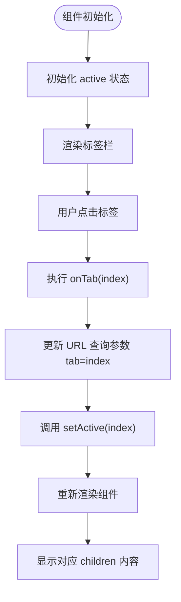
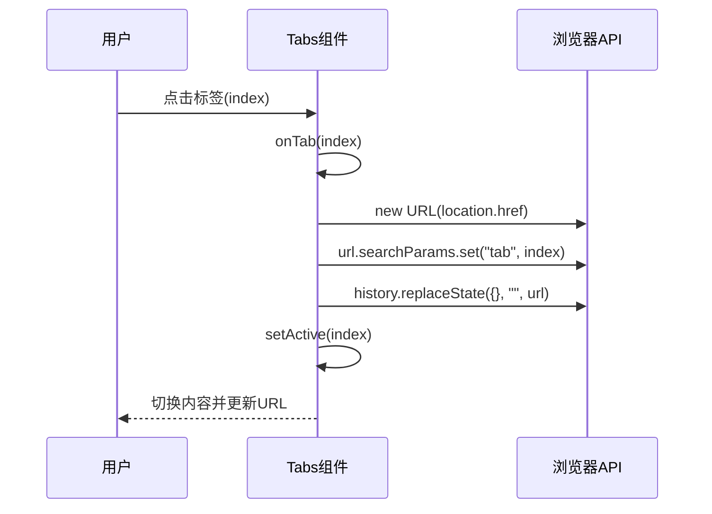
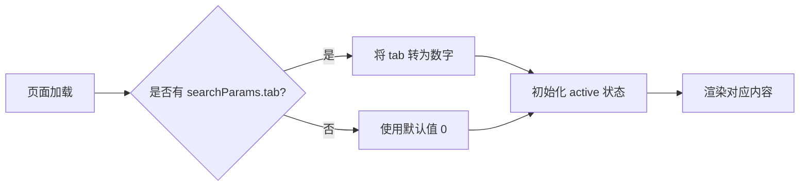

# 标签页切换组件演示

<cite>
**本文档引用的文件**  
- [Tabs.tsx](file://src/app/demo/_components/Tabs.tsx)
- [page.tsx](file://src/app/demo/page.tsx)
</cite>

## 目录
1. [简介](#简介)
2. [核心机制分析](#核心机制分析)
3. [状态管理与 URL 同步](#状态管理与-url-同步)
4. [标签渲染与样式控制](#标签渲染与样式控制)
5. [响应式设计策略](#响应式设计策略)
6. [页面刷新状态保持](#页面刷新状态保持)
7. [总结](#总结)

## 简介
`Tabs` 组件是一个基于 React 的标签页切换组件，支持通过点击标签切换内容、动态更新 URL 查询参数而不触发页面跳转，并在桌面端显示标签栏、移动端隐藏。该组件利用 `useState` 管理当前激活标签索引，结合 `window.history.replaceState` 实现 URL 参数同步，确保用户刷新页面后仍能保持当前标签状态。

**Section sources**  
- [Tabs.tsx](file://src/app/demo/_components/Tabs.tsx#L1-L43)

## 核心机制分析
`Tabs` 组件接收三个主要属性：`children`（多个子组件）、`titles`（标签标题数组）和可选的 `defalultTab`（默认激活标签索引）。组件内部使用 `useState` 初始化当前激活标签索引，若未传入 `defalultTab`，则默认为 0。

当用户点击某个标签时，触发 `onTab` 回调函数，传入对应索引值，进而更新状态并同步 URL 参数。



**Diagram sources**  
- [Tabs.tsx](file://src/app/demo/_components/Tabs.tsx#L9-L40)

**Section sources**  
- [Tabs.tsx](file://src/app/demo/_components/Tabs.tsx#L9-L40)

## 状态管理与 URL 同步
组件通过 `useState` 创建 `active` 状态变量及其更新函数 `setActive`，用于记录当前激活的标签索引。初始值由 `defalultTab` 决定，若未提供则默认为 0。

在 `onTab` 函数中，使用 `URL` 构造函数解析当前页面 URL，并通过 `searchParams.set("tab", String(index))` 设置查询参数 `tab` 的值为当前索引。随后调用 `window.history.replaceState` 方法更新浏览器地址栏中的 URL，但不向历史记录添加新条目，从而避免页面跳转或刷新。

此机制实现了 URL 与 UI 状态的解耦同步，使用户可通过复制链接分享特定标签页状态。



**Diagram sources**  
- [Tabs.tsx](file://src/app/demo/_components/Tabs.tsx#L11-L18)

**Section sources**  
- [Tabs.tsx](file://src/app/demo/_components/Tabs.tsx#L11-L18)

## 标签渲染与样式控制
组件使用 `map` 方法遍历 `titles` 数组，生成一组可点击的标签项。每个标签通过 `onClick={() => onTab(index)}` 绑定点击事件。

选中态的视觉反馈通过内联样式实现：
- 当 `active === index` 时，背景色设为 `#f3f4f6`（浅灰），文字颜色设为 `#111827`（深灰）
- 否则保持默认样式

这种动态样式控制方式无需额外 CSS 类切换，简洁高效。

```mermaid
classDiagram
class Tabs {
+children : JSX.Element[]
+titles : string[]
+defalultTab? : string
-active : number
-setActive : (n) => void
+onTab(index : number) : void
}
class Label {
+text : string
+index : number
+onClick : () => void
+style : { backgroundColor, color }
}
Tabs --> Label : "生成多个"
```

**Diagram sources**  
- [Tabs.tsx](file://src/app/demo/_components/Tabs.tsx#L20-L35)

**Section sources**  
- [Tabs.tsx](file://src/app/demo/_components/Tabs.tsx#L20-L35)

## 响应式设计策略
组件通过 Tailwind CSS 的响应式类 `xs:hidden` 控制标签栏的显示行为：
- 在桌面端（非 xs 屏幕）显示标签栏
- 在移动端（xs 屏幕）隐藏标签栏

这一设计考量在于移动端空间有限，可能采用其他导航方式（如轮播、折叠菜单等），因此隐藏标签栏以优化布局。

尽管当前实现中未展示移动端替代方案，但该策略体现了组件对多设备适配的关注。

**Section sources**  
- [Tabs.tsx](file://src/app/demo/_components/Tabs.tsx#L20)

## 页面刷新状态保持
为了在页面刷新后仍能保持当前标签状态，父组件 `page.tsx` 通过 `searchParams` 获取 URL 中的 `tab` 参数，并将其作为 `defalultTab` 传递给 `Tabs` 组件。

例如，在 `page.tsx` 中：
```tsx
const { tab } = searchParams ? use(searchParams) : {};
<Tabs titles={tabs} defalultTab={tab}>
  {/* children */}
</Tabs>
```
当页面加载时，`Tabs` 组件读取 `defalultTab` 并初始化 `active` 状态，从而恢复上次访问的标签页。



**Diagram sources**  
- [page.tsx](file://src/app/demo/page.tsx#L15-L25)

**Section sources**  
- [page.tsx](file://src/app/demo/page.tsx#L15-L25)

## 总结
`Tabs` 组件通过 `useState` 管理标签状态，结合 `window.history.replaceState` 实现 URL 参数同步，利用内联样式控制选中态外观，并通过响应式类控制显示行为。配合父组件从 `searchParams` 读取初始状态，实现了页面刷新后标签状态的持久化。整体设计简洁、高效，具备良好的用户体验与可维护性。