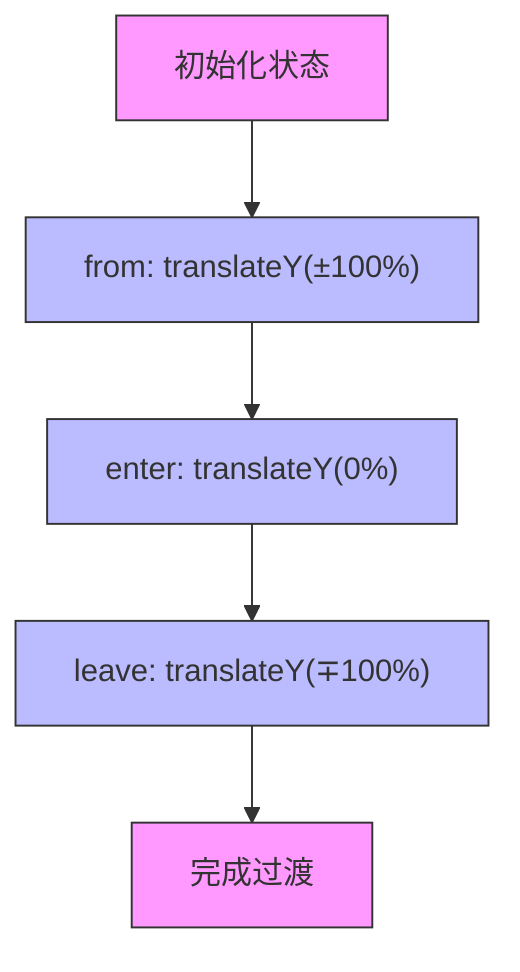
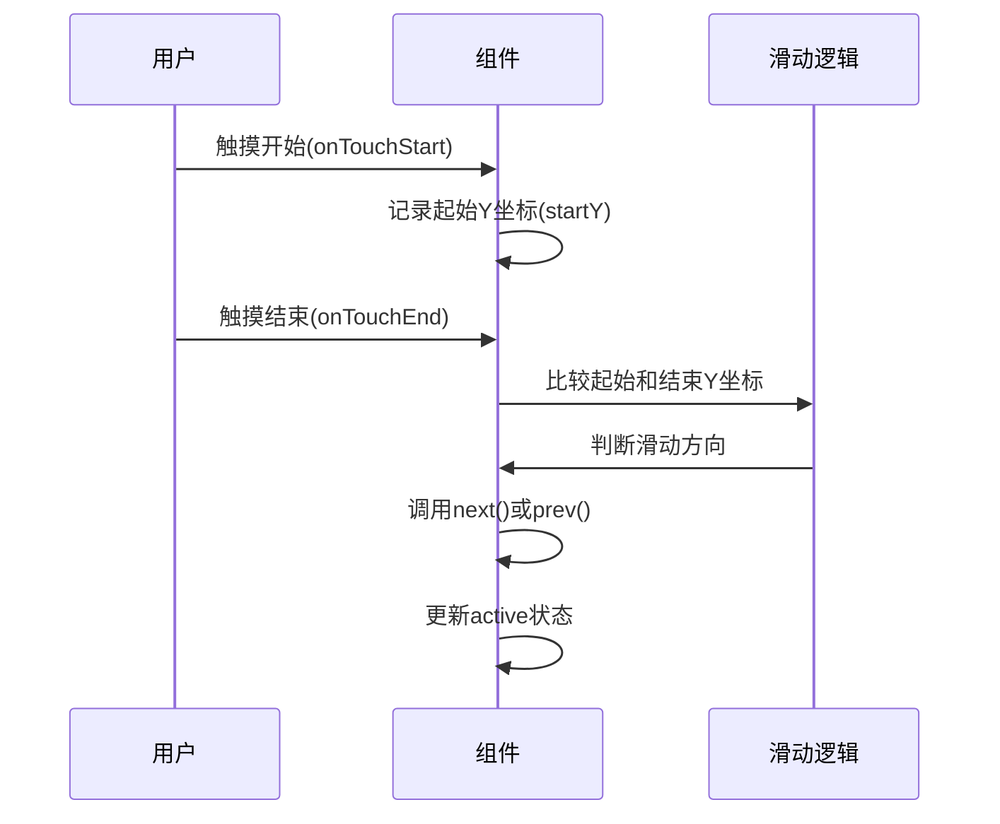
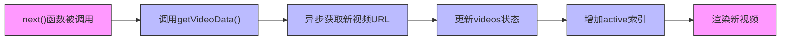
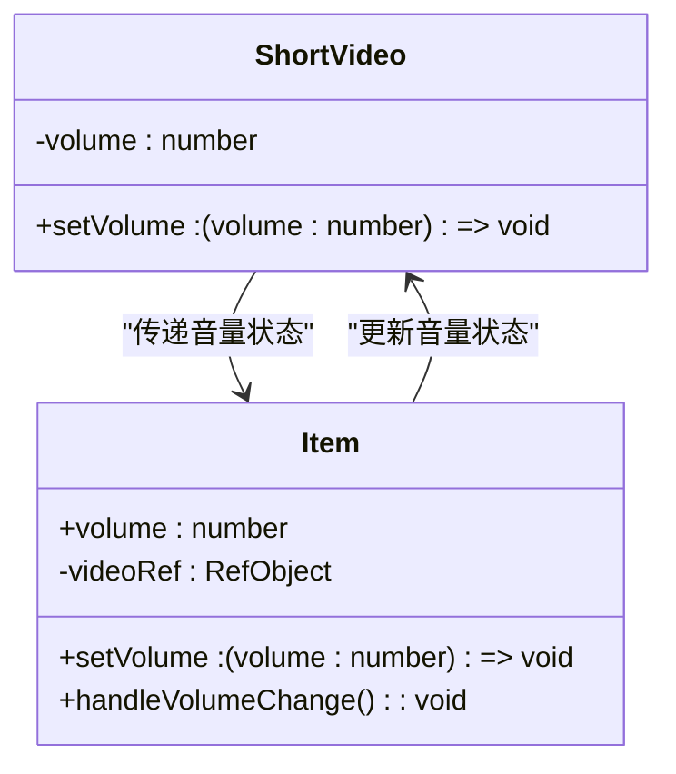
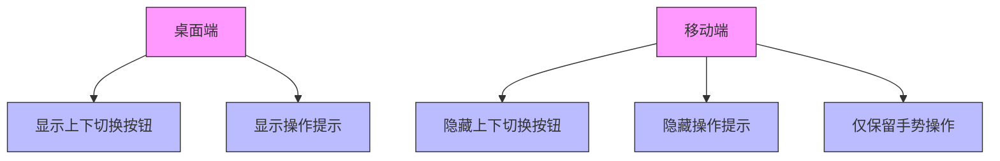

# 短视频上下滑动切换演示

<cite>
**Referenced Files in This Document**   
- [ShortVideo.tsx](file://src/app/demo/_components/ShortVideo.tsx)
- [api.ts](file://src/app/demo/api.ts)
</cite>

## 目录
1. [简介](#简介)
2. [核心组件分析](#核心组件分析)
3. [动画过渡机制](#动画过渡机制)
4. [手势滑动控制](#手势滑动控制)
5. [视频列表动态加载](#视频列表动态加载)
6. [音量控制状态管理](#音量控制状态管理)
7. [移动端响应式设计](#移动端响应式设计)

## 简介

`ShortVideo` 组件实现了类似抖音的短视频上下滑动切换体验。该组件通过手势识别、动画过渡和动态数据加载等技术，为用户提供流畅的视频浏览体验。本文档将详细阐述该组件的实现原理和关键技术细节。

**Section sources**
- [ShortVideo.tsx](file://src/app/demo/_components/ShortVideo.tsx#L1-L142)

## 核心组件分析

`ShortVideo` 组件是实现短视频滑动切换的核心，它通过状态管理和动画库实现了流畅的用户体验。组件接收视频数据作为输入，并维护当前活动视频的索引、滑动方向等状态。

组件内部使用了 `react-spring` 库的 `useTransition` 钩子来实现动画效果，并通过触摸事件处理函数来识别用户的滑动手势。同时，组件还实现了视频列表的动态加载和音量控制功能。

```mermaid
classDiagram
class ShortVideo {
+data : string[]
-videos : string[]
-isNext : boolean
-active : number
-volume : number
-startY : number | null
+next() : void
+prev() : void
+onTouchStart(e : TouchEvent) : void
+onTouchEnd(e : TouchEvent) : void
}
class Item {
+src : string
+volume : number
+setVolume : (volume : number) => void
-videoRef : RefObject<HTMLVideoElement>
+handleVolumeChange() : void
}
ShortVideo --> Item : "渲染"
ShortVideo --> "react-spring" : "使用 useTransition"
ShortVideo --> api : "调用 getVideoData"
```

**Diagram sources**
- [ShortVideo.tsx](file://src/app/demo/_components/ShortVideo.tsx#L8-L102)
- [ShortVideo.tsx](file://src/app/demo/_components/ShortVideo.tsx#L110-L141)

**Section sources**
- [ShortVideo.tsx](file://src/app/demo/_components/ShortVideo.tsx#L8-L142)

## 动画过渡机制

`ShortVideo` 组件使用 `react-spring` 库的 `useTransition` 钩子来实现视频切换的动画效果。该动画配置通过 `from`、`enter` 和 `leave` 三个状态来定义视频元素的变换逻辑。



**Diagram sources**
- [ShortVideo.tsx](file://src/app/demo/_components/ShortVideo.tsx#L46-L48)

`useTransition` 的配置如下：
- `from`: 根据滑动方向设置初始位置，向上滑动时为 `translateY(100%)`，向下滑动时为 `translateY(-100%)`
- `enter`: 进入动画，目标位置为 `translateY(0%)`，即居中显示
- `leave`: 离开动画，根据滑动方向设置离开位置，与 `from` 相反

这种配置实现了视频从屏幕外滑入、居中显示、再从另一侧滑出的流畅动画效果。动画持续时间为 400 毫秒，确保了用户体验的流畅性。

**Section sources**
- [ShortVideo.tsx](file://src/app/demo/_components/ShortVideo.tsx#L70-L75)

## 手势滑动控制

`ShortVideo` 组件通过 `onTouchStart` 和 `onTouchEnd` 事件处理函数来识别用户的滑动手势，并据此触发视频的切换。



**Diagram sources**
- [ShortVideo.tsx](file://src/app/demo/_components/ShortVideo.tsx#L46-L60)

`onTouchStart` 函数在用户开始触摸时记录触摸点的 Y 坐标，而 `onTouchEnd` 函数在触摸结束时比较起始和结束的 Y 坐标来判断滑动方向：
- 如果结束 Y 坐标小于起始 Y 坐标，则为向上滑动，调用 `next()` 切换到下一个视频
- 如果结束 Y 坐标大于起始 Y 坐标，则为向下滑动，调用 `prev()` 切换到上一个视频

这种实现方式简单而有效，能够准确识别用户的滑动意图，提供直观的操作体验。

**Section sources**
- [ShortVideo.tsx](file://src/app/demo/_components/ShortVideo.tsx#L46-L60)

## 视频列表动态加载

`ShortVideo` 组件实现了视频列表的动态加载机制，通过异步获取新视频 URL 来扩展视频列表。



**Diagram sources**
- [ShortVideo.tsx](file://src/app/demo/_components/ShortVideo.tsx#L52-L57)
- [api.ts](file://src/app/demo/api.ts#L1-L7)

当用户向上滑动切换到下一个视频时，`next()` 函数会被调用。该函数首先调用 `getVideoData()` 异步函数获取新的视频 URL，然后将新 URL 添加到视频列表中，并更新当前活动视频的索引。

`getVideoData()` 函数通过 `fetch` 请求从指定的 API 接口获取视频数据，返回一个包含视频 URL 的 Promise。这种动态加载机制确保了用户在浏览视频时能够持续获得新的内容，提升了用户体验。

**Section sources**
- [ShortVideo.tsx](file://src/app/demo/_components/ShortVideo.tsx#L52-L57)
- [api.ts](file://src/app/demo/api.ts#L1-L7)

## 音量控制状态管理

`ShortVideo` 组件实现了音量控制状态管理，通过 `volume` 状态来控制视频的静音和音量调节。



**Diagram sources**
- [ShortVideo.tsx](file://src/app/demo/_components/ShortVideo.tsx#L10-L14)
- [ShortVideo.tsx](file://src/app/demo/_components/ShortVideo.tsx#L110-L141)

组件初始化时将 `volume` 状态设置为 0，即默认静音。每个视频项（`Item` 组件）都会接收 `volume` 状态和 `setVolume` 函数作为 props。当视频组件挂载或 `volume` 状态变化时，会通过 `useEffect` 钩子将视频元素的实际音量同步到状态值。

同时，视频元素的 `onVolumeChange` 事件监听器会调用 `setVolume` 函数来更新全局音量状态，实现了音量控制的双向绑定。视频元素的 `muted` 属性根据 `volume` 是否为 0 来决定是否静音，确保了静音状态的正确显示。

**Section sources**
- [ShortVideo.tsx](file://src/app/demo/_components/ShortVideo.tsx#L10-L14)
- [ShortVideo.tsx](file://src/app/demo/_components/ShortVideo.tsx#L110-L141)

## 移动端响应式设计

`ShortVideo` 组件采用了响应式设计策略，在移动端隐藏按钮，仅保留手势操作，优化了移动设备的用户体验。



**Diagram sources**
- [ShortVideo.tsx](file://src/app/demo/_components/ShortVideo.tsx#L22-L23)
- [ShortVideo.tsx](file://src/app/demo/_components/ShortVideo.tsx#L90-L97)

通过使用 CSS 类名中的 `xs:` 前缀（如 `xs:block` 和 `xs:hidden`），组件能够根据屏幕尺寸自动调整显示内容。在桌面端，组件显示上下切换按钮和操作提示文字；而在移动端，这些按钮和提示会被隐藏，仅保留通过触摸事件处理的手势操作。

这种设计策略符合移动端的交互习惯，避免了屏幕空间的浪费，让用户能够专注于视频内容本身。同时，通过隐藏非必要的 UI 元素，提升了移动端的视觉简洁性和操作流畅性。

**Section sources**
- [ShortVideo.tsx](file://src/app/demo/_components/ShortVideo.tsx#L22-L23)
- [ShortVideo.tsx](file://src/app/demo/_components/ShortVideo.tsx#L90-L97)