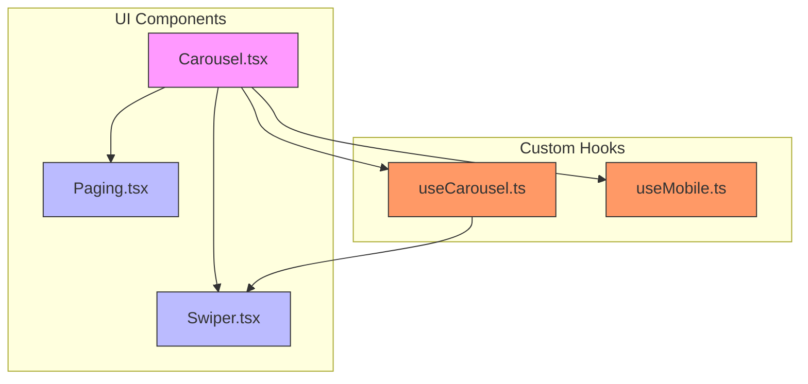
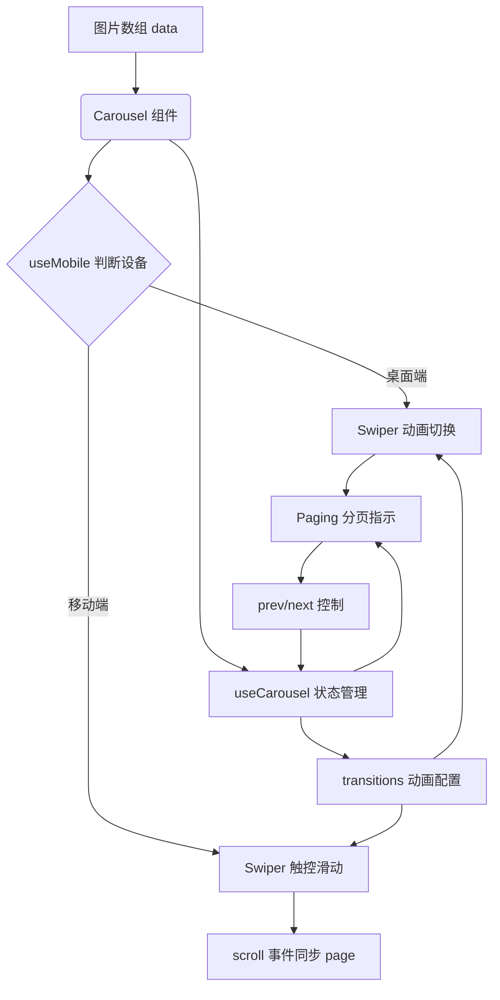
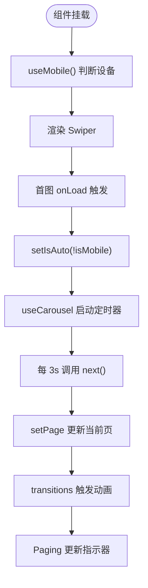
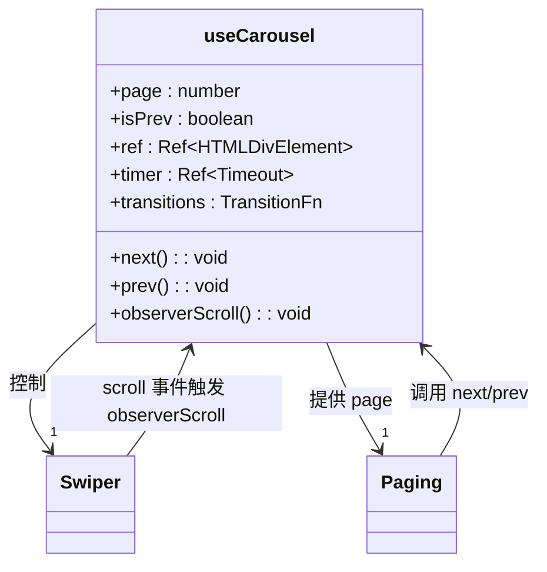
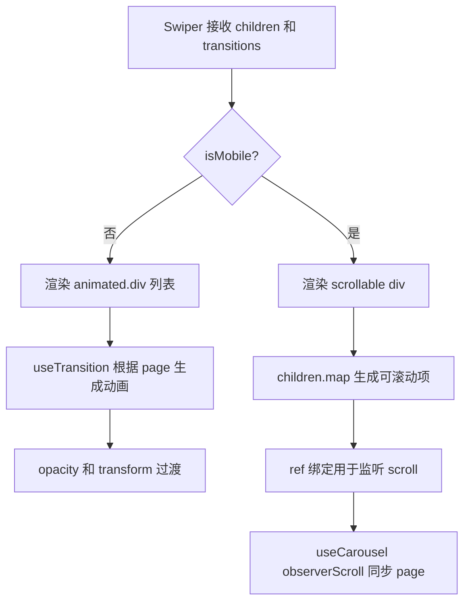
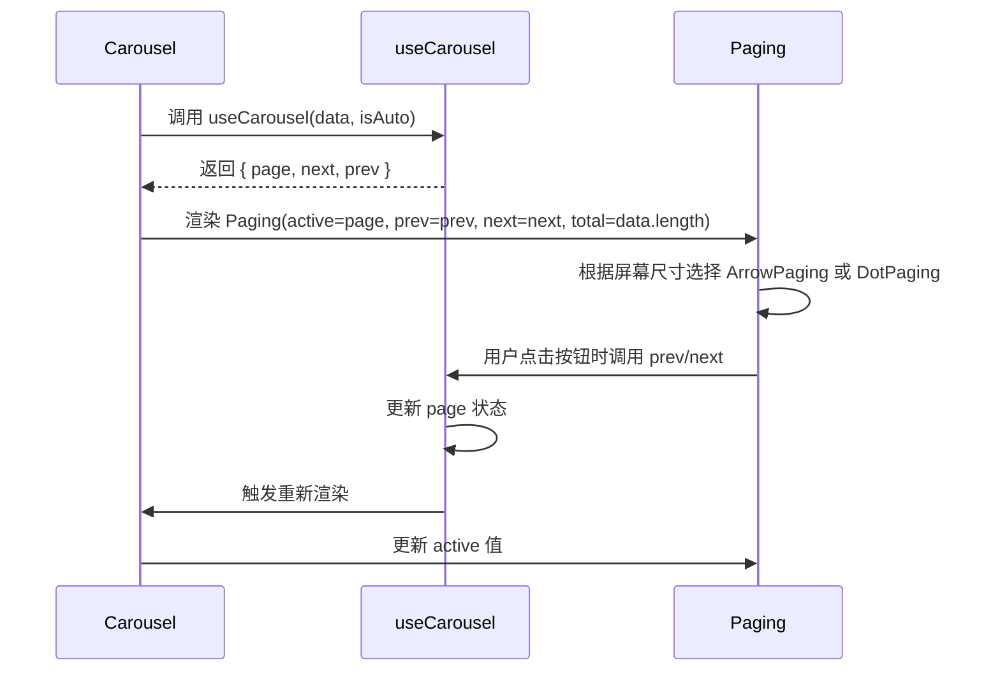
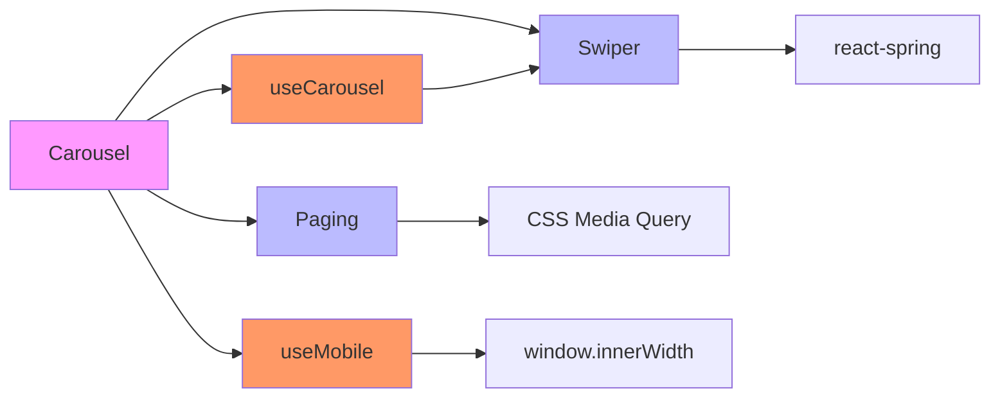

# 轮播组件演示

<cite>
**本文档引用的文件**  
- [Carousel.tsx](file://src/app/demo/_components/Carousel.tsx)
- [Swiper.tsx](file://src/app/_components/Swiper.tsx)
- [Paging.tsx](file://src/app/_components/Paging.tsx)
- [useCarousel.ts](file://src/app/hooks/useCarousel.ts)
- [useMobile.ts](file://src/app/hooks/useMobile.ts)
</cite>

## 目录
1. [简介](#简介)
2. [项目结构](#项目结构)
3. [核心组件](#核心组件)
4. [架构概述](#架构概述)
5. [详细组件分析](#详细组件分析)
6. [依赖分析](#依赖分析)
7. [性能考虑](#性能考虑)
8. [故障排除指南](#故障排除指南)
9. [结论](#结论)

## 简介
本文档详细说明 `Carousel` 组件的实现机制，涵盖其依赖的 `useCarousel` 自定义 Hook 如何管理轮播状态（包括当前页码、前后切换逻辑与动画过渡），并解释 `Swiper` 组件如何结合 CSS transition 实现平滑滑动效果，同时支持移动端 Touch 事件适配。文档还提供图片数组传入方式的使用示例，分析自动播放控制逻辑及首图加载后触发的行为，并说明 `Paging` 分页指示器与轮播状态的联动方式。

## 项目结构
轮播功能相关文件集中于 `src/app` 目录下，按功能模块组织清晰：
- 核心轮播组件位于 `demo/_components/Carousel.tsx`
- 滑动容器组件 `Swiper.tsx` 位于 `_components` 目录
- 分页指示器组件 `Paging.tsx` 同样位于 `_components` 目录
- 自定义 Hook `useCarousel.ts` 和 `useMobile.ts` 位于 `hooks` 目录，分别处理轮播逻辑与设备适配判断

该结构体现了组件职责分离的设计原则，便于维护与复用。

**图示来源**  
- [Carousel.tsx](file://src/app/demo/_components/Carousel.tsx)
- [Swiper.tsx](file://src/app/_components/Swiper.tsx)
- [Paging.tsx](file://src/app/_components/Paging.tsx)
- [useCarousel.ts](file://src/app/hooks/useCarousel.ts)
- [useMobile.ts](file://src/app/hooks/useMobile.ts)

**本节来源**  
- [src/app/demo/_components/Carousel.tsx](file://src/app/demo/_components/Carousel.tsx)
- [src/app/_components/Swiper.tsx](file://src/app/_components/Swiper.tsx)
- [src/app/_components/Paging.tsx](file://src/app/_components/Paging.tsx)
- [src/app/hooks/useCarousel.ts](file://src/app/hooks/useCarousel.ts)
- [src/app/hooks/useMobile.ts](file://src/app/hooks/useMobile.ts)

## 核心组件
`Carousel` 是轮播功能的主控组件，负责整合 `useCarousel`、`Swiper` 和 `Paging` 三大模块。它接收图片数组 `data` 作为输入，通过 `useMobile` 判断设备类型，并根据首张图片加载状态决定是否开启自动播放。

**本节来源**  
- [Carousel.tsx](file://src/app/demo/_components/Carousel.tsx#L1-L56)

## 架构概述
整个轮播系统采用“状态驱动 + 动画库 + 视图渲染”三层架构：
1. **状态层**：由 `useCarousel` 提供，管理当前页码、方向判断、自动播放定时器等
2. **动画层**：使用 `@react-spring/web` 的 `useTransition` 实现平滑过渡动画
3. **视图层**：`Swiper` 负责渲染动画内容，`Paging` 提供分页指示，`Carousel` 统一调度

移动端通过监听 `scroll` 事件实现触控滑动，桌面端则依赖按钮控制。

**图示来源**  
- [Carousel.tsx](file://src/app/demo/_components/Carousel.tsx#L1-L56)
- [useCarousel.ts](file://src/app/hooks/useCarousel.ts#L8-L68)
- [Swiper.tsx](file://src/app/_components/Swiper.tsx#L8-L40)
- [Paging.tsx](file://src/app/_components/Paging.tsx#L8-L19)

## 详细组件分析

### Carousel 组件分析
`Carousel` 组件作为容器，协调各子组件工作。其核心逻辑包括：
- 接收 `data` 图片数组并渲染 `Image` 列表
- 使用 `useMobile` 检测设备类型以调整样式
- 通过 `onLoad` 事件在首图加载后启用自动播放（非移动端）
- 将 `useCarousel` 返回的 `ref` 传递给 `Swiper` 以监听滚动

**图示来源**  
- [Carousel.tsx](file://src/app/demo/_components/Carousel.tsx#L1-L56)
- [useCarousel.ts](file://src/app/hooks/useCarousel.ts#L8-L68)

**本节来源**  
- [Carousel.tsx](file://src/app/demo/_components/Carousel.tsx#L1-L56)

### useCarousel Hook 分析
`useCarousel` 是轮播逻辑的核心，封装了状态管理与动画配置。

#### 状态管理
- `page`：当前页码，使用 `useState` 管理
- `isPrev`：方向标志，用于动画方向判断
- `ref`：指向移动端滑动容器，用于监听 `scroll` 事件
- `timer`：自动播放定时器引用

#### 动画配置
使用 `useTransition` 根据 `page` 值生成动画样式：
- 进入动画：`translateX(0%)`
- 离开动画：根据方向为 `translateX(-100%)` 或 `translateX(100%)`
- 透明度从 `0` 到 `1` 渐变

#### 切换逻辑
- `next()`：页码加 1，取模防止越界，设置 `isPrev = false`
- `prev()`：页码减 1，加长度后取模，设置 `isPrev = true`

#### 自动播放
通过 `useEffect` 监听 `isAuto` 变化，启动或清除定时器，每 3 秒调用 `next()`。

#### 触控同步
`observerScroll` 函数监听 `scrollLeft` 变化，计算当前页码并更新 `page` 状态，实现触控滑动与状态同步。

**图示来源**  
- [useCarousel.ts](file://src/app/hooks/useCarousel.ts#L8-L68)

**本节来源**  
- [useCarousel.ts](file://src/app/hooks/useCarousel.ts#L8-L68)

### Swiper 组件分析
`Swiper` 组件负责渲染轮播内容，支持双模式：
- **桌面端**：使用 `react-spring` 动画切换，`absolute` 定位叠加
- **移动端**：使用原生 `overflow-x-auto` 滚动，配合 `snap-x` 实现磁吸效果

#### 桌面端动画模式
- 外层 `relative` 容器
- 每个子项 `absolute inset-0` 覆盖全屏
- `transitions` 函数生成带动画的 `animated.div`

#### 移动端触控模式
- 使用 `ref` 绑定滚动容器
- `overflow-x-auto` 启用横向滚动
- `snap-x snap-mandatory` 实现页面级滑动
- `snap-always snap-center` 确保居中对齐

**图示来源**  
- [Swiper.tsx](file://src/app/_components/Swiper.tsx#L8-L40)

**本节来源**  
- [Swiper.tsx](file://src/app/_components/Swiper.tsx#L8-L40)

### Paging 组件分析
`Paging` 组件根据设备类型渲染不同分页指示器：
- **桌面端**：`ArrowPaging`，显示左右箭头与 `当前/总数` 文字
- **移动端**：`DotPaging`，显示圆点指示器，当前页高亮

#### 状态联动
- 接收 `active`（当前页）、`total`（总数）、`prev`、`next` 回调
- `ArrowPaging` 的按钮绑定 `prev`/`next` 函数
- `DotPaging` 的圆点根据 `active === i` 判断是否高亮

**图示来源**  
- [Paging.tsx](file://src/app/_components/Paging.tsx#L8-L19)
- [Carousel.tsx](file://src/app/demo/_components/Carousel.tsx#L1-L56)

**本节来源**  
- [Paging.tsx](file://src/app/_components/Paging.tsx#L8-L60)

## 依赖分析
轮播组件体系依赖关系清晰，无循环依赖：

**图示来源**  
- [Carousel.tsx](file://src/app/demo/_components/Carousel.tsx)
- [useCarousel.ts](file://src/app/hooks/useCarousel.ts)
- [Swiper.tsx](file://src/app/_components/Swiper.tsx)
- [Paging.tsx](file://src/app/_components/Paging.tsx)
- [useMobile.ts](file://src/app/hooks/useMobile.ts)

**本节来源**  
- [Carousel.tsx](file://src/app/demo/_components/Carousel.tsx)
- [useCarousel.ts](file://src/app/hooks/useCarousel.ts)
- [Swiper.tsx](file://src/app/_components/Swiper.tsx)
- [Paging.tsx](file://src/app/_components/Paging.tsx)
- [useMobile.ts](file://src/app/hooks/useMobile.ts)

## 性能考虑
- **图片优化**：使用 `next/image` 支持懒加载、占位符模糊、质量压缩
- **动画性能**：`react-spring` 使用硬件加速的 `transform` 和 `opacity`
- **事件监听**：`scroll` 事件绑定在 `useEffect` 中，确保正确清理
- **内存管理**：`timer` 和 `ref` 均在组件卸载时清理，避免内存泄漏
- **条件渲染**：移动端与桌面端组件按需渲染，减少 DOM 节点

## 故障排除指南
- **自动播放未启动**：检查首图是否加载，`onLoad` 是否触发，`isMobile` 是否正确
- **触控滑动不同步**：确认 `Swiper` 的 `ref` 已正确传递，`observerScroll` 是否绑定
- **动画卡顿**：检查 `transitions` 配置，避免频繁重渲染
- **分页指示错误**：验证 `page` 状态是否正确更新，`total` 是否与 `data.length` 一致
- **样式错乱**：检查 `tailwind` 类名拼写，特别是 `snap` 相关类

**本节来源**  
- [Carousel.tsx](file://src/app/demo/_components/Carousel.tsx#L41-L44)
- [useCarousel.ts](file://src/app/hooks/useCarousel.ts#L38-L70)
- [Swiper.tsx](file://src/app/_components/Swiper.tsx#L8-L40)

## 结论
`Carousel` 组件通过 `useCarousel` Hook 实现了完整的轮播状态管理，结合 `Swiper` 的双模式渲染（动画 + 触控）和 `Paging` 的智能分页指示，构建了一个高性能、响应式、跨平台兼容的轮播系统。其设计体现了组件化、职责分离与状态驱动的现代前端开发理念，具备良好的可维护性与扩展性。