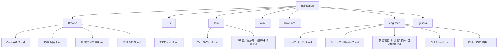
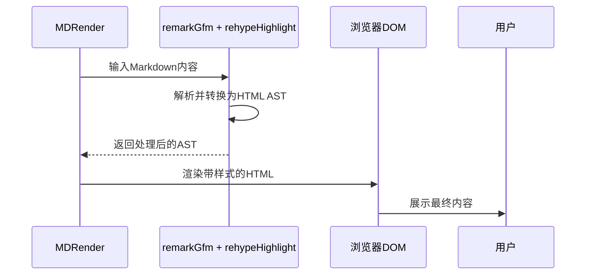
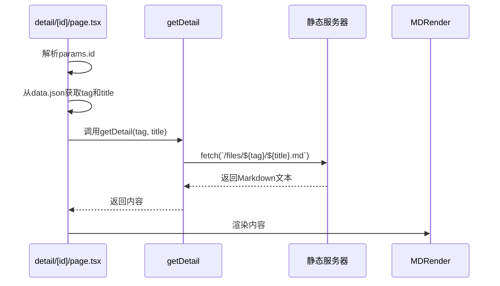

# Markdown内容管理

<cite>
**本文档引用文件**  
- [MDRender.tsx](file://src/app/_components/MDRender.tsx)
- [List.tsx](file://src/app/_components/List.tsx)
- [Perview.tsx](file://src/app/_components/Perview.tsx)
- [page.tsx](file://src/app/detail/[id]/page.tsx)
- [api.ts](file://src/app/common/api.ts)
- [data.json](file://src/config/data.json)
- [public/files](file://public/files)
</cite>

## 目录
1. [介绍](#介绍)
2. [项目结构与知识组织](#项目结构与知识组织)
3. [核心组件分析](#核心组件分析)
4. [动态路由与内容展示集成](#动态路由与内容展示集成)
5. [新增技术文章流程与格式规范](#新增技术文章流程与格式规范)
6. [常见渲染问题及解决方案](#常见渲染问题及解决方案)
7. [总结](#总结)

## 介绍
本系统基于Next.js构建了一套完整的Markdown技术文档管理体系，通过静态文件存储、客户端渲染、动态路由和本地缓存机制，实现了高效、可扩展的技术知识管理。文档内容以Markdown格式按主题分类存放，前端组件负责解析、渲染和导航，支持桌面端与移动端自适应展示。

## 项目结构与知识组织

系统采用清晰的目录结构对技术文档进行分类管理，所有Markdown文件集中存放在`public/files`目录下，按技术主题划分子目录，如Browser、TS、Taro等，便于知识归类与维护。



**图示来源**  
- [public/files](file://public/files)

**本节来源**  
- [public/files](file://public/files)

## 核心组件分析

### MDRender组件：Markdown解析与渲染

`MDRender.tsx`是系统的核心渲染组件，基于`react-markdown`实现Markdown到HTML的转换，并集成语法高亮、原始HTML解析和交互式图片预览功能。

该组件使用以下插件：
- `remark-gfm`：支持GitHub风格的Markdown扩展（如表格、删除线）
- `rehype-highlight`：代码块语法高亮，依赖`highlight.js`的`atom-one-dark`主题
- `rehype-raw`：允许解析原始HTML标签

组件对特定HTML元素进行了定制化处理：
- 图片元素添加点击预览功能，结合`tdesign-react`的`ImageViewer`实现弹窗查看
- 表格元素包裹`overflow-x-auto`容器，支持横向滚动，适配小屏幕设备
- 表头与单元格应用统一的样式类，确保视觉一致性



**图示来源**  
- [MDRender.tsx](file://src/app/_components/MDRender.tsx#L1-L85)

**本节来源**  
- [MDRender.tsx](file://src/app/_components/MDRender.tsx#L1-L85)

### List组件：目录导航生成

`List.tsx`组件负责从`data.json`配置文件中读取文档元信息，并动态生成左侧导航列表。每个条目由`Perview`子组件渲染，包含标题、描述、日期和交互状态。

关键特性：
- 使用`useMobile`钩子检测设备类型，实现响应式布局
- 桌面端支持点击条目右侧展开详情面板，展示Markdown渲染内容
- 移动端点击直接跳转至详情页，优化小屏体验
- 利用`localStorage`缓存已加载的Markdown内容，避免重复请求

组件通过`ref`测量容器高度，实现详情面板的平滑展开动画。

```mermaid
flowchart TD
A[加载data.json] --> B[遍历生成Perview列表]
B --> C{用户点击条目}
C --> |桌面端| D[设置chooseData，展开右侧面板]
C --> |移动端| E[跳转至/detail/[id]]
D --> F[从localStorage读取内容]
F --> G[传递给MDRender渲染]
```

**图示来源**  
- [List.tsx](file://src/app/_components/List.tsx#L8-L70)
- [Perview.tsx](file://src/app/_components/Perview.tsx#L11-L53)

**本节来源**  
- [List.tsx](file://src/app/_components/List.tsx#L8-L70)
- [Perview.tsx](file://src/app/_components/Perview.tsx#L11-L53)

## 动态路由与内容展示集成

`detail/[id]/page.tsx`实现了基于ID的动态路由页面，用于展示单篇技术文章的完整内容。

工作流程如下：
1. 从路由参数`id`获取文章索引
2. 根据索引从`data.json`中查找对应的`tag`和`title`
3. 调用`getDetail(tag, title)` API 获取Markdown文件内容
4. 使用`MDRender`组件渲染内容
5. 同时生成页面元数据（Metadata），包括标题、描述、关键词等，提升SEO

其中`getDetail`函数根据当前环境（开发/生产）动态拼接基础URL，从`/files/{tag}/{title}.md`路径异步加载Markdown文件。



**图示来源**  
- [page.tsx](file://src/app/detail/[id]/page.tsx#L1-L41)
- [api.ts](file://src/app/common/api.ts#L1-L17)

**本节来源**  
- [page.tsx](file://src/app/detail/[id]/page.tsx#L1-L41)
- [api.ts](file://src/app/common/api.ts#L1-L17)

## 新增技术文章流程与格式规范

### 新增流程
1. 在`public/files`下选择或创建合适的主题目录（如`Browser`、`engineer`）
2. 创建新的`.md`文件，文件名应为文章标题（建议使用中文，避免特殊字符）
3. 在`src/config/data.json`中添加一条记录，包含：
   - `tag`：所属目录名
   - `title`：文件名（不含`.md`）
   - `desc`：简短描述（用于列表展示）
   - `date`：发布日期，格式为`YYYY/MM/DD`
4. 确保标题在`data.json`中唯一

### Markdown格式规范
- 使用标准Markdown语法
- 代码块需指定语言类型以启用语法高亮，如```js
- 表格使用GFM语法
- 图片建议使用相对路径或绝对路径引用`public`目录下的资源
- 避免使用内联样式或非标准HTML标签（除非`rehype-raw`支持）

## 常见渲染问题及解决方案

### 特殊字符处理
- **问题**：中文标点、全角字符可能导致解析异常
- **方案**：确保文件编码为UTF-8，使用标准Unicode字符

### 代码块样式定制
- **问题**：默认的`atom-one-dark`主题可能不符合整体UI风格
- **方案**：替换`highlight.js`的主题CSS文件，或在`MDRender.tsx`中引入自定义样式覆盖

### 图片预览失效
- **问题**：`ImageViewer`未正确加载或样式冲突
- **方案**：确保`tdesign-react`正确安装并引入样式，检查`Tooltip`和`Image`组件的props传递

### 表格溢出
- **问题**：宽表格在小屏幕上被截断
- **方案**：已通过包裹`overflow-x-auto`容器解决，确保此样式未被覆盖

### 移动端布局错乱
- **问题**：响应式类名（如`xs:`）未生效
- **方案**：检查`tailwind.config.ts`是否正确配置断点，确保构建时生成对应样式

## 总结
本Markdown内容管理系统通过合理的文件组织、组件化设计和动态路由机制，实现了技术文档的高效管理与展示。`MDRender`提供强大的渲染能力，`List`实现智能导航，`detail/[id]`支持深度链接，整体架构清晰、扩展性强，适合长期积累和技术分享。