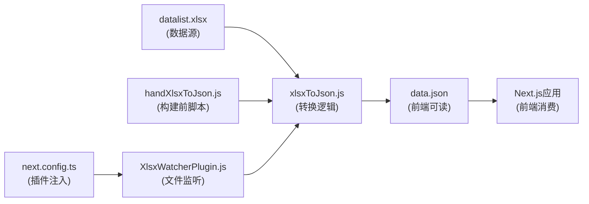
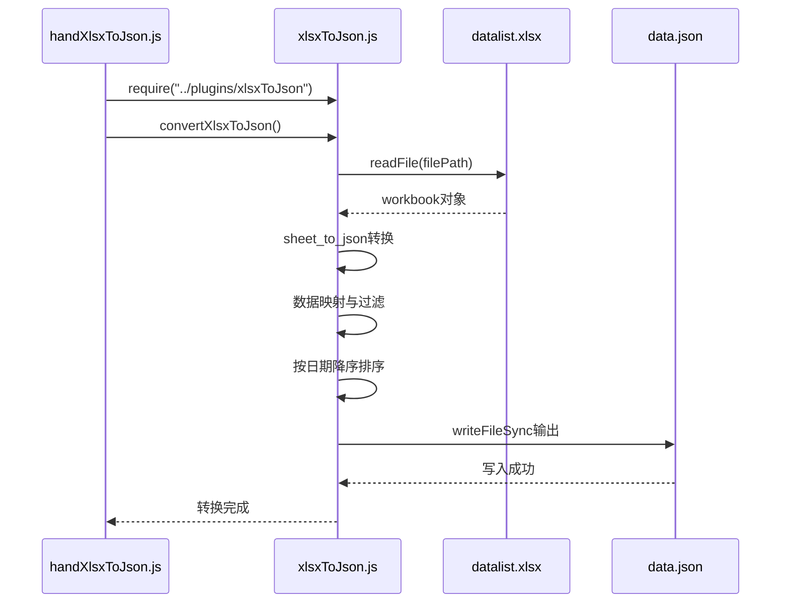
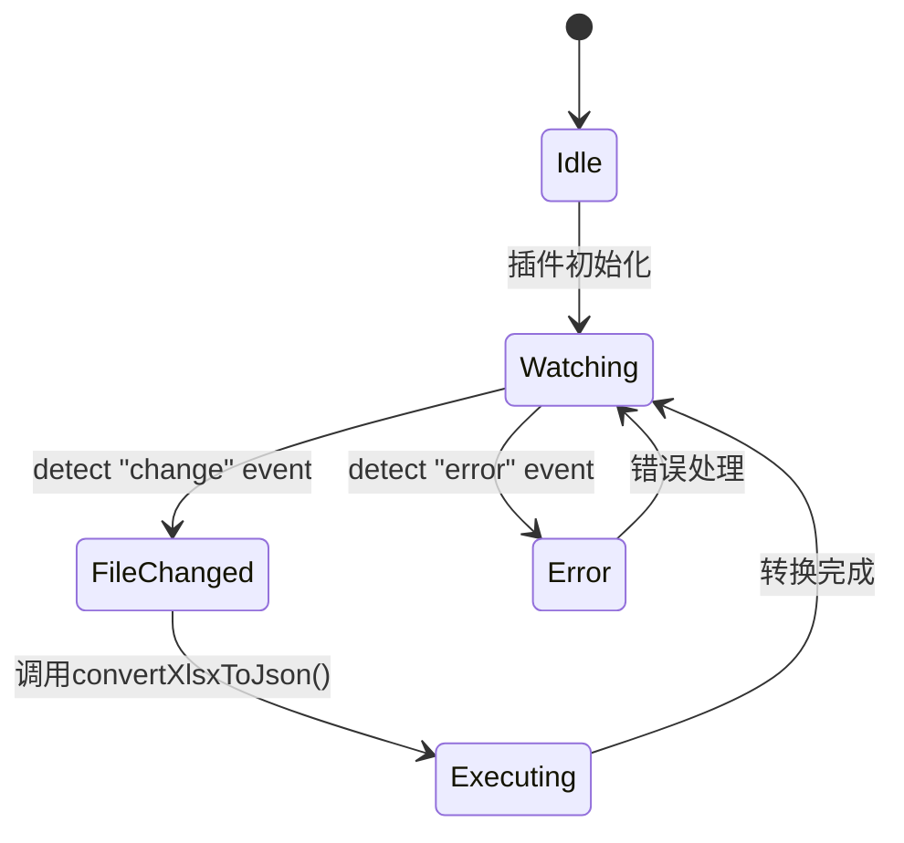
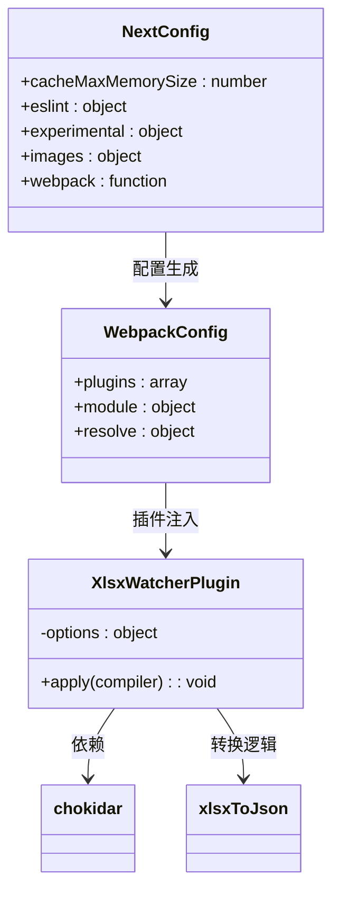
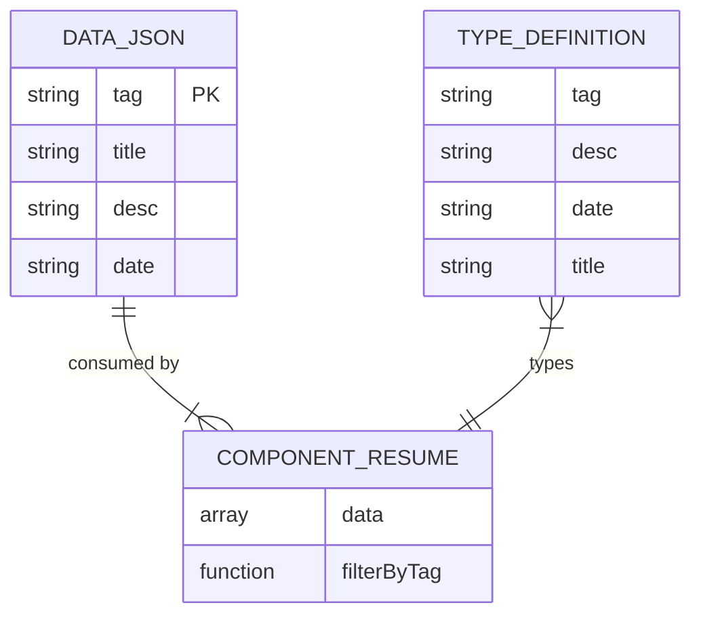

# XLSX数据驱动机制

<cite>
**本文档引用文件**   
- [datalist.xlsx](file://src/config/datalist.xlsx)
- [data.json](file://src/config/data.json)
- [handXlsxToJson.js](file://scripts/handXlsxToJson.js)
- [xlsxToJson.js](file://plugins/xlsxToJson.js)
- [XlsxWatcherPlugin.js](file://plugins/XlsxWatcherPlugin.js)
- [next.config.ts](file://next.config.ts)
- [type.d.ts](file://src/app/_components/type.d.ts)
</cite>

## 目录
1. [项目结构概览](#项目结构概览)
2. [核心数据流设计](#核心数据流设计)
3. [数据源结构与用途](#数据源结构与用途)
4. [构建时数据转换流程](#构建时数据转换流程)
5. [开发环境热更新机制](#开发环境热更新机制)
6. [Webpack插件集成分析](#webpack插件集成分析)
7. [数据更新工作流](#数据更新工作流)
8. [错误排查指南](#错误排查指南)
9. [性能优化建议](#性能优化建议)
10. [类型定义与前端消费](#类型定义与前端消费)

## 项目结构概览

本项目采用模块化分层架构，核心数据驱动机制围绕Excel文件构建。`src/config/`目录存放`datalist.xlsx`原始数据文件和生成的`data.json`，`plugins/`目录包含数据转换逻辑和监听插件，`scripts/`目录提供手动执行脚本，`next.config.ts`完成开发环境插件注入。

**Section sources**
- [project_structure](file://project_structure#L1-L50)

## 核心数据流设计

系统采用"Excel源文件 → JSON中间件 → 前端消费"的数据流模式。通过自动化脚本和Webpack插件实现从结构化Excel到可编程JSON的无缝转换，确保内容更新无需手动干预。

**Diagram sources**
- [datalist.xlsx](file://src/config/datalist.xlsx)
- [xlsxToJson.js](file://plugins/xlsxToJson.js)
- [handXlsxToJson.js](file://scripts/handXlsxToJson.js)
- [XlsxWatcherPlugin.js](file://plugins/XlsxWatcherPlugin.js)
- [next.config.ts](file://next.config.ts)

## 数据源结构与用途

`datalist.xlsx`作为单一数据源，其Sheet1包含四个关键字段：分类(tag)、描述(desc)、日期(date)、标题(title)。该文件统一管理简历项目、技能标签等内容，实现内容与代码分离。

- **分类(tag)**：对应前端路由分类，如"Browser"、"engineer"
- **描述(desc)**：内容摘要，用于列表展示
- **日期(date)**：时间戳，用于排序
- **标题(title)**：内容主标题

所有public/files/下的Markdown文件均通过此数据结构进行索引和导航。

**Section sources**
- [datalist.xlsx](file://src/config/datalist.xlsx#L1-L20)
- [data.json](file://src/config/data.json#L1-L10)

## 构建时数据转换流程

`handXlsxToJson.js`作为预构建脚本，在每次编译前自动执行。该脚本导入`xlsxToJson.js`模块，触发Excel到JSON的转换流程。

**Diagram sources**
- [handXlsxToJson.js](file://scripts/handXlsxToJson.js#L1-L5)
- [xlsxToJson.js](file://plugins/xlsxToJson.js#L5-L29)

**Section sources**
- [handXlsxToJson.js](file://scripts/handXlsxToJson.js#L1-L5)
- [xlsxToJson.js](file://plugins/xlsxToJson.js#L5-L29)

## 开发环境热更新机制

`XlsxWatcherPlugin.js`基于chokidar实现文件系统监听，在开发模式下提供热更新能力。插件在Webpack环境初始化后启动，持续监控`datalist.xlsx`文件变化。

当文件被修改时，自动触发转换函数，生成新的`data.json`，Next.js开发服务器检测到JSON文件变化后自动刷新页面。

**Diagram sources**
- [XlsxWatcherPlugin.js](file://plugins/XlsxWatcherPlugin.js#L2-L26)

**Section sources**
- [XlsxWatcherPlugin.js](file://plugins/XlsxWatcherPlugin.js#L2-L26)

## Webpack插件集成分析

`next.config.ts`中的webpack配置在开发模式下动态注入`XlsxWatcherPlugin`。该集成利用Webpack的`afterEnvironment`钩子，在编译环境准备就绪后启动文件监听。

此设计确保仅在开发环境启用监听，避免生产构建时不必要的资源占用。

**Diagram sources**
- [next.config.ts](file://next.config.ts#L1-L66)
- [XlsxWatcherPlugin.js](file://plugins/XlsxWatcherPlugin.js#L2-L26)

**Section sources**
- [next.config.ts](file://next.config.ts#L1-L66)

## 数据更新工作流

完整的工作流如下：
1. 编辑`src/config/datalist.xlsx`添加/修改内容
2. 保存文件触发chokidar的change事件
3. `XlsxWatcherPlugin`调用`convertXlsxToJson`函数
4. 读取Excel并转换为JSON数组
5. 按日期字段降序排序
6. 写入`src/config/data.json`
7. Next.js检测到文件变化，触发热重载
8. 前端组件重新获取最新数据

生产构建时，`handXlsxToJson.js`在build前执行相同转换逻辑。

**Section sources**
- [xlsxToJson.js](file://plugins/xlsxToJson.js#L5-L29)
- [XlsxWatcherPlugin.js](file://plugins/XlsxWatcherPlugin.js#L10-L15)

## 错误排查指南

### 文件路径错误
- **现象**：`File not found`或`Cannot read property of undefined`
- **排查**：确认`filePath`配置为相对项目根目录的正确路径
- **验证**：检查`xlsxToJson.js`中`filePath = "src/config/datalist.xlsx"`

### JSON格式异常
- **现象**：前端解析失败或类型错误
- **排查**：验证Excel中日期格式统一为`YYYY/M/D`
- **验证**：确保无空分类(tag)行，转换时会过滤空值

### 监听失效
- **现象**：修改Excel后未自动更新
- **排查**：确认`next.config.ts`中开发模式插件注入
- **验证**：启动时应有`Started watching...`日志

### 编码问题
- **现象**：中文乱码
- **排查**：确保Excel保存为UTF-8编码格式

**Section sources**
- [xlsxToJson.js](file://plugins/xlsxToJson.js#L5-L29)
- [XlsxWatcherPlugin.js](file://plugins/XlsxWatcherPlugin.js#L20-L25)

## 性能优化建议

1. **增量更新**：当前为全量转换，可优化为仅处理变更行
2. **内存缓存**：在开发环境中缓存Workbook对象，减少文件读取开销
3. **防抖机制**：为文件监听添加防抖，避免频繁保存导致多次转换
4. **类型校验**：在转换后添加JSON Schema验证，提前发现数据问题
5. **错误恢复**：当JSON写入失败时，保留旧版本避免应用崩溃

这些优化可在不影响现有工作流的前提下逐步实施。

**Section sources**
- [xlsxToJson.js](file://plugins/xlsxToJson.js#L5-L29)
- [XlsxWatcherPlugin.js](file://plugins/XlsxWatcherPlugin.js#L10-L15)

## 类型定义与前端消费

前端通过`type.d.ts`中的`DataType`接口定义消费`data.json`。该类型确保tag、desc、date、title四个字段的类型安全，支持TypeScript的智能提示和编译时检查。

各页面组件（如resume/page.tsx）导入data.json并按需过滤展示。

**Diagram sources**
- [data.json](file://src/config/data.json#L1-L10)
- [type.d.ts](file://src/app/_components/type.d.ts#L1-L5)

**Section sources**
- [data.json](file://src/config/data.json#L1-L10)
- [type.d.ts](file://src/app/_components/type.d.ts#L1-L5)