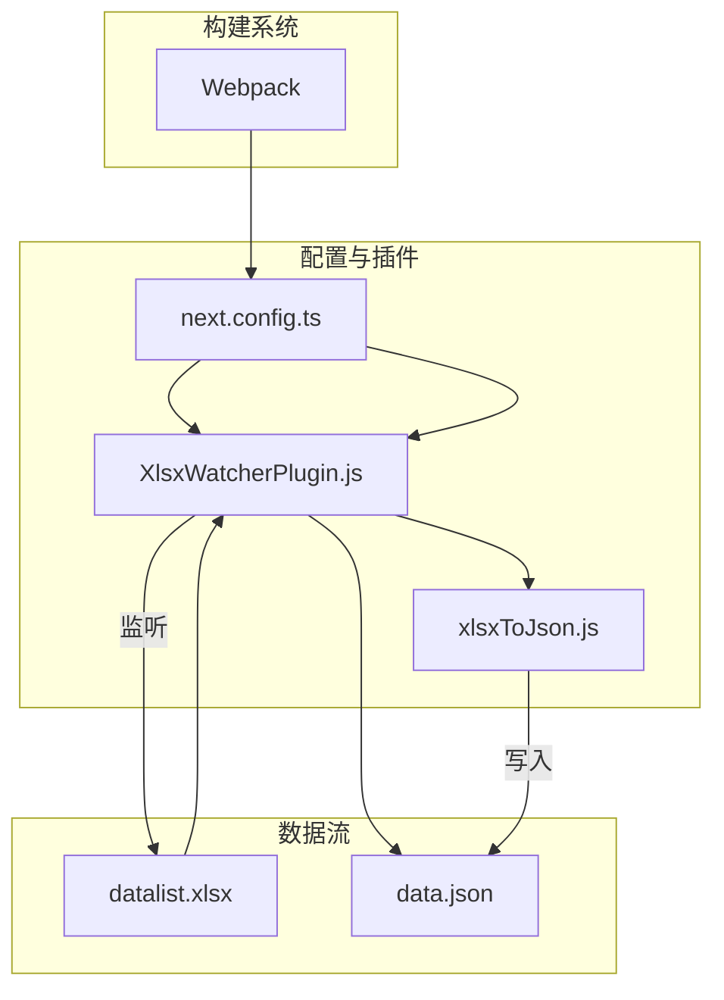
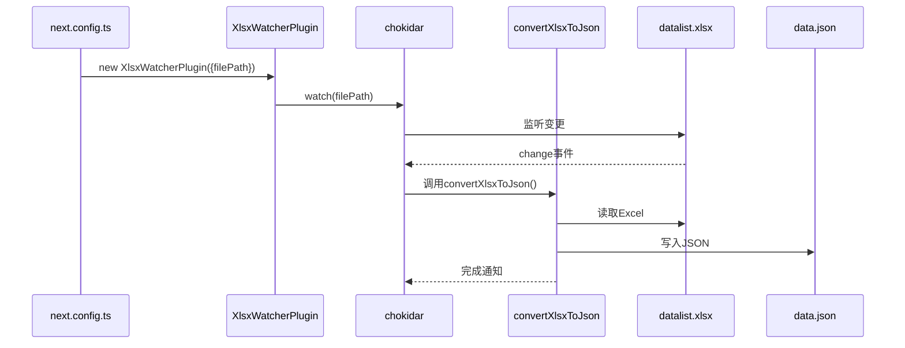
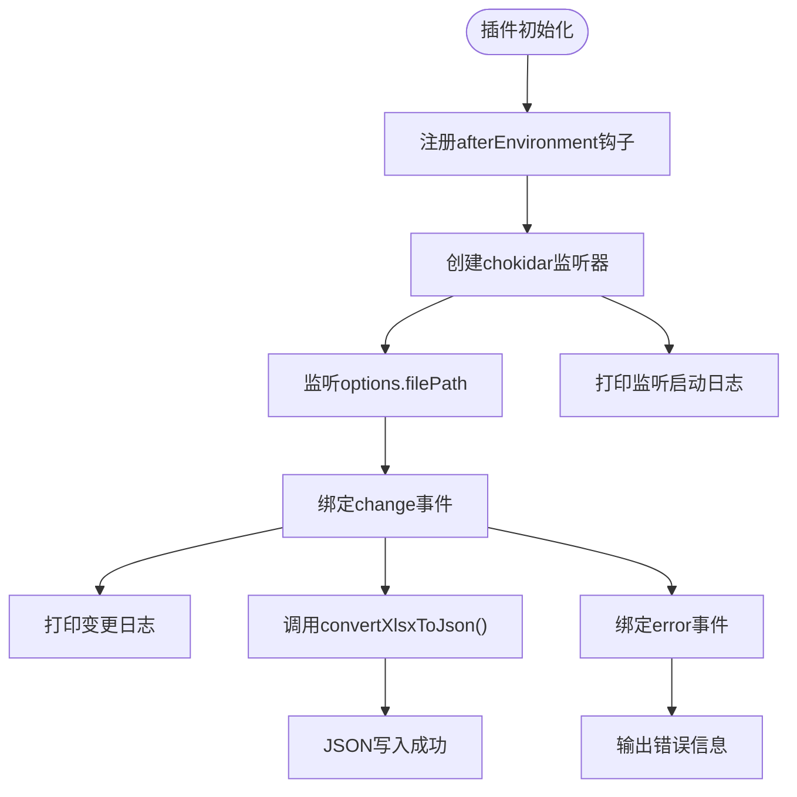
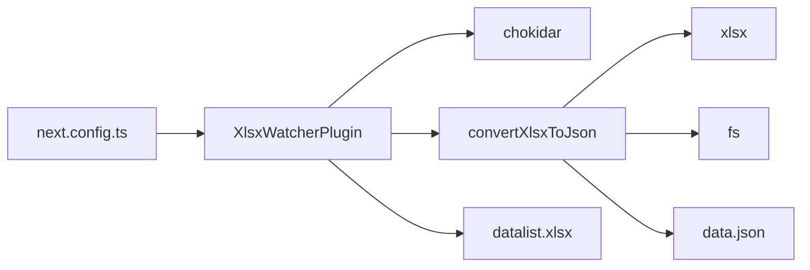

# 开发时热更新机制

<cite>
**本文档引用文件**  
- [XlsxWatcherPlugin.js](file://plugins/XlsxWatcherPlugin.js)
- [xlsxToJson.js](file://plugins/xlsxToJson.js)
- [next.config.ts](file://next.config.ts)
- [data.json](file://src/config/data.json)
</cite>

## 目录
1. [简介](#简介)
2. [项目结构](#项目结构)
3. [核心组件](#核心组件)
4. [架构概述](#架构概述)
5. [详细组件分析](#详细组件分析)
6. [依赖分析](#依赖分析)
7. [性能考虑](#性能考虑)
8. [故障排查指南](#故障排查指南)
9. [结论](#结论)

## 简介
本文档深入解析 `XlsxWatcherPlugin.js` 作为 Webpack 插件在开发环境下的运行机制。重点说明其如何利用 `chokidar` 监听 `datalist.xlsx` 文件变化，并在 `next.config.ts` 的 Webpack 配置中通过 `options.dev` 条件注入插件实例。详细描述 `apply` 方法中 `afterEnvironment` 钩子的调用时机，以及 `change` 事件触发时自动执行 `convertXlsxToJson()` 函数实现热重载的技术细节。结合 `next.config.ts` 中的插件注册代码，解释 `filePath` 配置项的传递过程。提供控制台日志输出示例，说明文件变更检测的反馈机制，并指导开发者如何验证监听功能是否正常工作，包括常见监听失效问题的诊断步骤。

## 项目结构
本项目采用模块化设计，主要分为以下几个目录：
- `plugins/`：存放自定义 Webpack 插件和工具函数，如 `XlsxWatcherPlugin.js` 和 `xlsxToJson.js`
- `src/`：前端源码目录，包含应用逻辑和配置文件
- `public/files/`：静态文档资源
- 根目录下包含构建配置文件，如 `next.config.ts`、`tsconfig.json` 等

关键文件路径：
- 插件入口：`plugins/XlsxWatcherPlugin.js`
- 数据转换逻辑：`plugins/xlsxToJson.js`
- Webpack 配置：`next.config.ts`
- 源数据文件：`src/config/datalist.xlsx`
- 输出目标文件：`src/config/data.json`



**图示来源**  
- [XlsxWatcherPlugin.js](file://plugins/XlsxWatcherPlugin.js#L7-L25)
- [xlsxToJson.js](file://plugins/xlsxToJson.js#L5-L34)
- [next.config.ts](file://next.config.ts#L54-L60)

**本节来源**  
- [next.config.ts](file://next.config.ts#L1-L66)
- [XlsxWatcherPlugin.js](file://plugins/XlsxWatcherPlugin.js#L1-L29)

## 核心组件
`XlsxWatcherPlugin` 是一个自定义 Webpack 插件，用于在开发模式下监听 Excel 文件变化并自动将其转换为 JSON 格式。该插件通过 `chokidar` 实现文件系统监听，结合 `xlsx` 库完成格式转换，最终实现数据文件的热更新。

插件通过构造函数接收配置选项，其中 `filePath` 指定要监听的 `.xlsx` 文件路径。在 Webpack 编译生命周期的 `afterEnvironment` 阶段启动文件监听器，确保在构建环境初始化完成后开始监听。

**本节来源**  
- [XlsxWatcherPlugin.js](file://plugins/XlsxWatcherPlugin.js#L3-L29)
- [xlsxToJson.js](file://plugins/xlsxToJson.js#L1-L36)

## 架构概述
系统整体架构围绕 Webpack 构建流程展开，`XlsxWatcherPlugin` 作为插件注入到构建配置中，在开发模式下激活。当检测到 `datalist.xlsx` 文件变化时，触发 `convertXlsxToJson` 函数执行，将最新数据写入 `data.json`，从而实现前端数据的实时更新。



**图示来源**  
- [XlsxWatcherPlugin.js](file://plugins/XlsxWatcherPlugin.js#L7-L25)
- [next.config.ts](file://next.config.ts#L54-L60)
- [xlsxToJson.js](file://plugins/xlsxToJson.js#L5-L34)

## 详细组件分析

### XlsxWatcherPlugin 分析
`XlsxWatcherPlugin` 类实现了 Webpack 插件接口，其核心是 `apply` 方法。该方法在 Webpack 编译器初始化时被调用，通过 `compiler.hooks.afterEnvironment.tap` 注册钩子函数。

#### apply 方法执行流程


**图示来源**  
- [XlsxWatcherPlugin.js](file://plugins/XlsxWatcherPlugin.js#L7-L25)

#### 配置项传递过程
在 `next.config.ts` 中，通过 `new XlsxWatcherPlugin({ filePath: "src/config/datalist.xlsx" })` 实例化插件，将文件路径作为选项传入。该选项在插件内部通过 `this.options.filePath` 访问，用于指定监听目标。

**本节来源**  
- [XlsxWatcherPlugin.js](file://plugins/XlsxWatcherPlugin.js#L3-L29)
- [next.config.ts](file://next.config.ts#L54-L60)

### 数据转换逻辑分析
`convertXlsxToJson` 函数负责核心的数据转换工作。它读取指定路径的 Excel 文件，提取所有工作表数据并转换为 JSON 格式，经过字段映射和排序处理后写入目标 JSON 文件。

处理流程包括：
1. 使用 `xlsx.readFile` 读取 Excel 文件
2. 遍历工作表名称，使用 `sheet_to_json` 转换数据
3. 提取所需字段（分类、描述、日期、标题）
4. 过滤空分类条目
5. 按日期降序排序
6. 写入 `data.json` 文件

**本节来源**  
- [xlsxToJson.js](file://plugins/xlsxToJson.js#L5-L34)

## 依赖分析
系统依赖关系清晰，主要依赖链如下：



外部依赖：
- `chokidar`：文件系统监听库
- `xlsx`：Excel 文件解析库
- `fs`：Node.js 文件系统模块

**图示来源**  
- [XlsxWatcherPlugin.js](file://plugins/XlsxWatcherPlugin.js#L1-L29)
- [xlsxToJson.js](file://plugins/xlsxToJson.js#L1-L36)

**本节来源**  
- [XlsxWatcherPlugin.js](file://plugins/XlsxWatcherPlugin.js#L1-L29)
- [xlsxToJson.js](file://plugins/xlsxToJson.js#L1-L36)

## 性能考虑
该机制在开发环境下运行良好，但在以下方面需注意性能影响：
- 文件监听本身资源消耗较低，`chokidar` 已优化跨平台兼容性
- Excel 解析可能成为性能瓶颈，特别是大文件场景
- 频繁写入 `data.json` 可能触发 Next.js 热重载，建议合理控制变更频率
- 建议在生产构建中禁用此插件，避免不必要的运行时开销

## 故障排查指南
### 日志输出示例
当文件变更时，控制台将输出：
```
Started watching src/config/datalist.xlsx for changes.
File src/config/datalist.xlsx has been changed. Executing script...
File has been written to src/config/data.json
```

### 验证监听功能
1. 修改 `datalist.xlsx` 文件并保存
2. 查看终端是否输出变更日志
3. 检查 `data.json` 是否更新且内容正确

### 常见问题诊断
- **监听未触发**：确认 `options.dev` 为 `true`，检查文件路径是否正确
- **JSON未更新**：检查 `convertXlsxToJson` 是否抛出异常，验证 Excel 格式是否符合预期
- **重复执行**：`chokidar` 可能因编辑器保存机制触发多次 `change` 事件，可添加防抖处理
- **权限问题**：确保 Node.js 进程有读写 `xlsx` 和 `json` 文件的权限

**本节来源**  
- [XlsxWatcherPlugin.js](file://plugins/XlsxWatcherPlugin.js#L15-L25)
- [xlsxToJson.js](file://plugins/xlsxToJson.js#L32-L34)

## 结论
`XlsxWatcherPlugin` 成功实现了开发环境下 Excel 数据文件的自动转换与热更新。通过 Webpack 插件机制和 `chokidar` 文件监听，结合 `xlsx` 库的数据解析能力，构建了一套高效的数据更新流程。该方案特别适用于内容驱动型应用，使非技术人员可通过 Excel 编辑内容，开发者可实时获取结构化数据，极大提升了开发协作效率。建议在项目中继续优化错误处理和性能表现，确保稳定运行。