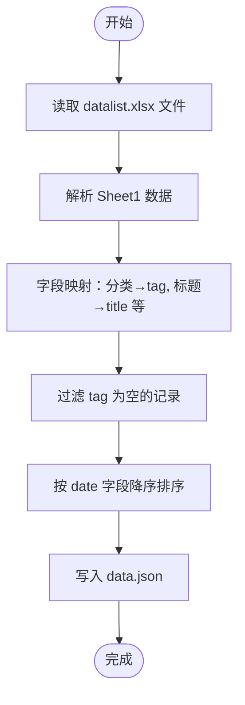
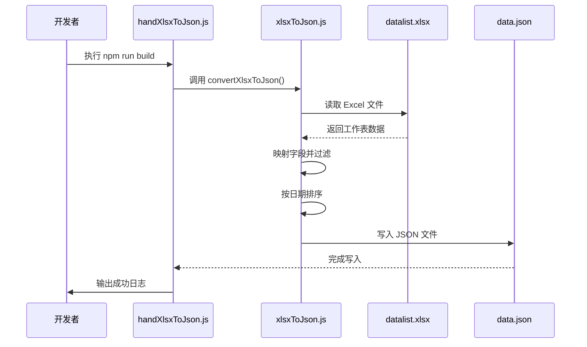

# 构建时数据转换流程

<cite>
**本文档引用的文件**   
- [handXlsxToJson.js](file://scripts/handXlsxToJson.js)
- [xlsxToJson.js](file://plugins/xlsxToJson.js)
- [XlsxWatcherPlugin.js](file://plugins/XlsxWatcherPlugin.js)
- [datalist.xlsx](file://src/config/datalist.xlsx)
- [data.json](file://src/config/data.json)
- [package.json](file://package.json)
- [next.config.ts](file://next.config.ts)
</cite>

## 目录
1. [项目概述](#项目概述)
2. [构建前自动转换机制](#构建前自动转换机制)
3. [核心转换逻辑解析](#核心转换逻辑解析)
4. [字段映射与数据处理](#字段映射与数据处理)
5. [数据排序与输出](#数据排序与输出)
6. [前端消费链路](#前端消费链路)
7. [构建脚本调用时机](#构建脚本调用时机)
8. [常见问题排查与修复建议](#常见问题排查与修复建议)
9. [总结](#总结)

## 项目概述
本项目通过自动化脚本实现从Excel到JSON的数据转换，确保内容更新后能无缝集成到前端应用中。`src/config/datalist.xlsx`作为数据源，存储分类、标题、描述和日期等信息，经由`handXlsxToJson.js`脚本触发转换流程，最终生成供前端组件使用的`data.json`文件。

该机制在构建阶段自动执行，保障了静态资源的实时性与一致性，同时支持开发环境下的热重载监听，提升开发效率。

## 构建前自动转换机制
在项目构建（build）命令执行前，系统会自动运行`scripts/handXlsxToJson.js`脚本，完成Excel到JSON的转换。此流程由`package.json`中的`build`脚本定义：

```json
"build": "node scripts/handXlsxToJson.js && next build"
```

该命令首先执行`handXlsxToJson.js`，调用`plugins/xlsxToJson.js`模块读取`src/config/datalist.xlsx`并生成`src/config/data.json`，随后启动Next.js构建流程。

此外，在开发模式下，`next.config.ts`通过Webpack插件`XlsxWatcherPlugin`实现了对`datalist.xlsx`文件的监听。一旦文件发生变更，将自动重新执行`convertXlsxToJson()`函数，实现实时刷新。

**Section sources**
- [package.json](file://package.json#L5-L7)
- [handXlsxToJson.js](file://scripts/handXlsxToJson.js#L1-L3)
- [XlsxWatcherPlugin.js](file://plugins/XlsxWatcherPlugin.js#L10-L25)
- [next.config.ts](file://next.config.ts#L58-L64)

## 核心转换逻辑解析
`xlsxToJson.js`是数据转换的核心模块，依赖`xlsx`库解析Excel文件，并将其内容结构化为JSON格式。

转换流程如下：
1. 使用`xlsx.readFile()`读取`src/config/datalist.xlsx`
2. 获取工作簿中所有工作表名称（`SheetNames`）
3. 遍历每个工作表，使用`sheet_to_json()`将其转换为JSON数组
4. 提取`Sheet1`中的数据进行字段映射
5. 过滤空值记录
6. 按日期降序排序
7. 写入`src/config/data.json`



**Diagram sources**
- [xlsxToJson.js](file://plugins/xlsxToJson.js#L5-L29)

**Section sources**
- [xlsxToJson.js](file://plugins/xlsxToJson.js#L5-L29)

## 字段映射与数据处理
在数据转换过程中，Excel列名被映射为JSON对象的属性名，具体映射关系如下：

| Excel列名 | JSON字段 | 说明 |
|----------|--------|------|
| 分类     | tag    | 内容所属分类，用于路由与标签展示 |
| 标题     | title  | 文章或文档标题 |
| 描述     | desc   | 内容简要描述 |
| 日期     | date   | 发布日期，格式为 YYYY/M/D |

转换代码使用`map()`方法实现字段重命名：
```js
{
  tag: item["分类"],
  desc: item["描述"],
  date: item["日期"],
  title: item["标题"]
}
```

同时，通过`filter((item) => item.tag !== "")`过滤掉`tag`为空的无效行，确保输出数据的完整性与可用性。

**Section sources**
- [xlsxToJson.js](file://plugins/xlsxToJson.js#L16-L19)

## 数据排序与输出
转换后的数据按`date`字段进行降序排列，确保最新内容优先展示。排序逻辑如下：

```js
data.sort((a, b) => {
  const dateA = new Date(a.date);
  const dateB = new Date(b.date);
  return dateB - dateA;
});
```

使用`new Date()`将字符串日期转换为时间戳进行比较，保证排序准确性。

最终，使用`fs.writeFileSync()`将格式化后的JSON写入`src/config/data.json`，并采用`JSON.stringify(..., null, 4)`保留4个空格缩进，便于人工查看与调试。

**Section sources**
- [xlsxToJson.js](file://plugins/xlsxToJson.js#L21-L29)

## 前端消费链路
转换生成的`data.json`位于`src/config/data.json`，被前端组件直接导入使用。例如，在文章列表页`List.tsx`或详情页`PageContainer.tsx`中，可通过以下方式加载数据：

```ts
import data from '@/config/data.json';
```

该JSON数组包含所有文章元信息，前端可基于`tag`进行分类筛选，按`date`展示时间线，或通过`title`和`desc`渲染列表项。由于数据在构建时生成，具备良好的性能表现与SEO支持。

**Section sources**
- [data.json](file://src/config/data.json#L1-L103)
- [List.tsx](file://src/app/_components/List.tsx)

## 构建脚本调用时机
`handXlsxToJson.js`在两种场景下被调用：

1. **构建时**：执行`npm run build`时，`package.json`中的`build`脚本首先运行该脚本。
2. **开发时**：`next.config.ts`中注册`XlsxWatcherPlugin`，在开发服务器启动后持续监听`datalist.xlsx`文件变化，实时触发转换。

这种双重机制确保了开发与生产环境的数据同步一致性。



**Diagram sources**
- [package.json](file://package.json#L6)
- [handXlsxToJson.js](file://scripts/handXlsxToJson.js#L3)
- [xlsxToJson.js](file://plugins/xlsxToJson.js#L5-L29)

## 常见问题排查与修复建议
### 1. 文件路径错误
**现象**：报错 `File not found` 或 `Cannot read property 'SheetNames' of undefined`  
**原因**：`filePath`配置路径不正确  
**修复**：确认`xlsxToJson.js`中`filePath = "src/config/datalist.xlsx"`路径存在且拼写无误

### 2. Excel格式异常
**现象**：转换后数据缺失或字段为空  
**原因**：Excel列名拼写错误（如“分类”误写为“类别”）或首行非标题行  
**修复**：确保Excel第一行为准确列名：`分类、标题、描述、日期`

### 3. 日期排序失败
**现象**：`data.json`中数据未按时间排序  
**原因**：日期格式不统一（如混用`2025-07-18`与`2025/7/18`）  
**修复**：统一使用`YYYY/M/D`格式，避免横杠或补零

### 4. 监听未生效（开发环境）
**现象**：修改Excel后页面未更新  
**原因**：`XlsxWatcherPlugin`未正确加载  
**修复**：检查`next.config.ts`是否在`webpack`配置中添加插件，且`options.dev`条件成立

### 5. JSON写入失败
**现象**：`EACCES`权限错误  
**原因**：目标目录无写入权限  
**修复**：确保`src/config/`目录可写，或调整`outputJsonPath`

**Section sources**
- [xlsxToJson.js](file://plugins/xlsxToJson.js#L4-L5)
- [XlsxWatcherPlugin.js](file://plugins/XlsxWatcherPlugin.js#L10-L14)
- [next.config.ts](file://next.config.ts#L58-L64)

## 总结
本项目通过`handXlsxToJson.js`脚本实现了构建前自动化的Excel到JSON转换流程，结合`xlsx`库完成数据读取、字段映射、空值过滤与日期排序，并将结果写入前端可消费的`data.json`文件。该机制由`package.json`构建脚本触发，在开发环境中还通过`XlsxWatcherPlugin`实现热更新。整个流程高效、可靠，显著提升了内容维护的便捷性与系统可维护性。

**Section sources**
- [package.json](file://package.json#L6)
- [handXlsxToJson.js](file://scripts/handXlsxToJson.js)
- [xlsxToJson.js](file://plugins/xlsxToJson.js)