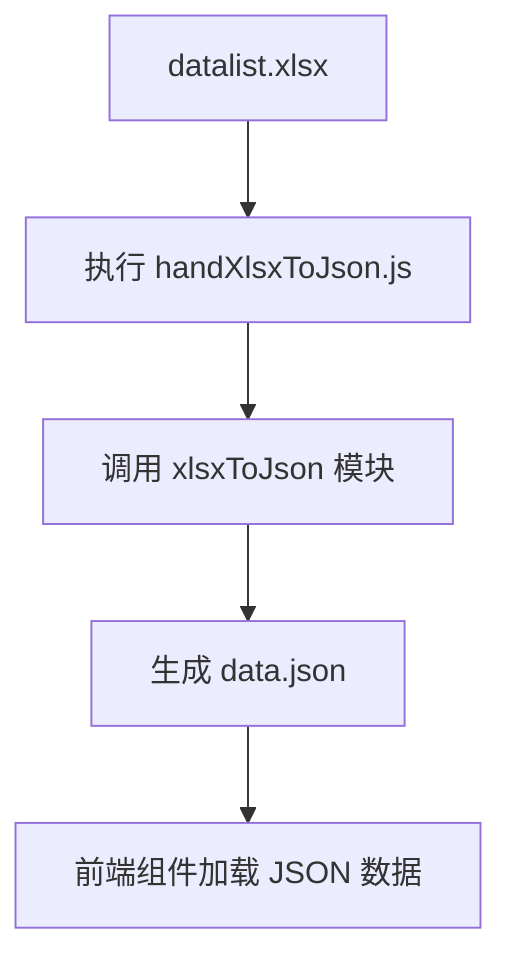
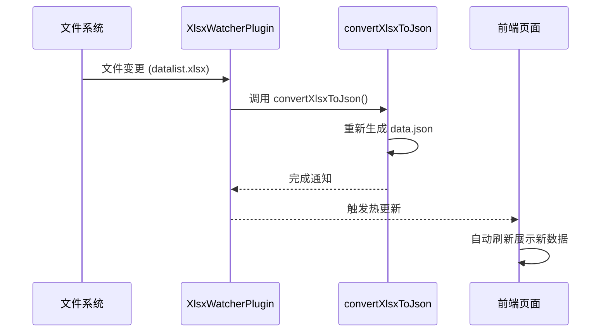
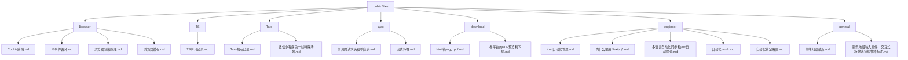

# 内容管理机制

<cite>
**本文档引用的文件**  
- [handXlsxToJson.js](file://scripts/handXlsxToJson.js)
- [XlsxWatcherPlugin.js](file://plugins/XlsxWatcherPlugin.js)
- [data.json](file://src/config/data.json)
- [public/files](file://public/files)
- [Cookie跨域.md](file://public/files/Browser/Cookie跨域.md)
- [JS事件循环.md](file://public/files/Browser/JS事件循环.md)
- [浏览器渲染原理.md](file://public/files/Browser/浏览器渲染原理.md)
- [浏览器缓存.md](file://public/files/Browser/浏览器缓存.md)
- [TS学习记录.md](file://public/files/TS/TS学习记录.md)
- [Taro坑点记录.md](file://public/files/Taro/Taro坑点记录.md)
- [微信小程序的一些特殊场景.md](file://public/files/Taro/微信小程序的一些特殊场景.md)
- [常见的请求头和响应头.md](file://public/files/ajax/常见的请求头和响应头.md)
- [流式传输.md](file://public/files/ajax/流式传输.md)
- [html转png、pdf.md](file://public/files/download/html转png、pdf.md)
- [各平台的PDF预览和下载.md](file://public/files/download/各平台的PDF预览和下载.md)
- [icon自动化管理.md](file://public/files/engineer/icon自动化管理.md)
- [为什么要用Nextjs？.md](file://public/files/engineer/为什么要用Nextjs？.md)
- [多语言自动化同步和jest自动检查.md](file://public/files/engineer/多语言自动化同步和jest自动检查.md)
- [自动化mock.md](file://public/files/engineer/自动化mock.md)
- [自动化约定路由.md](file://public/files/engineer/自动化约定路由.md)
- [前端知识散点.md](file://public/files/general/前端知识散点.md)
- [腾讯地图输入组件：交互式场地选择与物种标注.md](file://public/files/general/腾讯地图输入组件：交互式场地选择与物种标注.md)
</cite>

## 目录
1. [引言](#引言)
2. [数据驱动设计思想](#数据驱动设计思想)
3. [构建时数据转换机制](#构建时数据转换机制)
4. [开发环境热更新监听机制](#开发环境热更新监听机制)
5. [技术文章内容组织结构](#技术文章内容组织结构)
6. [数据流与前端消费模式](#数据流与前端消费模式)
7. [总结](#总结)

## 引言
本项目采用数据驱动的设计思想，通过结构化数据源（Excel 和 Markdown）驱动前端内容展示。核心机制包括：在构建时将 Excel 数据转换为 JSON 供前端使用，开发环境下监听 Excel 变化实现热更新，以及通过目录化的 Markdown 文件组织技术文章内容。该设计提升了内容维护效率与开发体验。

## 数据驱动设计思想
项目以数据为中心，将内容元信息（如标题、标签、描述、日期）与具体内容（Markdown 正文）分离管理。元数据通过 `datalist.xlsx` 统一维护，经脚本处理生成 `data.json`，供前端组件动态渲染列表；正文内容则以 Markdown 文件形式存放于 `public/files` 目录下，按主题分类组织。这种设计实现了内容与代码的解耦，便于非技术人员参与内容维护。

## 构建时数据转换机制
在项目构建阶段，`handXlsxToJson.js` 脚本负责将 `datalist.xlsx` 文件转换为前端可消费的 `data.json` 格式。该脚本在构建流程中被调用，确保每次部署前数据均为最新状态。

**图示来源**  
- [handXlsxToJson.js](file://scripts/handXlsxToJson.js#L1-L4)
- [data.json](file://src/config/data.json#L1-L104)

**本节来源**  
- [handXlsxToJson.js](file://scripts/handXlsxToJson.js#L1-L4)
- [data.json](file://src/config/data.json#L1-L104)

## 开发环境热更新监听机制
在开发环境中，`XlsxWatcherPlugin.js` 作为 Webpack 插件注入构建流程，利用 `chokidar` 监听 `datalist.xlsx` 文件的变化。一旦检测到文件修改，立即触发 `convertXlsxToJson()` 函数重新生成 `data.json`，结合 Next.js 的热更新机制，使前端页面自动刷新，实现开发时的实时反馈。

**图示来源**  
- [XlsxWatcherPlugin.js](file://plugins/XlsxWatcherPlugin.js#L1-L30)

**本节来源**  
- [XlsxWatcherPlugin.js](file://plugins/XlsxWatcherPlugin.js#L1-L30)

## 技术文章内容组织结构
`public/files` 目录用于存放所有技术文章的 Markdown 文件，采用主题分类的目录结构进行组织。每个子目录代表一个技术领域（如 Browser、TS、Taro 等），其下的 `.md` 文件即为具体文章。该结构清晰直观，便于内容查找与维护。

**图示来源**  
- [public/files](file://public/files)
- [Browser](file://public/files/Browser)
- [TS](file://public/files/TS)
- [Taro](file://public/files/Taro)
- [ajax](file://public/files/ajax)
- [download](file://public/files/download)
- [engineer](file://public/files/engineer)
- [general](file://public/files/general)

**本节来源**  
- [public/files](file://public/files)
- [Cookie跨域.md](file://public/files/Browser/Cookie跨域.md)
- [JS事件循环.md](file://public/files/Browser/JS事件循环.md)
- [浏览器渲染原理.md](file://public/files/Browser/浏览器渲染原理.md)
- [浏览器缓存.md](file://public/files/Browser/浏览器缓存.md)
- [TS学习记录.md](file://public/files/TS/TS学习记录.md)
- [Taro坑点记录.md](file://public/files/Taro/Taro坑点记录.md)
- [微信小程序的一些特殊场景.md](file://public/files/Taro/微信小程序的一些特殊场景.md)
- [常见的请求头和响应头.md](file://public/files/ajax/常见的请求头和响应头.md)
- [流式传输.md](file://public/files/ajax/流式传输.md)
- [html转png、pdf.md](file://public/files/download/html转png、pdf.md)
- [各平台的PDF预览和下载.md](file://public/files/download/各平台的PDF预览和下载.md)
- [icon自动化管理.md](file://public/files/engineer/icon自动化管理.md)
- [为什么要用Nextjs？.md](file://public/files/engineer/为什么要用Nextjs？.md)
- [多语言自动化同步和jest自动检查.md](file://public/files/engineer/多语言自动化同步和jest自动检查.md)
- [自动化mock.md](file://public/files/engineer/自动化mock.md)
- [自动化约定路由.md](file://public/files/engineer/自动化约定路由.md)
- [前端知识散点.md](file://public/files/general/前端知识散点.md)
- [腾讯地图输入组件：交互式场地选择与物种标注.md](file://public/files/general/腾讯地图输入组件：交互式场地选择与物种标注.md)

## 数据流与前端消费模式
前端通过 `src/app/_components/List.tsx` 等组件加载 `src/config/data.json`，根据 `tag` 字段匹配 `public/files` 中对应目录的 Markdown 文件路径，实现文章列表的动态渲染。用户点击条目后，通过动态路由 `[id]/page.tsx` 加载并展示对应 Markdown 内容。整个流程实现了数据驱动的内容展示闭环。

**本节来源**  
- [data.json](file://src/config/data.json#L1-L104)
- [List.tsx](file://src/app/_components/List.tsx)
- [page.tsx](file://src/app/detail/[id]/page.tsx)

## 总结
本项目通过 `handXlsxToJson.js` 实现构建时数据转换，`XlsxWatcherPlugin.js` 支持开发环境热更新，结合 `public/files` 的结构化 Markdown 组织，构建了一套高效、可维护的内容管理系统。该数据驱动设计显著提升了内容更新效率与开发体验，是现代前端工程化实践中内容管理的优秀范例。