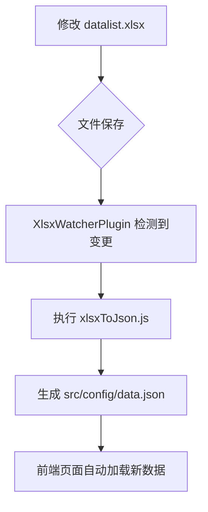

# 开发者贡献指南

<cite>
**本文档引用的文件**  
- [Cookie跨域.md](file://public/files/Browser/Cookie跨域.md)
- [resume/page.tsx](file://src/app/resume/page.tsx)
- [ProjectCard.tsx](file://src/app/resume/ProjectCard.tsx)
- [page.tsx](file://src/app/demo/page.tsx)
- [XlsxWatcherPlugin.js](file://plugins/XlsxWatcherPlugin.js)
- [xlsxToJson.js](file://plugins/xlsxToJson.js)
- [data.json](file://src/config/data.json)
</cite>

## 目录
1. [简介](#简介)
2. [添加新文章](#添加新文章)
3. [更新项目经验](#更新项目经验)
4. [新增交互演示组件](#新增交互演示组件)
5. [更新技能数据](#更新技能数据)
6. [总结](#总结)

## 简介
本指南旨在为开发者提供清晰、可操作的贡献流程，涵盖内容扩展、组件开发与数据更新等核心操作。所有变更均遵循自动化与模块化原则，确保项目维护高效且一致。

## 添加新文章

向项目中添加新的技术文章非常简单，只需将 Markdown 文件放入指定分类目录即可。系统会自动读取并渲染内容。

### 操作步骤
1. 准备 `.md` 格式的 Markdown 文件
2. 将文件放入 `public/files` 下对应的分类文件夹中（如 `Browser`、`TS`、`Taro` 等）
3. 文件命名建议使用简洁明了的中文名称，避免特殊字符
4. 提交后，文章将自动出现在对应分类页面中

例如，添加一篇关于浏览器缓存的新文章：
```
public/files/Browser/浏览器缓存机制详解.md
```

**Section sources**
- [Cookie跨域.md](file://public/files/Browser/Cookie跨域.md)

## 更新项目经验

项目经验展示在简历页面（`/resume`），其内容由 `resume/page.tsx` 中的 JSX 结构和 `ProjectCard` 组件共同驱动。

### 修改方式
1. 打开 `src/app/resume/page.tsx`
2. 在 `<section>` 标签内查找 `<ProjectCard />` 组件调用
3. 添加或修改 `ProjectCard` 的 `props` 参数：
   - `title`: 项目名称
   - `techStack`: 技术栈
   - `description`: 项目描述
   - `points`: 项目亮点数组

新增项目示例如下：
```tsx
<ProjectCard
  title="新项目名称"
  techStack="React + Node.js"
  description="这是一个全新的项目描述。"
  points={["亮点一", "亮点二"]}
/>
```

`ProjectCard` 组件定义位于 `src/app/resume/ProjectCard.tsx`，可根据需要调整样式或结构。

**Section sources**
- [resume/page.tsx](file://src/app/resume/page.tsx#L1-L219)
- [ProjectCard.tsx](file://src/app/resume/ProjectCard.tsx#L1-L38)

## 新增交互演示组件

交互式演示页面（`/demo`）支持动态注册多个功能组件，便于展示前端技术实践。

### 创建流程
1. 在 `src/app/demo/_components` 目录下创建新的组件文件（如 `MyDemo.tsx`）
2. 编写 React 组件逻辑与 UI
3. 在 `src/app/demo/page.tsx` 中导入该组件
4. 将组件插入 `<Tabs>` 的子元素中，并确保 `titles` 数组长度与组件数量一致

#### 示例代码结构
```tsx
import MyDemo from "./_components/MyDemo";
```

在 JSX 中注册：
```tsx
<Tabs titles={["短视频", "拖拽", "壁纸", "动效", "我的演示"]}>
  <ShortVideo data={[video]} />
  <Drag />
  <Wallpaper data={wallpapers} />
  <ReactSpring carousel={wallpapers} />
  <MyDemo />
</Tabs>
```

**Section sources**
- [page.tsx](file://src/app/demo/page.tsx#L1-L36)

## 更新技能数据

技能数据来源于 Excel 文件 `datalist.xlsx`，通过插件实现自动转换为 JSON 并供前端使用。

### 更新流程
1. 修改根目录下的 `datalist.xlsx` 文件（若不存在可创建）
2. 确保工作表名为 `Sheet1`，并包含以下列：
   - 分类（tag）
   - 描述（desc）
   - 日期（date）
   - 标题（title）
3. 保存文件后，插件将自动触发转换

### 自动化机制
项目通过 `XlsxWatcherPlugin.js` 监听 `datalist.xlsx` 文件变化，调用 `xlsxToJson.js` 将其转换为 `src/config/data.json`。

转换逻辑包括：
- 读取 XLSX 表格数据
- 过滤空分类项
- 按日期降序排序
- 输出格式化 JSON 到 `data.json`

前端通过 `data.json` 动态加载技能列表，无需手动修改代码。



**Diagram sources**
- [XlsxWatcherPlugin.js](file://plugins/XlsxWatcherPlugin.js#L1-L30)
- [xlsxToJson.js](file://plugins/xlsxToJson.js#L1-L36)

**Section sources**
- [XlsxWatcherPlugin.js](file://plugins/XlsxWatcherPlugin.js#L1-L30)
- [xlsxToJson.js](file://plugins/xlsxToJson.js#L1-L36)
- [data.json](file://src/config/data.json)

## 总结
本项目采用模块化设计与自动化流程，极大简化了内容维护与功能扩展。开发者可通过标准流程安全高效地进行贡献，无需深入底层实现细节即可完成常见任务。