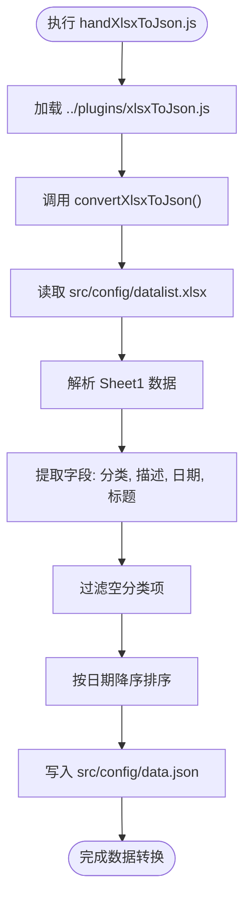
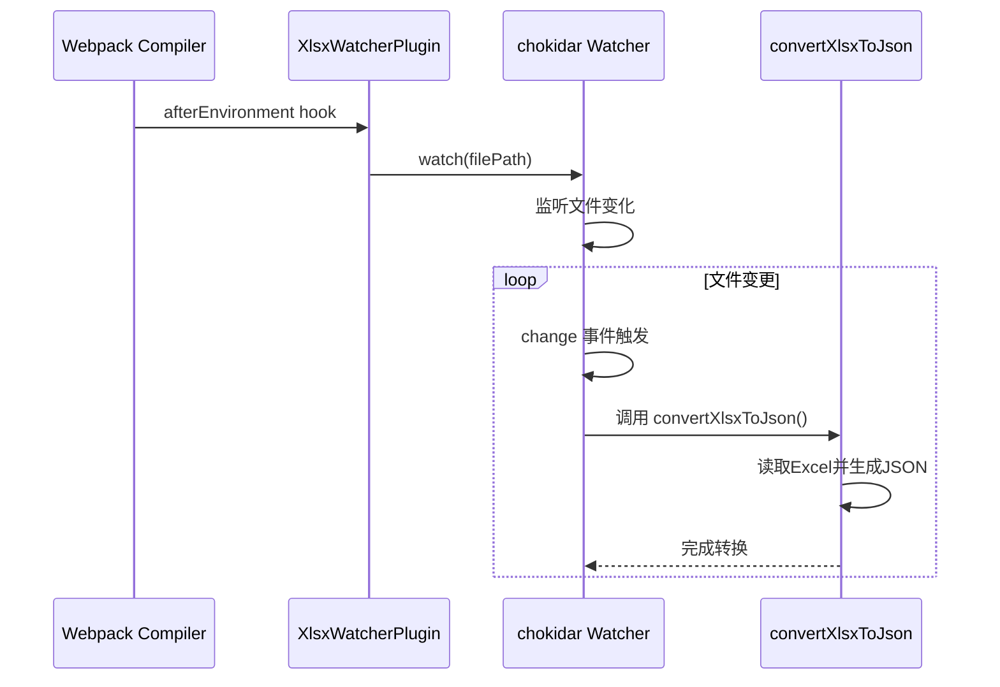

# 构建与部署流程

<cite>
**Referenced Files in This Document**  
- [package.json](file://package.json)
- [next.config.ts](file://next.config.ts)
- [netlify.toml](file://netlify.toml)
- [scripts/handXlsxToJson.js](file://scripts/handXlsxToJson.js)
- [plugins/xlsxToJson.js](file://plugins/xlsxToJson.js)
- [plugins/XlsxWatcherPlugin.js](file://plugins/XlsxWatcherPlugin.js)
</cite>

## 目录

1. [开发与构建命令说明](#开发与构建命令说明)
2. [数据预处理脚本分析](#数据预处理脚本分析)
3. [Webpack 插件注入机制](#webpack-插件注入机制)
4. [Netlify 部署配置](#netlify-部署配置)
5. [CI/CD 自动化部署流程](#cicd-自动化部署流程)

## 开发与构建命令说明

项目通过 `package.json` 中定义的脚本命令管理开发与生产环境的生命周期。`dev` 命令用于本地开发，`build` 命令用于生产构建，两者职责明确且流程清晰。

### 开发环境启动（dev）

`dev` 脚本通过 `next dev -p 8200` 启动 Next.js 开发服务器，并指定端口为 8200。该命令启用热重载和开发调试功能，适用于本地开发调试。

**Section sources**  
- [package.json](file://package.json#L5-L6)

### 生产构建流程（build）

`build` 脚本定义了生产环境的完整构建流程，包含两个关键步骤：

1. 执行 `node scripts/handXlsxToJson.js`：运行数据预处理脚本，将 Excel 文件转换为 JSON 数据。
2. 执行 `next build`：启动 Next.js 的生产构建流程，生成静态资源和服务器端渲染代码。

该命令确保在构建前完成数据转换，保证构建产物包含最新数据。

**Section sources**  
- [package.json](file://package.json#L7-L8)

## 数据预处理脚本分析

项目通过 `handXlsxToJson.js` 脚本实现 Excel 数据到 JSON 的自动化转换，确保静态资源在构建时保持最新。

### 脚本执行流程

`scripts/handXlsxToJson.js` 是构建流程的入口脚本，其主要职责是加载并执行 `plugins/xlsxToJson.js` 模块中的核心转换逻辑。



**Diagram sources**  
- [scripts/handXlsxToJson.js](file://scripts/handXlsxToJson.js#L1-L5)
- [plugins/xlsxToJson.js](file://plugins/xlsxToJson.js#L5-L29)

### 数据转换逻辑

`plugins/xlsxToJson.js` 实现了完整的 Excel 到 JSON 的转换逻辑：

1. 使用 `xlsx` 库读取 `src/config/datalist.xlsx` 文件。
2. 解析工作表数据，提取 `Sheet1` 中的每一行。
3. 映射字段：将 Excel 中的“分类”、“描述”、“日期”、“标题”列转换为 JSON 对象的 `tag`、`desc`、`date`、`title` 属性。
4. 过滤掉 `tag` 为空的无效数据。
5. 按 `date` 字段进行降序排序，确保最新内容优先。
6. 将处理后的数据写入 `src/config/data.json`，供 Next.js 应用在构建时使用。

**Section sources**  
- [plugins/xlsxToJson.js](file://plugins/xlsxToJson.js#L5-L29)

## Webpack 插件注入机制

在开发环境中，项目通过自定义 Webpack 插件 `XlsxWatcherPlugin` 实现 Excel 文件的实时监听与自动转换。

### 插件注入方式

`next.config.ts` 文件中通过 `webpack` 配置项向 Webpack 注入插件。仅在开发模式（`options.dev === true`）下启用该插件，避免影响生产构建性能。

```typescript
webpack: (config, options) => {
  if (options.dev) {
    config.plugins.push(
      new XlsxWatcherPlugin({
        filePath: "src/config/datalist.xlsx"
      })
    );
  }
  return config;
}
```

**Section sources**  
- [next.config.ts](file://next.config.ts#L60-L66)

### 插件工作原理

`XlsxWatcherPlugin` 基于 `chokidar` 实现文件系统监听，其核心逻辑如下：



**Diagram sources**  
- [plugins/XlsxWatcherPlugin.js](file://plugins/XlsxWatcherPlugin.js#L2-L26)
- [next.config.ts](file://next.config.ts#L60-L66)

当 `src/config/datalist.xlsx` 文件发生变化时，插件自动触发 `convertXlsxToJson()` 函数，重新生成 `data.json`，Next.js 开发服务器随之热重载，实现数据的实时更新。

**Section sources**  
- [plugins/XlsxWatcherPlugin.js](file://plugins/XlsxWatcherPlugin.js#L2-L26)

## Netlify 部署配置

`netlify.toml` 文件定义了项目在 Netlify 平台上的部署行为，包括构建命令、发布目录和函数配置。

### 构建与发布配置

```toml
[build]
  command = "npm run build"
  publish = ".next"
  functions = "functions"
  cache = { paths = ["node_modules"] }
```

- `command`：执行 `npm run build`，触发完整的构建流程（含数据预处理）。
- `publish`：指定 `.next` 目录为发布目录，该目录由 `next build` 生成。
- `functions`：指定 `functions` 目录为 Netlify Functions 的存放位置。
- `cache`：缓存 `node_modules` 以加速后续构建。

**Section sources**  
- [netlify.toml](file://netlify.toml#L1-L5)

### 头部与插件配置

文件还配置了 HTTP 响应头和 Netlify 插件：

- 为 `/functions/*` 路由启用 CORS，允许跨域请求。
- 为静态资源设置长期缓存（1年）。
- 使用 `@netlify/plugin-nextjs` 插件以支持 Next.js 的高级功能（如 SSR、ISR）。

**Section sources**  
- [netlify.toml](file://netlify.toml#L7-L21)

## CI/CD 自动化部署流程

项目通过 Netlify 实现完整的 CI/CD 自动化部署，流程如下：


**Diagram sources**  
- [package.json](file://package.json#L7-L8)
- [netlify.toml](file://netlify.toml#L2-L5)
- [scripts/handXlsxToJson.js](file://scripts/handXlsxToJson.js#L1-L5)

### 部署步骤

1. 将项目推送至 GitHub/GitLab 等支持的 Git 仓库。
2. 在 Netlify 控制台创建新站点，关联该仓库。
3. Netlify 自动读取 `netlify.toml` 配置。
4. 每次代码推送都会触发 `npm run build` 命令。
5. 构建成功后，自动发布至指定域名。

该流程确保了从代码提交到线上发布的全自动化，结合 Excel 数据预处理，实现了内容驱动型应用的高效部署。