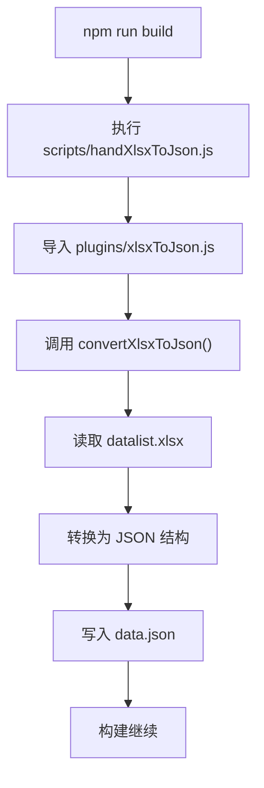
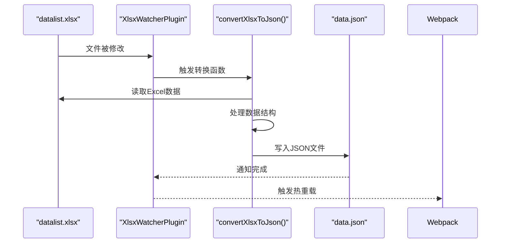

<cite>
**本文档中引用的文件**  
- [handXlsxToJson.js](file://scripts/handXlsxToJson.js)
- [next.config.ts](file://next.config.ts)
- [XlsxWatcherPlugin.js](file://plugins/XlsxWatcherPlugin.js)
- [xlsxToJson.js](file://plugins/xlsxToJson.js)
- [data.json](file://src/config/data.json)
</cite>

## 目录
1. [构建流程](#构建流程)
2. [核心脚本分析](#核心脚本分析)
3. [开发环境监听机制](#开发环境监听机制)
4. [数据转换函数调用逻辑](#数据转换函数调用逻辑)
5. [前端数据消费影响](#前端数据消费影响)
6. [数据驱动内容管理](#数据驱动内容管理)
7. [常见问题排查](#常见问题排查)

## 构建流程

在执行 `npm run build` 时，项目通过预构建脚本触发数据预处理流程。该流程的核心是将位于 `src/config/datalist.xlsx` 的 Excel 数据文件转换为前端可直接消费的 JSON 格式文件 `src/config/data.json`。此过程由 `scripts/handXlsxToJson.js` 脚本驱动，确保在应用构建前完成静态数据的生成，从而保证构建产物包含最新的内容数据。

该机制实现了内容与代码的分离，允许非技术人员通过编辑 Excel 表格更新网站内容，而无需修改源码或重新部署开发环境。构建系统自动捕获这些变更并将其集成到最终的静态资源中。

**Section sources**
- [handXlsxToJson.js](file://scripts/handXlsxToJson.js#L1-L5)

## 核心脚本分析

`handXlsxToJson.js` 是构建流程的入口脚本，其职责是调用 `plugins/xlsxToJson.js` 中定义的 `convertXlsxToJson()` 函数。该脚本在构建开始前执行，确保 `data.json` 始终反映最新的 `datalist.xlsx` 内容。

脚本通过 Node.js 的 `require` 机制导入转换函数，并立即执行。这种设计将构建逻辑与具体的数据处理实现解耦，提高了可维护性和可测试性。



**Diagram sources**
- [handXlsxToJson.js](file://scripts/handXlsxToJson.js#L1-L5)
- [xlsxToJson.js](file://plugins/xlsxToJson.js#L5-L35)

**Section sources**
- [handXlsxToJson.js](file://scripts/handXlsxToJson.js#L1-L5)
- [xlsxToJson.js](file://plugins/xlsxToJson.js#L5-L35)

## 开发环境监听机制

在开发模式下，项目通过 `next.config.ts` 中的 Webpack 配置动态注入 `XlsxWatcherPlugin` 插件，实现实时数据同步。该插件利用 `chokidar` 库监听 `src/config/datalist.xlsx` 文件的变化，一旦检测到修改，立即触发 `convertXlsxToJson()` 函数重新生成 `data.json`。

此机制确保开发者在编辑 Excel 文件后，无需手动重建项目即可在浏览器中看到更新的内容，极大地提升了内容迭代效率。



**Diagram sources**
- [next.config.ts](file://next.config.ts#L20-L30)
- [XlsxWatcherPlugin.js](file://plugins/XlsxWatcherPlugin.js#L5-L25)

**Section sources**
- [next.config.ts](file://next.config.ts#L20-L30)
- [XlsxWatcherPlugin.js](file://plugins/XlsxWatcherPlugin.js#L5-L25)

## 数据转换函数调用逻辑

`convertXlsxToJson()` 函数封装了完整的数据转换逻辑，包括读取 Excel 工作簿、提取指定工作表（Sheet1）的数据、映射字段（分类→tag、描述→desc 等）、过滤空值以及按日期降序排序。最终结果以格式化的 JSON 写入 `src/config/data.json`。

该函数被设计为可复用模块，既可在构建脚本中一次性调用，也可在开发插件中响应式调用，体现了高内聚低耦合的设计原则。

```mermaid
classDiagram
class convertXlsxToJson {
+string filePath
+string outputJsonPath
+convertXlsxToJson() void
}
class XlsxWatcherPlugin {
+Object options
+apply(compiler) void
}
class handXlsxToJson {
+convertXlsxToJson function
}
convertXlsxToJson <|-- handXlsxToJson : "require"
convertXlsxToJson <|-- XlsxWatcherPlugin : "require"
XlsxWatcherPlugin ..> "Webpack" : "compiler.hooks"
```

**Diagram sources**
- [xlsxToJson.js](file://plugins/xlsxToJson.js#L5-L35)
- [handXlsxToJson.js](file://scripts/handXlsxToJson.js#L1-L5)
- [XlsxWatcherPlugin.js](file://plugins/XlsxWatcherPlugin.js#L1-L30)

**Section sources**
- [xlsxToJson.js](file://plugins/xlsxToJson.js#L5-L35)

## 前端数据消费影响

生成的 `data.json` 被前端组件（如 `List.tsx`、`Perview.tsx`）直接导入或通过 API 路由提供，作为内容展示的数据源。由于数据在构建时已静态生成，应用获得了极佳的加载性能和 SEO 友好性。

当 Excel 数据更新时，无论是通过构建流程还是开发监听器，`data.json` 的变更都会触发 Next.js 的页面重新生成机制，确保用户始终访问到最新内容。

**Section sources**
- [data.json](file://src/config/data.json)

## 数据驱动内容管理

该项目实现了基于 Excel 的低代码内容管理系统。内容编辑者只需维护 `datalist.xlsx` 文件，系统自动将其转换为结构化数据供前端消费。这种方式降低了内容更新的技术门槛，同时保持了系统的灵活性和可扩展性。

该机制特别适用于博客、作品集、文档站点等以内容为中心的应用，实现了内容与表现的完全分离。

## 常见问题排查

### 文件路径错误
- **现象**：`File not found` 或 `Cannot read property 'SheetNames' of undefined`
- **排查**：检查 `xlsxToJson.js` 中的 `filePath` 和 `outputJsonPath` 是否正确指向 `src/config/` 目录下的文件

### 依赖缺失
- **现象**：`Cannot find module 'xlsx'` 或 `chokidar` 报错
- **排查**：确认 `package.json` 中已安装 `xlsx` 和 `chokidar` 依赖，并通过 `pnpm install` 正确安装

### 权限问题
- **现象**：`EACCES: permission denied, open 'src/config/data.json'`
- **排查**：确保 Node.js 进程有权限写入 `src/config/` 目录

### 插件未生效
- **现象**：开发模式下修改 Excel 文件未触发转换
- **排查**：检查 `next.config.ts` 中是否正确注入 `XlsxWatcherPlugin`，并确认 `options.dev` 条件判断正确

**Section sources**
- [xlsxToJson.js](file://plugins/xlsxToJson.js#L3-L4)
- [XlsxWatcherPlugin.js](file://plugins/XlsxWatcherPlugin.js#L5-L10)
- [next.config.ts](file://next.config.ts#L20-L30)