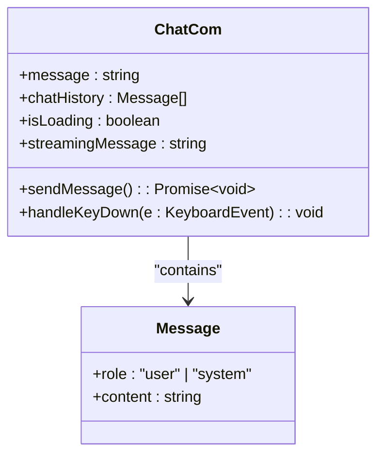
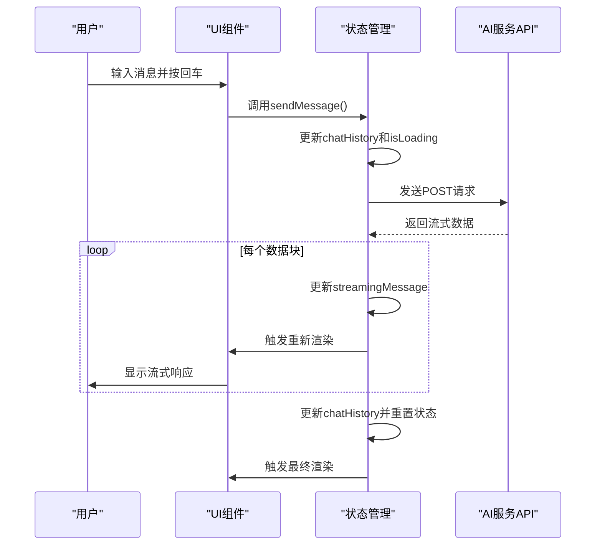
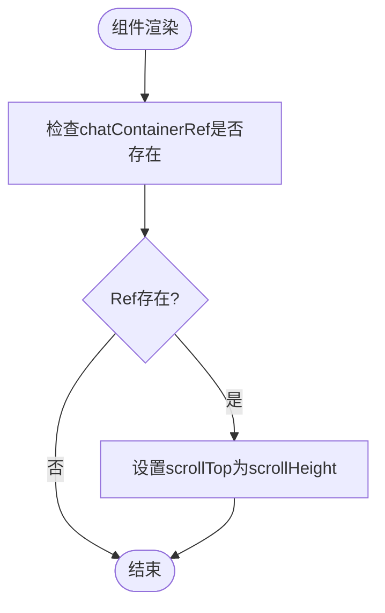
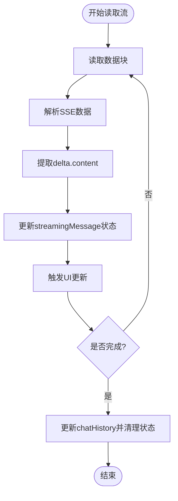
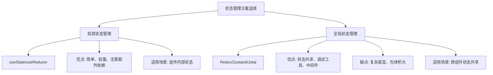

# 状态管理

<cite>
**Referenced Files in This Document**   
- [ChatCom.tsx](file://src/app/chat/ChatCom.tsx)
- [page.tsx](file://src/app/chat/page.tsx)
- [前端知识散点.md](file://public/files/general/前端知识散点.md)
</cite>

## 目录
1. [简介](#简介)
2. [核心状态管理实现](#核心状态管理实现)
3. [状态更新与UI同步机制](#状态更新与ui同步机制)
4. [流式响应中的性能优化](#流式响应中的性能优化)
5. [轻量级状态管理选择分析](#轻量级状态管理选择分析)
6. [结论](#结论)

## 简介
本文档深入分析 `ChatCom` 组件中状态管理的使用场景与实现方式。重点探讨如何使用 React 内建的 `useState` 管理聊天历史、输入消息与加载状态，以及为何选择局部状态管理而非引入复杂状态库。文档还将解释状态更新与 UI 渲染的同步机制，以及在流式响应场景下 `setStreamingMessage` 的性能优化考虑。

**Section sources**
- [ChatCom.tsx](file://src/app/chat/ChatCom.tsx#L1-L200)

## 核心状态管理实现

`ChatCom` 组件通过 React 内建的 `useState` Hook 实现了完整的状态管理，涵盖了聊天历史、用户输入、加载状态和流式响应等核心功能。

组件定义了四个主要状态变量：
- `message`: 管理用户输入框中的消息内容
- `chatHistory`: 存储完整的聊天历史记录，包含用户和系统的消息
- `isLoading`: 控制加载指示器的显示状态
- `streamingMessage`: 专门用于处理流式 API 响应的中间状态

**Diagram sources**
- [ChatCom.tsx](file://src/app/chat/ChatCom.tsx#L12-L165)

**Section sources**
- [ChatCom.tsx](file://src/app/chat/ChatCom.tsx#L12-L25)

## 状态更新与UI同步机制

`ChatCom` 组件通过 React 的状态更新机制实现了状态与 UI 的高效同步。当状态发生变化时，React 会自动触发组件的重新渲染，确保 UI 与状态保持一致。

### 状态更新流程

**Diagram sources**
- [ChatCom.tsx](file://src/app/chat/ChatCom.tsx#L43-L87)
- [ChatCom.tsx](file://src/app/chat/ChatCom.tsx#L111-L148)

### 自动滚动机制

组件使用 `useEffect` Hook 监听聊天历史、加载状态和流式消息的变化，自动将聊天容器滚动到底部，确保用户始终能看到最新的消息。

**Diagram sources**
- [ChatCom.tsx](file://src/app/chat/ChatCom.tsx#L89-L109)

**Section sources**
- [ChatCom.tsx](file://src/app/chat/ChatCom.tsx#L89-L109)

## 流式响应中的性能优化

在处理 AI 服务的流式响应时，`ChatCom` 组件通过精心设计的状态管理实现了性能优化，避免了不必要的重渲染和性能瓶颈。

### 流式数据处理策略

**Diagram sources**
- [ChatCom.tsx](file://src/app/chat/ChatCom.tsx#L43-L87)

### 性能优化考虑

1. **分阶段更新**: 使用 `streamingMessage` 作为临时状态，避免频繁更新 `chatHistory` 导致的重渲染
2. **条件渲染**: 通过条件判断控制加载指示器和流式消息的显示
3. **批量处理**: 在循环中累积响应内容，减少状态更新频率
4. **资源清理**: 在 `finally` 块中重置加载状态和流式消息，确保组件状态的一致性

**Section sources**
- [ChatCom.tsx](file://src/app/chat/ChatCom.tsx#L43-L87)

## 轻量级状态管理选择分析

`ChatCom` 组件选择使用 React 内建的 `useState` 而非复杂状态管理库（如 Redux），体现了对项目需求的精准把握和架构设计的合理性。

### 选择局部状态管理的原因

1. **组件独立性**: `ChatCom` 是一个功能独立的聊天组件，其状态不需要在多个不相关的组件间共享
2. **复杂度适中**: 组件的状态结构相对简单，仅包含四个状态变量，使用 `useState` 已足够
3. **性能考虑**: 避免引入额外的状态管理库带来的包体积增加和运行时开销
4. **开发效率**: `useState` 的 API 简单直观，降低了开发和维护成本

### 与复杂状态库的对比

**Diagram sources**
- [ChatCom.tsx](file://src/app/chat/ChatCom.tsx#L12-L25)
- [前端知识散点.md](file://public/files/general/前端知识散点.md#L296-L355)

**Section sources**
- [ChatCom.tsx](file://src/app/chat/ChatCom.tsx#L12-L25)
- [前端知识散点.md](file://public/files/general/前端知识散点.md#L296-L355)

## 结论

`ChatCom` 组件通过合理使用 React 内建的 `useState` Hook，实现了高效、可靠的状态管理。组件的设计体现了以下最佳实践：

1. **关注点分离**: 将不同的状态（聊天历史、输入消息、加载状态、流式响应）分别管理，提高了代码的可维护性
2. **性能优化**: 通过 `streamingMessage` 临时状态和条件渲染，优化了流式响应的用户体验
3. **架构合理性**: 根据实际需求选择轻量级状态管理方案，避免了过度工程化
4. **用户体验优先**: 自动滚动和加载指示器等细节设计提升了用户交互体验

这种基于 React 内建 Hook 的状态管理方案，既满足了功能需求，又保持了代码的简洁性和性能，是中小型 React 应用状态管理的优秀范例。