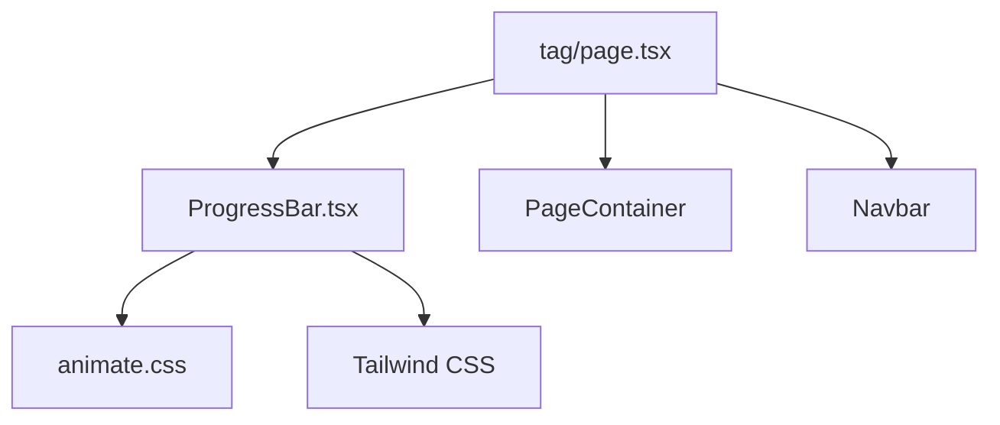
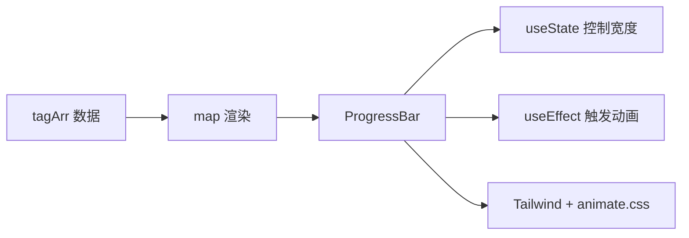
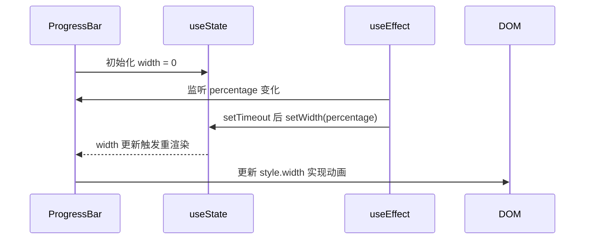
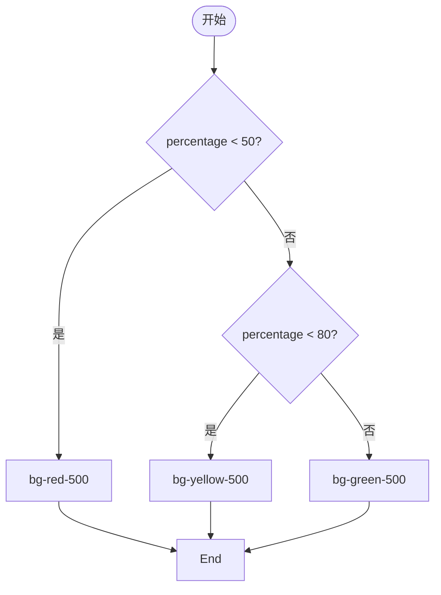
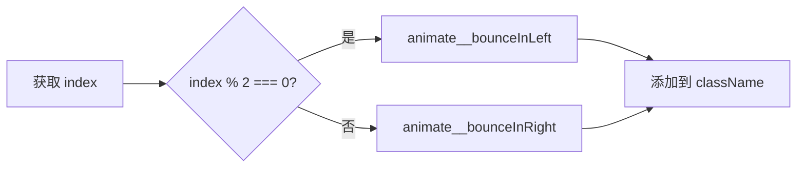
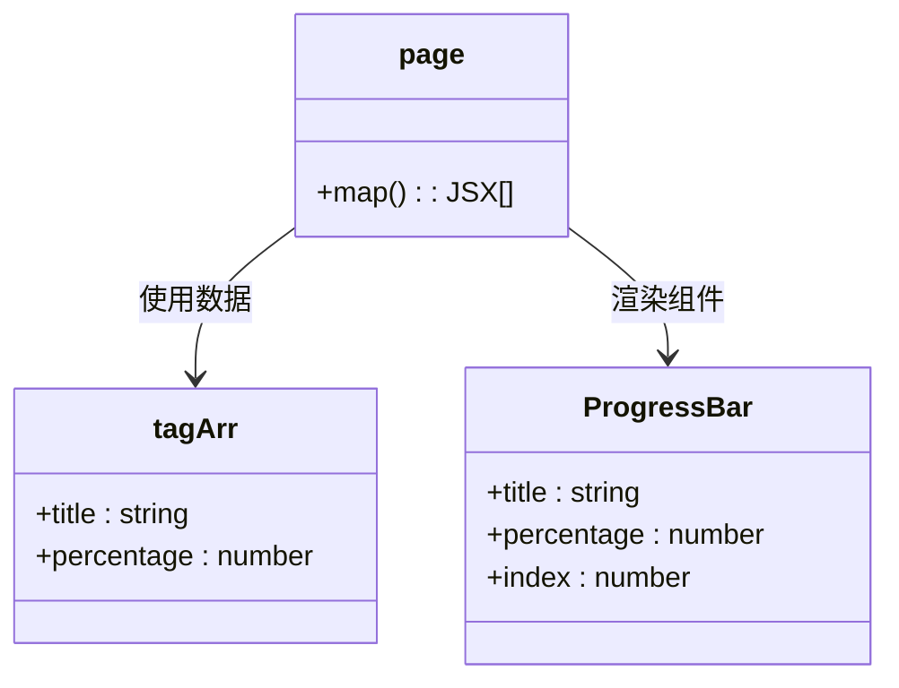
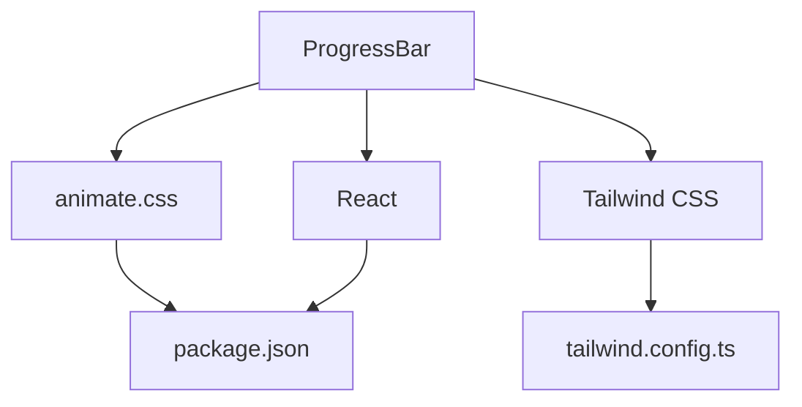

# 技能进度条展示

<cite>
**本文档引用的文件**  
- [ProgressBar.tsx](file://src/app/tag/ProgressBar.tsx)
- [page.tsx](file://src/app/tag/page.tsx)
- [globals.css](file://src/app/globals.css)
- [tailwind.config.ts](file://tailwind.config.ts)
- [package.json](file://package.json)
</cite>

## 目录
1. [简介](#简介)
2. [项目结构](#项目结构)
3. [核心组件](#核心组件)
4. [架构概览](#架构概览)
5. [详细组件分析](#详细组件分析)
6. [依赖分析](#依赖分析)
7. [性能考虑](#性能考虑)
8. [故障排除指南](#故障排除指南)
9. [结论](#结论)

## 简介
本文档深入解析 `ProgressBar` 组件的实现机制，涵盖其属性接收、动态动画渲染、颜色语义化逻辑及批量渲染流程。通过分析 React 的状态管理与副作用机制，结合 Tailwind CSS 和 animate.css 实现视觉动效，全面揭示该组件在技能展示页面中的工作原理。

## 项目结构
`ProgressBar` 组件位于 `src/app/tag/` 目录下，作为独立功能模块被 `page.tsx` 调用。整体结构遵循 Next.js App Router 规范，采用组件化设计，分离 UI 与数据逻辑。

**图示来源**  
- [page.tsx](file://src/app/tag/page.tsx#L1-L84)
- [ProgressBar.tsx](file://src/app/tag/ProgressBar.tsx#L1-L56)

**本节来源**  
- [page.tsx](file://src/app/tag/page.tsx#L1-L84)
- [ProgressBar.tsx](file://src/app/tag/ProgressBar.tsx#L1-L56)

## 核心组件
`ProgressBar` 是一个客户端渲染的函数式组件，接收 `title`、`percentage` 和 `index` 属性，利用 React 的 `useState` 与 `useEffect` 实现宽度增长动画，并通过条件判断动态设置颜色与进入动画方向。

**本节来源**  
- [ProgressBar.tsx](file://src/app/tag/ProgressBar.tsx#L1-L56)

## 架构概览
组件采用声明式 UI 与函数式编程范式，结合 Tailwind 的实用类系统实现样式控制，通过外部库 animate.css 提供预设动画。数据流为单向：`page.tsx` → `ProgressBar`，无状态提升需求。

**图示来源**  
- [page.tsx](file://src/app/tag/page.tsx#L10-L20)
- [ProgressBar.tsx](file://src/app/tag/ProgressBar.tsx#L10-L30)

## 详细组件分析

### ProgressBar 组件分析
该组件实现了进度条的动态增长与语义化颜色展示。

#### 状态与副作用管理

**图示来源**  
- [ProgressBar.tsx](file://src/app/tag/ProgressBar.tsx#L10-L20)

#### 颜色逻辑判断
根据百分比区间自动切换背景色，增强可视化语义：

**图示来源**  
- [ProgressBar.tsx](file://src/app/tag/ProgressBar.tsx#L22-L30)

#### 动画效果实现
利用 `index` 奇偶性交替应用 `animate__bounceInLeft` 与 `animate__bounceInRight`，实现交错进入动效。

**图示来源**  
- [ProgressBar.tsx](file://src/app/tag/ProgressBar.tsx#L32-L34)

**本节来源**  
- [ProgressBar.tsx](file://src/app/tag/ProgressBar.tsx#L1-L56)

### 批量渲染机制
`page.tsx` 中定义 `tagArr` 数组，通过 `map` 方法批量生成 `ProgressBar` 实例，实现多技能项展示。

**图示来源**  
- [page.tsx](file://src/app/tag/page.tsx#L10-L20)
- [ProgressBar.tsx](file://src/app/tag/ProgressBar.tsx#L5-L10)

**本节来源**  
- [page.tsx](file://src/app/tag/page.tsx#L1-L84)

## 依赖分析
组件依赖多个外部库与配置文件，确保功能完整。

**图示来源**  
- [package.json](file://package.json#L1-L47)
- [tailwind.config.ts](file://tailwind.config.ts#L1-L40)
- [globals.css](file://src/app/globals.css#L1-L63)

**本节来源**  
- [package.json](file://package.json#L1-L47)
- [tailwind.config.ts](file://tailwind.config.ts#L1-L40)

## 性能考虑
- 动画延迟通过 `setTimeout` 控制，避免阻塞主线程
- `useEffect` 依赖项精确指定 `percentage`，防止不必要的重执行
- Tailwind 的 JIT 模式确保仅生成实际使用的样式类
- 客户端组件按需加载，减少首屏体积

## 故障排除指南
### 动画未触发
- 检查 `animate.css` 是否正确引入（确认 `globals.css` 中无误）
- 验证 `animate__animated` 类是否存在于外层容器
- 确保 `percentage` 属性为数字类型且在 0-100 范围内

### 样式错位
- 检查父容器是否设置了固定宽度或 `flex` 布局冲突
- 确认 Tailwind 的 `content` 配置包含组件路径
- 排查全局 CSS 是否覆盖了 `.h-4` 或 `rounded-full` 类

### 颜色未更新
- 确保 `percentage` 更新后组件重新渲染
- 检查三元表达式逻辑是否覆盖所有区间
- 验证 Tailwind 的颜色类名是否拼写正确

**本节来源**  
- [ProgressBar.tsx](file://src/app/tag/ProgressBar.tsx#L22-L30)
- [globals.css](file://src/app/globals.css#L1-L63)

## 结论
`ProgressBar` 组件通过简洁的 React 状态管理实现了流畅的动画效果，结合 Tailwind 与 animate.css 提供了良好的视觉体验。其模块化设计便于复用与维护，适用于技能展示、任务进度等多种场景。建议未来可扩展为支持自定义颜色阈值、动画时长与方向配置，提升灵活性。