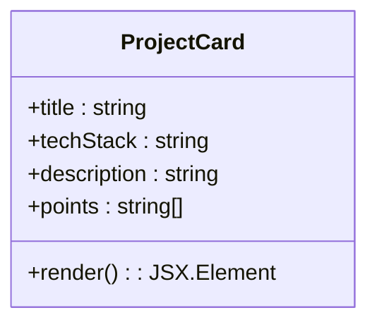
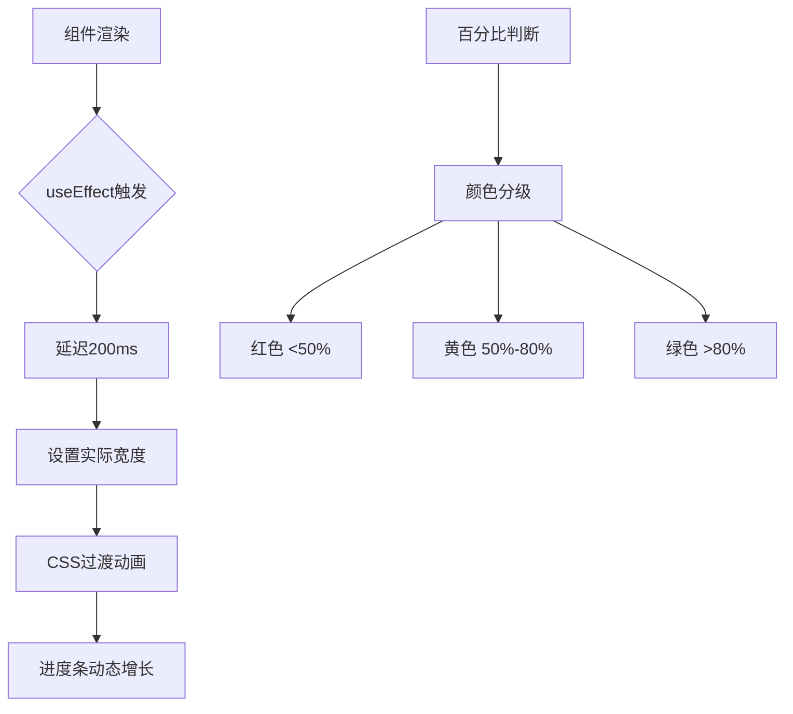

# 简历与技能展示

<cite>
**本文档引用文件**  
- [resume/page.tsx](file://src/app/resume/page.tsx)
- [resume/ProjectCard.tsx](file://src/app/resume/ProjectCard.tsx)
- [tag/page.tsx](file://src/app/tag/page.tsx)
- [tag/ProgressBar.tsx](file://src/app/tag/ProgressBar.tsx)
- [config/data.json](file://src/config/data.json)
- [\_components/Navbar.tsx](file://src/app/_components/Navbar.tsx)
- [\_components/PageContainer.tsx](file://src/app/_components/PageContainer.tsx)
</cite>

## 目录
1. [简介](#简介)
2. [简历页面实现](#简历页面实现)
3. [项目经验组件结构](#项目经验组件结构)
4. [技能标签页面实现](#技能标签页面实现)
5. [进度条组件可视化机制](#进度条组件可视化机制)
6. [数据来源与样式定制](#数据来源与样式定制)
7. [总结](#总结)

## 简介
本文档详细说明简历页面（`resume`）与技能标签页面（`tag`）的实现方式。重点分析 `ProjectCard` 组件如何结构化展示项目经验，包括标题、职责、成果等字段；解释 `ProgressBar` 组件如何通过 UI 进度条可视化展示技能掌握程度，支持多维度技能评估；并说明其数据来源及样式定制方法。

## 简历页面实现
简历页面通过 `PageContainer` 和 `Navbar` 构建基础布局结构，采用响应式设计适配移动端与桌面端。页面内容包含头部信息、个人技能、工作经历、项目经验和教育经历五大模块，使用语义化 HTML 标签组织内容层级。

页面通过嵌套 `div` 容器结合 Tailwind CSS 实现卡片式布局，外层容器设置最大宽度（`max-w-5xl`）、阴影（`shadow-2xl`）、圆角（`rounded-lg`）和动画效果（`animate__fadeInUp`），提升视觉表现力。各模块之间通过 `mb-10` 设置垂直间距，确保阅读流畅性。

**Section sources**  
- [resume/page.tsx](file://src/app/resume/page.tsx#L1-L218)

## 项目经验组件结构
`ProjectCard` 组件用于统一展示项目经验，接收 `title`、`techStack`、`description` 和 `points` 四个属性，分别对应项目名称、技术栈、项目描述和关键职责/成果列表。

组件结构如下：
- **项目标题**：使用 `h3` 标签，字体加粗，颜色为深灰色（`text-gray-800`），适配移动端为 `xs:text-base`
- **技术栈说明**：以“技术栈：”前缀展示，颜色为浅灰色（`text-gray-500`）
- **项目描述**：普通段落文本，行高 `leading-6`，颜色 `text-gray-600`
- **职责与成果列表**：使用有序列表（`ol` + `list-decimal`），每项通过 `map` 渲染，支持动态条目数量

该组件通过语义化标签和 Tailwind 的响应式前缀（`xs:`）实现跨设备兼容，结构清晰且易于维护。

**Diagram sources**  
- [resume/ProjectCard.tsx](file://src/app/resume/ProjectCard.tsx#L10-L34)

**Section sources**  
- [resume/ProjectCard.tsx](file://src/app/resume/ProjectCard.tsx#L1-L37)
- [resume/page.tsx](file://src/app/resume/page.tsx#L100-L180)

## 技能标签页面实现
技能标签页面（`tag`）用于展示技能掌握程度，整体布局简洁，以居中卡片形式呈现多个技能条目。页面结构由 `PageContainer` 包裹 `Navbar` 和技能进度条列表组成。

核心逻辑在于遍历 `tagArr` 数组，为每个技能项渲染一个 `ProgressBar` 组件。`tagArr` 是页面内定义的静态数据数组，包含技能名称（`title`）和掌握百分比（`percentage`）。通过 `index` 控制动画方向（奇偶行左右交错进入），增强视觉动态感。

页面使用 `flex` 布局居中内容，最大宽度限制为 `max-w-xl`，内边距 `p-5`，外边距 `mt-5`，整体风格简洁专业。

**Section sources**  
- [tag/page.tsx](file://src/app/tag/page.tsx#L1-L83)

## 进度条组件可视化机制
`ProgressBar` 组件基于 React 函数组件实现，使用 `useState` 和 `useEffect` 实现动画效果。组件接收三个 props：`title`（技能名称）、`percentage`（百分比值）、`index`（索引用于动画控制）。

核心可视化机制如下：
1. **状态管理**：初始宽度为 0，通过 `useEffect` 在挂载后延迟 200ms 设置实际宽度，触发 CSS 过渡动画
2. **颜色分级**：根据百分比动态设置背景色：
   - 小于 50%：红色（`bg-red-500`）
   - 50%-80%：黄色（`bg-yellow-500`）
   - 大于 80%：绿色（`bg-green-500`）
3. **动画效果**：利用 `animate__animated` 和 `animate__bounceInLeft/Right` 实现左右交错弹入动画
4. **布局结构**：使用 `flex` 布局，左侧为固定宽度技能名，中间为弹性进度条容器，右侧显示百分比数值

进度条本身通过内联样式 `style={{ width: width + "%" }}` 动态控制宽度，并结合 `transition-width duration-1000 ease-in-out` 实现平滑过渡。

**Diagram sources**  
- [tag/ProgressBar.tsx](file://src/app/tag/ProgressBar.tsx#L9-L52)

**Section sources**  
- [tag/ProgressBar.tsx](file://src/app/tag/ProgressBar.tsx#L1-L55)
- [tag/page.tsx](file://src/app/tag/page.tsx#L10-L15)

## 数据来源与样式定制
### 数据来源
- **简历页面数据**：直接内联于 `resume/page.tsx` 中，包括个人信息、技能列表、工作经历、项目经验等，采用 JSX 静态结构展示
- **技能标签数据**：定义于 `tag/page.tsx` 内部的 `tagArr` 数组，包含 14 项技能及其掌握程度，便于快速修改和调试
- **全局配置数据**：部分博客文章元数据存储于 `config/data.json`，但当前页面未直接使用该文件

所有数据均为静态定义，未接入外部 API 或服务端渲染，适用于个人简历类静态站点。

### 样式定制
- **CSS 框架**：使用 Tailwind CSS 实现原子化样式管理，通过类名直接控制样式
- **响应式设计**：广泛使用 `xs:` 前缀适配移动端，如 `xs:text-sm`、`xs:px-5` 等
- **动画库**：集成 Animate.css，通过 `animate__animated` 类实现页面元素入场动画
- **颜色体系**：基于 Tailwind 默认调色板，主文字色为 `text-gray-700/800`，辅助色为 `text-gray-500/600`
- **自定义逻辑**：通过 JavaScript 动态计算进度条颜色和动画方向，实现个性化视觉反馈

**Section sources**  
- [resume/page.tsx](file://src/app/resume/page.tsx#L1-L218)
- [tag/page.tsx](file://src/app/tag/page.tsx#L1-L83)
- [config/data.json](file://src/config/data.json#L1-L103)

## 总结
简历页面与技能标签页面共同构成个人技术能力的可视化展示体系。`ProjectCard` 组件通过结构化字段清晰呈现项目经验，支持技术栈、描述与多条职责成果的展示；`ProgressBar` 组件则通过动态进度条与颜色分级机制，直观反映技能掌握程度。

两页面均采用 React 函数组件 + Tailwind CSS 的现代前端技术栈，具备良好的可维护性与响应式适配能力。数据以静态形式内联管理，适合个人简历类轻量级应用。整体设计注重用户体验与视觉表现力，为技术人才的自我展示提供了高效解决方案。