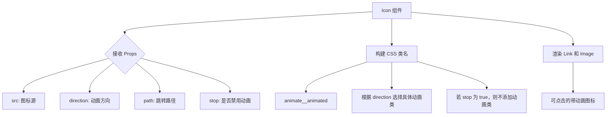
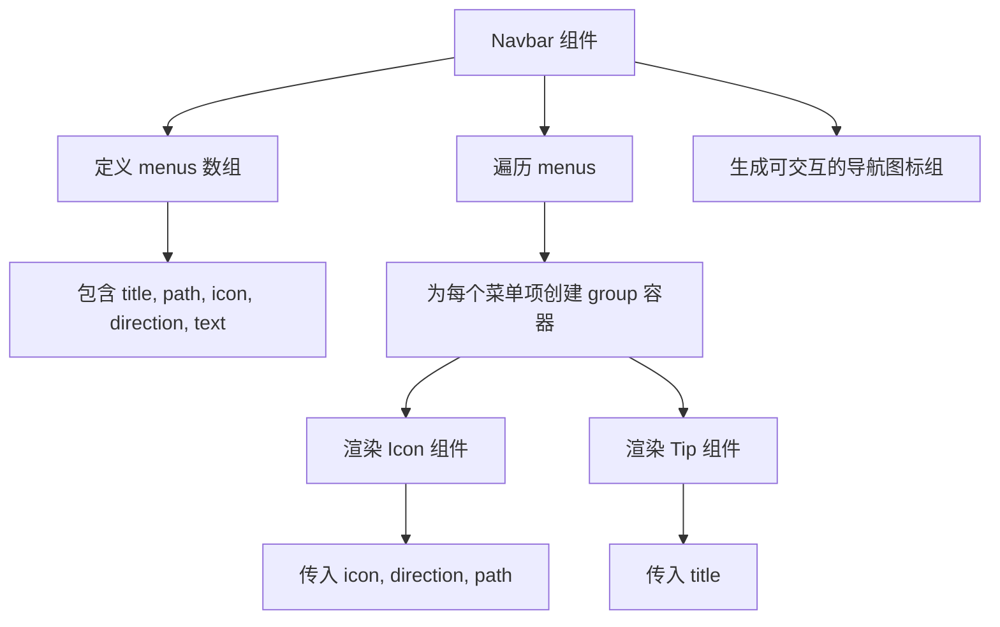

<cite>
**本文档中引用的文件**  
- [Icon.tsx](file://src/app/_components/Icon.tsx)
- [Navbar.tsx](file://src/app/_components/Navbar.tsx)
</cite>

## 目录
1. [简介](#简介)
2. [核心功能与实现机制](#核心功能与实现机制)
3. [Props 详解](#props-详解)
4. [使用示例](#使用示例)
5. [在 Navbar 中的应用](#在-navbar-中的应用)
6. [与 Tip 组件的组合使用](#与-tip-组件的组合使用)
7. [自定义与扩展](#自定义与扩展)
8. [常见问题与解决方案](#常见问题与解决方案)
9. [总结](#总结)

## 简介
`Icon` 组件是一个可复用的导航图标组件，专为在导航栏中展示可点击、带动画效果的图标而设计。该组件基于 React 和 Next.js 构建，利用 `next/link` 实现页面跳转，通过 `next/image` 渲染图标，并结合 Animate.css 提供进入动画效果。组件支持方向控制、路径跳转和动画启停，具备良好的可配置性和复用性。

**Section sources**
- [Icon.tsx](file://src/app/_components/Icon.tsx#L1-L36)

## 核心功能与实现机制
`Icon` 组件的核心功能是封装一个可点击的图标，支持带动画的页面跳转。其技术实现依赖于以下几个关键点：

- **路由跳转**：使用 `next/link` 组件包裹图标，实现客户端导航，提升用户体验。
- **图像渲染**：采用 `next/image` 组件加载图标资源，支持静态图像（`StaticImageData`）或字符串路径。
- **动画控制**：集成 Animate.css 动画库，通过动态拼接 CSS 类名实现不同方向的进入动画（如从左、右、上进入）。
- **条件渲染**：通过 `stop` 属性控制是否启用动画，提供更灵活的交互控制。



**Diagram sources**
- [Icon.tsx](file://src/app/_components/Icon.tsx#L1-L36)

**Section sources**
- [Icon.tsx](file://src/app/_components/Icon.tsx#L1-L36)

## Props 详解
`Icon` 组件接收以下四个 Props，用于控制其行为和外观：

| 属性名 | 类型 | 是否必需 | 默认值 | 说明 |
| :--- | :--- | :--- | :--- | :--- |
| `src` | `string \| StaticImageData` | 是 | 无 | 图标的图像源，可以是字符串路径或 Next.js 的静态图像导入对象。 |
| `direction` | `string` | 是 | 无 | 控制图标进入动画的方向，有效值为 `"left"`、`"right"`、`"top"`，分别对应从左、右、上方进入的动画效果。 |
| `path` | `string` | 否 | `"/"` | 点击图标后跳转的路由路径。若未提供，则默认跳转至首页。 |
| `stop` | `boolean` | 否 | `false` | 是否禁用进入动画。当值为 `true` 时，图标将无动画直接显示。 |

**Section sources**
- [Icon.tsx](file://src/app/_components/Icon.tsx#L4-L9)

## 使用示例
以下是一个使用 `Icon` 组件的基本示例：

```tsx
import Icon from "@/app/_components/Icon";
import homeIcon from "@/app/_images/home.svg";

function HomePage() {
  return (
    <div>
      <Icon 
        src={homeIcon} 
        direction="left" 
        path="/home" 
        stop={false} 
      />
    </div>
  );
}
```

在此示例中：
- `src` 指定了图标图像。
- `direction="left"` 设置了从左侧进入的动画。
- `path="/home"` 定义了点击后跳转到 `/home` 页面。
- `stop={false}` 确保动画效果被启用。

**Section sources**
- [Icon.tsx](file://src/app/_components/Icon.tsx#L15-L27)

## 在 Navbar 中的应用
`Icon` 组件在 `Navbar` 组件中被广泛使用，作为移动端导航栏的主要交互元素。`Navbar` 通过一个菜单配置数组 `menus` 来定义导航项，并使用 `map` 函数遍历生成多个 `Icon` 实例。



**Diagram sources**
- [Navbar.tsx](file://src/app/_components/Navbar.tsx#L16-L72)
- [Icon.tsx](file://src/app/_components/Icon.tsx#L15-L27)

**Section sources**
- [Navbar.tsx](file://src/app/_components/Navbar.tsx#L16-L72)

## 与 Tip 组件的组合使用
`Icon` 组件常与内置的 `Tip` 组件组合使用，以实现悬停提示功能。`Tip` 组件是一个纯展示型组件，其显示依赖于父容器的 `group-hover` CSS 类。

### 组合模式
在 `Navbar` 中，每个导航项被包裹在 `div` 容器中，并添加 `group` 和 `relative` 类。当用户将鼠标悬停在该容器上时，`group-hover:block` 会触发 `Tip` 组件的显示。

```tsx
<div className="group relative">
  <Icon src={v.icon} direction={v.direction} path={v.path} />
  <Tip title={v.title} />
</div>
```

### Tip 组件详解
`Tip` 组件接收一个 `title` 属性，并渲染为一个黑色背景、白色文字的小型提示框。其关键 CSS 类包括：
- `hidden`: 初始隐藏。
- `group-hover:block`: 当父容器被悬停时显示。
- `absolute -left-1/2 top-full`: 定位在图标正下方，水平居中。
- `w-20 text-center`: 固定宽度并居中文字。

**Section sources**
- [Icon.tsx](file://src/app/_components/Icon.tsx#L30-L36)
- [Navbar.tsx](file://src/app/_components/Navbar.tsx#L16-L72)

## 自定义与扩展
虽然 `Icon` 组件目前仅支持三种动画方向，但其设计具有良好的扩展性。开发者可以通过以下方式对其进行自定义：

1. **扩展动画方向**：在 `config` 对象中添加新的方向映射，例如 `"bottom": "animate__backInDown"`。
2. **自定义样式**：通过修改 `className` 中的 `w-6` 等 Tailwind CSS 类来调整图标大小和外观。
3. **增强交互**：为 `Link` 组件添加 `onClick` 或 `onMouseEnter` 等事件处理器，以支持更复杂的交互逻辑。

## 常见问题与解决方案
### 问题：动画不触发
**现象**：图标没有出现预期的进入动画，而是直接显示。

**可能原因与解决方案**：
1. **`stop` 属性被设置为 `true`**：检查组件调用时是否传递了 `stop={true}`。如果是，请将其改为 `false` 或移除该属性。
   - **代码路径**: [Icon.tsx](file://src/app/_components/Icon.tsx#L20)
2. **`direction` 值无效**：确保 `direction` 的值是 `"left"`、`"right"` 或 `"top"` 之一。任何其他值都会导致 `config[direction]` 为 `undefined`，从而不应用动画类。
   - **代码路径**: [Icon.tsx](file://src/app/_components/Icon.tsx#L19)
3. **缺少 Animate.css 样式**：确认项目已正确引入 Animate.css 库。如果未引入，需要在全局样式文件中通过 CDN 或 npm 包的方式添加。
4. **CSS 类名冲突**：检查 `className` 字符串中是否存在拼写错误或与其它样式冲突。

## 总结
`Icon` 组件是一个简洁而高效的可复用导航图标组件，它通过组合 `Link`、`Image` 和 CSS 动画，实现了带动画的可点击图标功能。其与 `Tip` 组件的组合使用，进一步增强了用户体验。该组件在 `Navbar` 中的应用展示了其在实际项目中的价值。通过理解其 Props 机制和实现原理，开发者可以轻松地在项目中复用和扩展此组件。