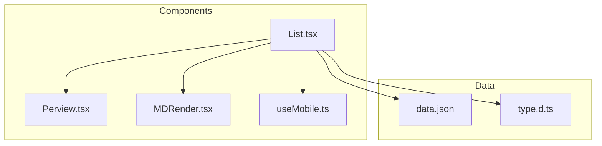
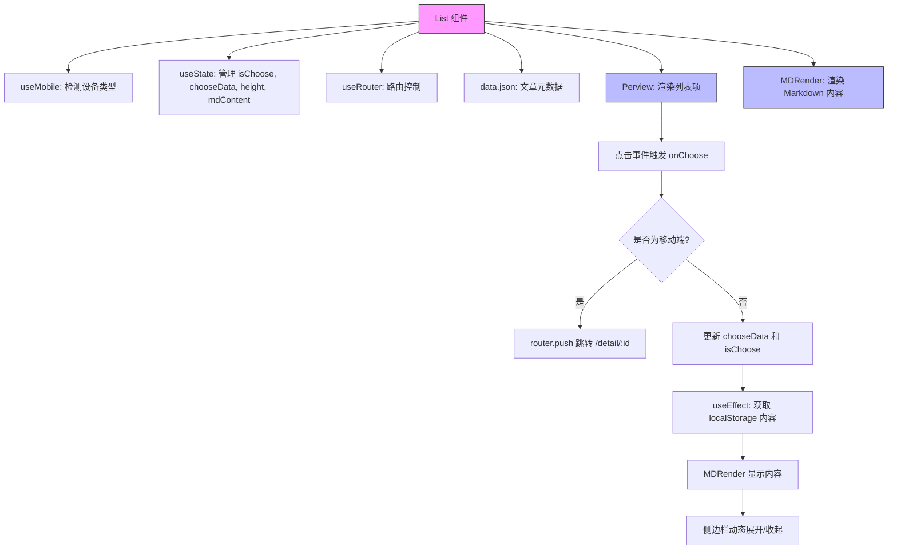
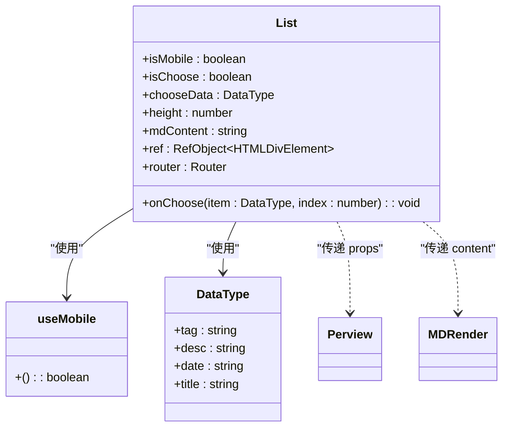
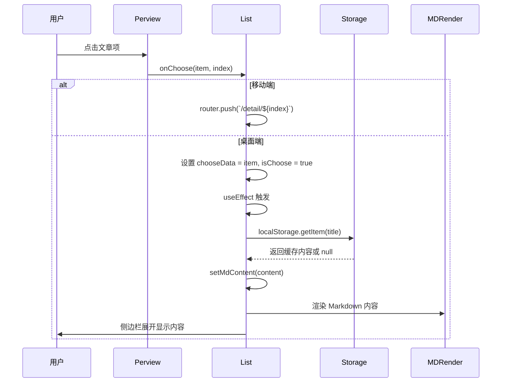
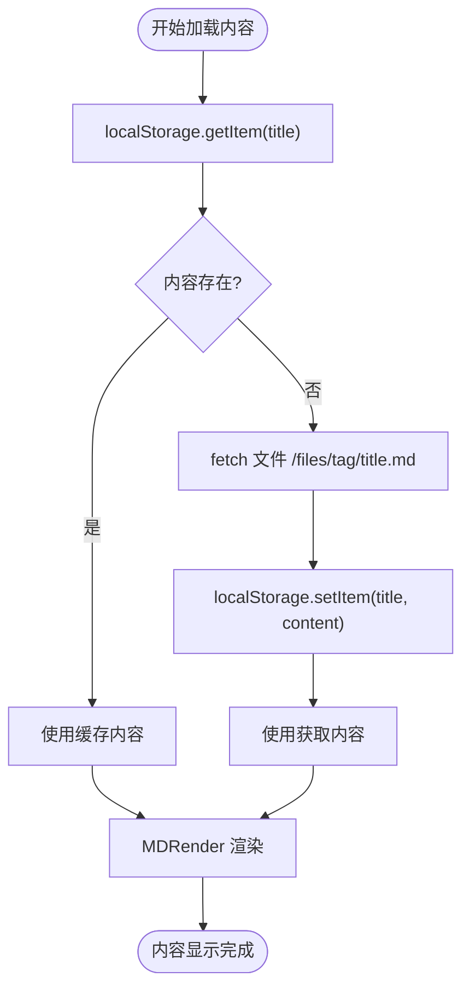

# List 组件

<cite>
**本文档引用文件**  
- [List.tsx](file://src/app/_components/List.tsx)
- [Perview.tsx](file://src/app/_components/Perview.tsx)
- [MDRender.tsx](file://src/app/_components/MDRender.tsx)
- [useMobile.ts](file://src/app/hooks/useMobile.ts)
- [type.d.ts](file://src/app/_components/type.d.ts)
- [data.json](file://src/config/data.json)
</cite>

## 目录
1. [简介](#简介)
2. [项目结构](#项目结构)
3. [核心组件](#核心组件)
4. [架构概览](#架构概览)
5. [详细组件分析](#详细组件分析)
6. [依赖分析](#依赖分析)
7. [性能考虑](#性能考虑)
8. [故障排除指南](#故障排除指南)
9. [结论](#结论)

## 简介
`List` 组件是首页文章列表的核心容器，负责管理文章预览项的渲染、用户交互状态以及内容展示逻辑。该组件根据设备类型（移动端或桌面端）动态调整行为：在移动端通过路由跳转至详情页，在桌面端则以内联方式展开内容侧边栏。它与 `Perview` 和 `MDRender` 组件协同工作，实现高效的内容加载与展示，并利用 `localStorage` 缓存已读取的 Markdown 内容以提升性能。

## 项目结构
项目采用标准的 Next.js 应用结构，核心组件集中于 `src/app/_components` 目录下。`List` 组件作为首页内容主容器，依赖多个子组件和工具模块完成其功能。



**Diagram sources**
- [List.tsx](file://src/app/_components/List.tsx#L1-L70)
- [Perview.tsx](file://src/app/_components/Perview.tsx#L1-L53)
- [useMobile.ts](file://src/app/hooks/useMobile.ts#L2-L20)
- [data.json](file://src/config/data.json#L1-L104)
- [type.d.ts](file://src/app/_components/type.d.ts#L1-L7)

**Section sources**
- [List.tsx](file://src/app/_components/List.tsx#L1-L70)
- [Perview.tsx](file://src/app/_components/Perview.tsx#L1-L53)

## 核心组件
`List` 组件通过 `useMobile` 判断当前设备类型，结合 `useState` 管理选中状态（`isChoose`、`chooseData`）、内容高度及 Markdown 内容。使用 `useRouter` 实现移动端路由跳转或桌面端内联展开逻辑。组件渲染 `Perview` 列表项，并在侧边栏中使用 `MDRender` 动态加载并渲染 Markdown 内容。

**Section sources**
- [List.tsx](file://src/app/_components/List.tsx#L8-L70)
- [Perview.tsx](file://src/app/_components/Perview.tsx#L11-L53)

## 架构概览
`List` 组件作为控制中心，协调多个子组件和状态管理机制，形成清晰的数据流和交互逻辑。



**Diagram sources**
- [List.tsx](file://src/app/_components/List.tsx#L8-L70)
- [Perview.tsx](file://src/app/_components/Perview.tsx#L11-L53)
- [MDRender.tsx](file://src/app/_components/MDRender.tsx#L1-L85)

## 详细组件分析

### List 组件分析
`List` 组件是整个文章列表的容器，负责整合数据、状态和交互逻辑。

#### 状态管理与设备检测


**Diagram sources**
- [List.tsx](file://src/app/_components/List.tsx#L8-L70)
- [useMobile.ts](file://src/app/hooks/useMobile.ts#L2-L20)
- [type.d.ts](file://src/app/_components/type.d.ts#L1-L7)

#### 交互流程


**Diagram sources**
- [List.tsx](file://src/app/_components/List.tsx#L8-L70)
- [Perview.tsx](file://src/app/_components/Perview.tsx#L11-L53)
- [MDRender.tsx](file://src/app/_components/MDRender.tsx#L1-L85)

#### 内容加载与缓存策略


**Diagram sources**
- [Perview.tsx](file://src/app/_components/Perview.tsx#L55-L67)
- [List.tsx](file://src/app/_components/List.tsx#L60-L65)

**Section sources**
- [List.tsx](file://src/app/_components/List.tsx#L8-L70)
- [Perview.tsx](file://src/app/_components/Perview.tsx#L55-L67)

## 依赖分析
`List` 组件依赖多个内部和外部模块，形成完整的功能链路。

```mermaid
dependency-graph
List --> useMobile
List --> useState
List --> useEffect
List --> useRouter
List --> data.json
List --> Perview
List --> MDRender
Perview --> useMobile
Perview --> dayjs
Perview --> getFiles
getFiles --> fetch
getFiles --> localStorage
MDRender --> react-markdown
MDRender --> remark-gfm
MDRender --> rehype-highlight
MDRender --> tdesign-react
```

**Diagram sources**
- [List.tsx](file://src/app/_components/List.tsx#L1-L70)
- [Perview.tsx](file://src/app/_components/Perview.tsx#L1-L67)
- [MDRender.tsx](file://src/app/_components/MDRender.tsx#L1-L85)
- [useMobile.ts](file://src/app/hooks/useMobile.ts#L2-L20)

**Section sources**
- [List.tsx](file://src/app/_components/List.tsx#L1-L70)
- [Perview.tsx](file://src/app/_components/Perview.tsx#L1-L67)
- [MDRender.tsx](file://src/app/_components/MDRender.tsx#L1-L85)

## 性能考虑
- **缓存策略**：通过 `localStorage` 缓存已加载的 Markdown 内容，避免重复网络请求。
- **条件渲染**：仅在桌面端且有选中项时才渲染侧边栏内容，减少不必要的 DOM 操作。
- **动画优化**：使用 CSS 过渡动画控制侧边栏展开/收起，配合 `setTimeout` 实现平滑关闭。
- **资源预取**：`Perview` 中的 `Link` 组件使用 `prefetch` 提前加载详情页资源。

## 故障排除指南
- **问题：侧边栏无法展开**
  - 检查 `isChoose` 状态是否正确更新
  - 确认 `chooseData` 是否被正确设置
  - 验证 `ref.current` 是否成功绑定到 DOM 元素

- **问题：Markdown 内容未显示**
  - 检查 `localStorage` 是否已缓存对应标题的内容
  - 确认 `fetch` 路径是否正确（`/files/tag/title.md`）
  - 查看浏览器控制台是否有网络请求错误

- **问题：移动端跳转失败**
  - 确保 `router.push` 路径格式正确（`/detail/:id`）
  - 检查 `useMobile` 返回值是否准确反映设备状态

**Section sources**
- [List.tsx](file://src/app/_components/List.tsx#L8-L70)
- [Perview.tsx](file://src/app/_components/Perview.tsx#L55-L67)

## 结论
`List` 组件通过合理的状态管理、设备适配和缓存策略，实现了高效且用户体验良好的文章列表展示功能。其与 `Perview` 和 `MDRender` 的协作模式清晰，数据流可控，具备良好的可维护性和扩展性。未来可考虑增加更多交互模式，如支持多选、收藏、搜索过滤等功能，进一步提升用户交互体验。