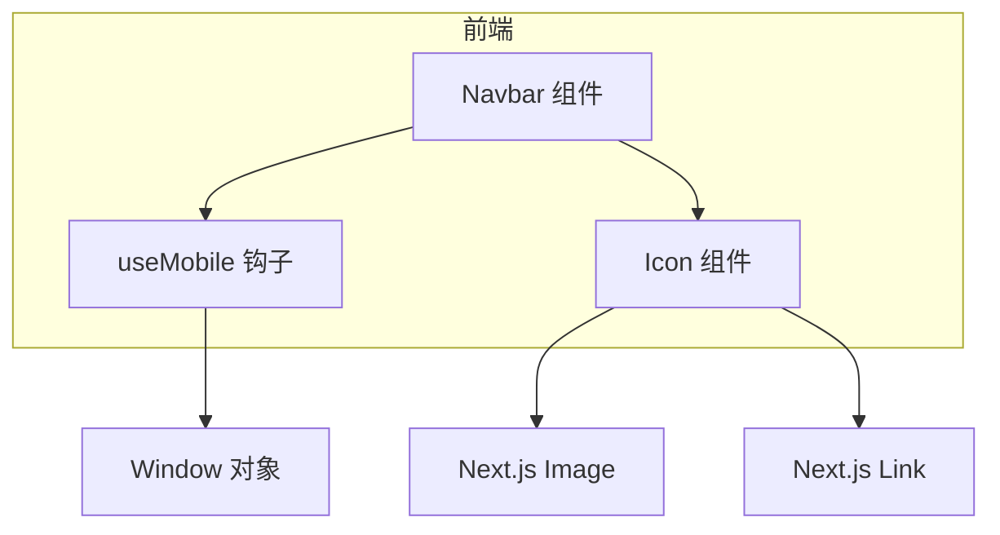
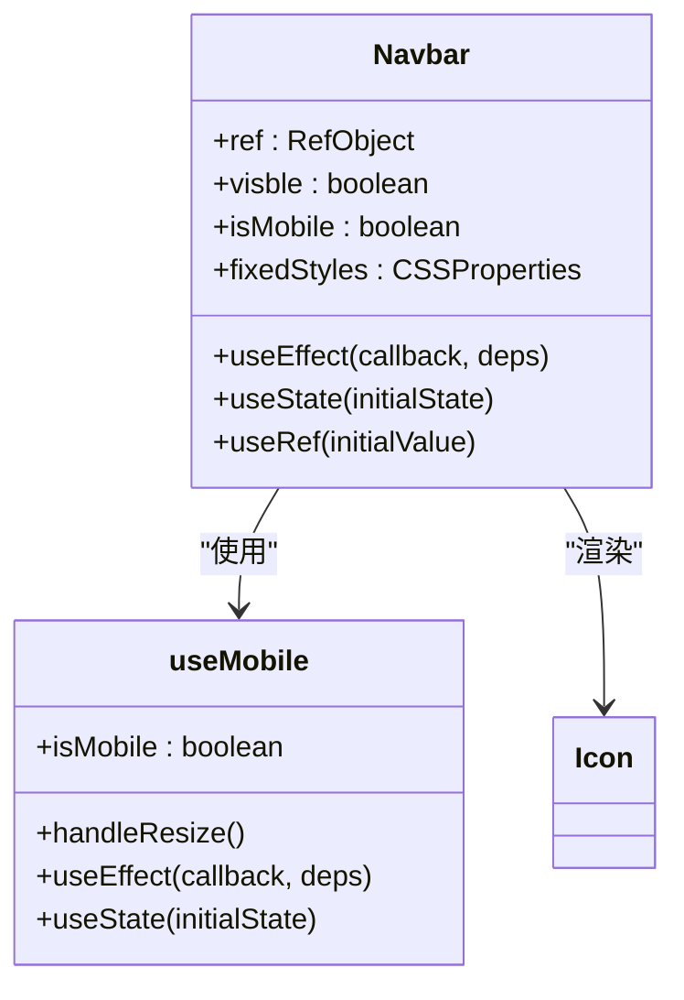
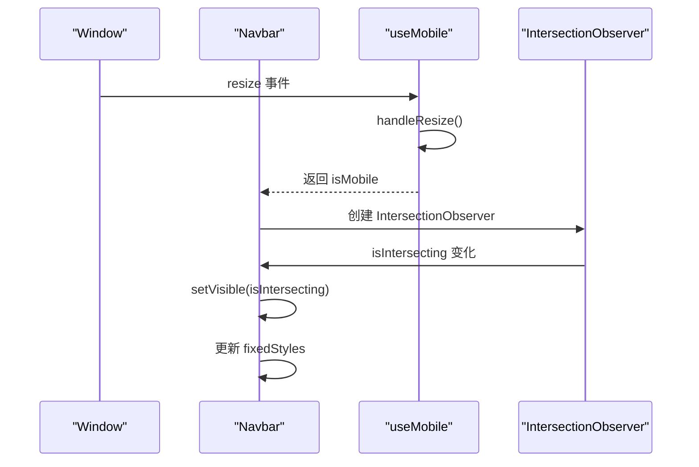
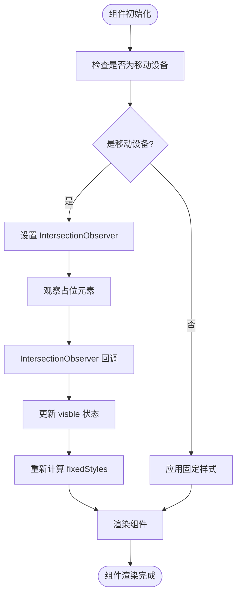
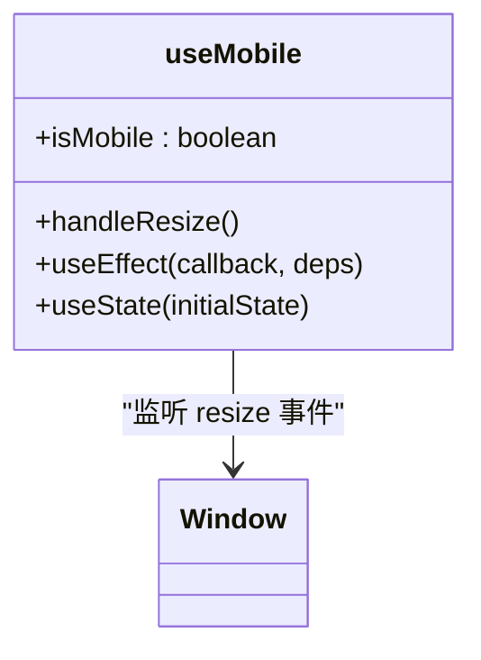
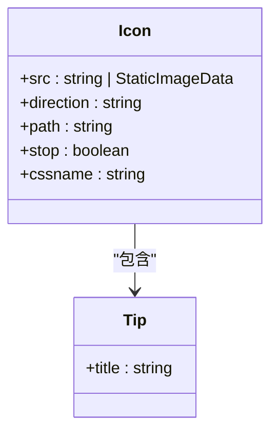
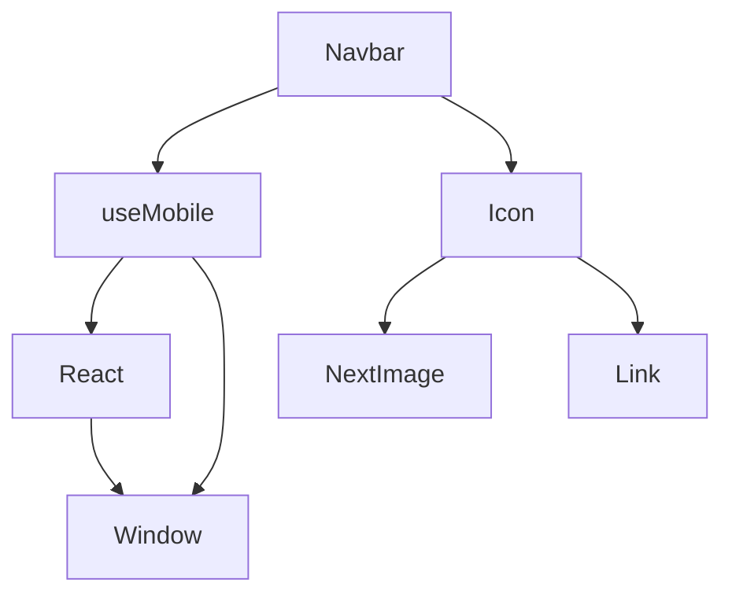

# Navbar 组件

<cite>
**Referenced Files in This Document**   
- [Navbar.tsx](file://src/app/_components/Navbar.tsx)
- [useMobile.ts](file://src/app/hooks/useMobile.ts)
- [Icon.tsx](file://src/app/_components/Icon.tsx)
- [data.json](file://src/config/data.json)
</cite>

## 目录
1. [简介](#简介)
2. [项目结构](#项目结构)
3. [核心组件](#核心组件)
4. [架构概览](#架构概览)
5. [详细组件分析](#详细组件分析)
6. [依赖分析](#依赖分析)
7. [性能考虑](#性能考虑)
8. [故障排除指南](#故障排除指南)
9. [结论](#结论)

## 简介
Navbar 组件是应用中的核心导航组件，负责在不同设备上提供一致的用户体验。该组件根据设备类型动态调整其行为和外观，利用 IntersectionObserver 实现滚动时的吸顶/隐藏效果，并通过 useMobile 钩子判断设备类型。

## 项目结构
项目结构清晰地组织了各个功能模块，主要分为以下几个部分：
- `functions`：包含各种工具函数
- `plugins`：插件相关代码
- `public/files`：公共文件资源
- `scripts`：脚本文件
- `src`：源代码目录
  - `app`：应用主目录
    - `_components`：通用组件
    - `chat`：聊天功能
    - `common`：公共API
    - `demo`：演示功能
    - `detail/[id]`：详情页
    - `hooks`：自定义钩子
    - `resume`：简历功能
    - `study`：学习功能
    - `tag`：标签功能
  - `config`：配置文件

**Section sources**
- [Navbar.tsx](file://src/app/_components/Navbar.tsx#L1-L114)
- [useMobile.ts](file://src/app/hooks/useMobile.ts#L1-L22)

## 核心组件
Navbar 组件是应用的核心导航组件，负责在不同设备上提供一致的用户体验。该组件根据设备类型动态调整其行为和外观，利用 IntersectionObserver 实现滚动时的吸顶/隐藏效果，并通过 useMobile 钩子判断设备类型。

**Section sources**
- [Navbar.tsx](file://src/app/_components/Navbar.tsx#L16-L72)
- [useMobile.ts](file://src/app/hooks/useMobile.ts#L2-L20)

## 架构概览
Navbar 组件的架构设计旨在提供灵活且高效的导航体验。它通过 useMobile 钩子检测设备类型，并根据设备类型应用不同的样式和行为。在移动端，组件使用 IntersectionObserver 监听滚动事件，实现吸顶/隐藏效果；在桌面端，组件则保持固定位置。

**Diagram sources**
- [Navbar.tsx](file://src/app/_components/Navbar.tsx#L16-L72)
- [useMobile.ts](file://src/app/hooks/useMobile.ts#L2-L20)

## 详细组件分析

### Navbar 组件分析
Navbar 组件通过 useMobile 钩子判断设备类型，并根据设备类型应用不同的样式和行为。在移动端，组件使用 IntersectionObserver 监听滚动事件，实现吸顶/隐藏效果；在桌面端，组件则保持固定位置。

#### 对象导向组件

**Diagram sources**
- [Navbar.tsx](file://src/app/_components/Navbar.tsx#L16-L72)
- [useMobile.ts](file://src/app/hooks/useMobile.ts#L2-L20)

#### API/服务组件

**Diagram sources**
- [Navbar.tsx](file://src/app/_components/Navbar.tsx#L16-L72)
- [useMobile.ts](file://src/app/hooks/useMobile.ts#L2-L20)

#### 复杂逻辑组件

**Diagram sources**
- [Navbar.tsx](file://src/app/_components/Navbar.tsx#L16-L72)
- [useMobile.ts](file://src/app/hooks/useMobile.ts#L2-L20)

**Section sources**
- [Navbar.tsx](file://src/app/_components/Navbar.tsx#L16-L72)
- [useMobile.ts](file://src/app/hooks/useMobile.ts#L2-L20)

### useMobile 钩子分析
useMobile 钩子用于检测当前设备是否为移动设备。它通过监听窗口的 resize 事件来判断设备宽度是否小于等于 768px。

**Diagram sources**
- [useMobile.ts](file://src/app/hooks/useMobile.ts#L2-L20)

**Section sources**
- [useMobile.ts](file://src/app/hooks/useMobile.ts#L2-L20)

### Icon 组件分析
Icon 组件用于渲染导航图标，并提供悬停提示功能。它通过配置对象 `config` 控制动画效果。

**Diagram sources**
- [Icon.tsx](file://src/app/_components/Icon.tsx#L1-L37)

**Section sources**
- [Icon.tsx](file://src/app/_components/Icon.tsx#L1-L37)

## 依赖分析
Navbar 组件依赖于 useMobile 钩子和 Icon 组件。useMobile 钩子依赖于 React 的 useEffect 和 useState 钩子，以及窗口的 resize 事件。Icon 组件依赖于 Next.js 的 Image 和 Link 组件。

**Diagram sources**
- [Navbar.tsx](file://src/app/_components/Navbar.tsx#L16-L72)
- [useMobile.ts](file://src/app/hooks/useMobile.ts#L2-L20)
- [Icon.tsx](file://src/app/_components/Icon.tsx#L1-L37)

**Section sources**
- [Navbar.tsx](file://src/app/_components/Navbar.tsx#L16-L72)
- [useMobile.ts](file://src/app/hooks/useMobile.ts#L2-L20)
- [Icon.tsx](file://src/app/_components/Icon.tsx#L1-L37)

## 性能考虑
Navbar 组件在性能方面有以下几点需要注意：
1. IntersectionObserver 的使用可能会导致频繁的回调，建议添加防抖处理。
2. useMobile 钩子在窗口 resize 事件中频繁调用，建议添加防抖处理。
3. Icon 组件的动画效果可能会影响性能，建议在低性能设备上禁用动画。

**Section sources**
- [Navbar.tsx](file://src/app/_components/Navbar.tsx#L16-L72)
- [useMobile.ts](file://src/app/hooks/useMobile.ts#L2-L20)

## 故障排除指南
### 常见问题
1. **移动端导航栏不隐藏**：检查 IntersectionObserver 的 rootMargin 设置是否正确。
2. **桌面端导航栏样式异常**：检查 CSS 类名是否正确应用。
3. **图标动画不生效**：检查 animate.css 是否正确引入。

### 调试方法
1. 使用浏览器开发者工具检查组件的 DOM 结构。
2. 检查控制台是否有错误信息。
3. 使用 React DevTools 检查组件的状态和属性。

**Section sources**
- [Navbar.tsx](file://src/app/_components/Navbar.tsx#L16-L72)
- [useMobile.ts](file://src/app/hooks/useMobile.ts#L2-L20)

## 结论
Navbar 组件通过 useMobile 钩子和 IntersectionObserver 实现了在不同设备上的自适应行为。它在移动端提供吸顶/隐藏效果，在桌面端保持固定位置。组件的设计考虑了性能和用户体验，但仍有一些优化空间，如添加防抖处理等。