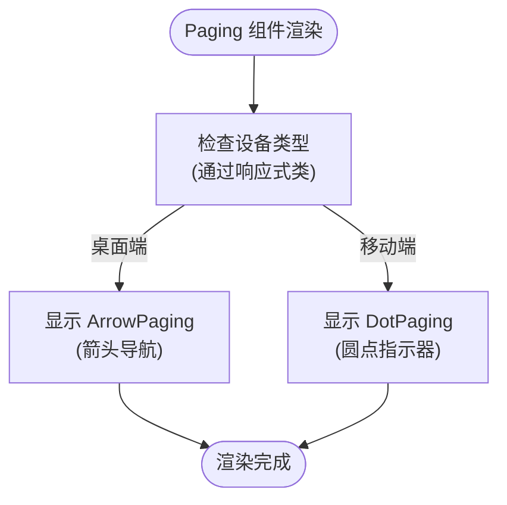
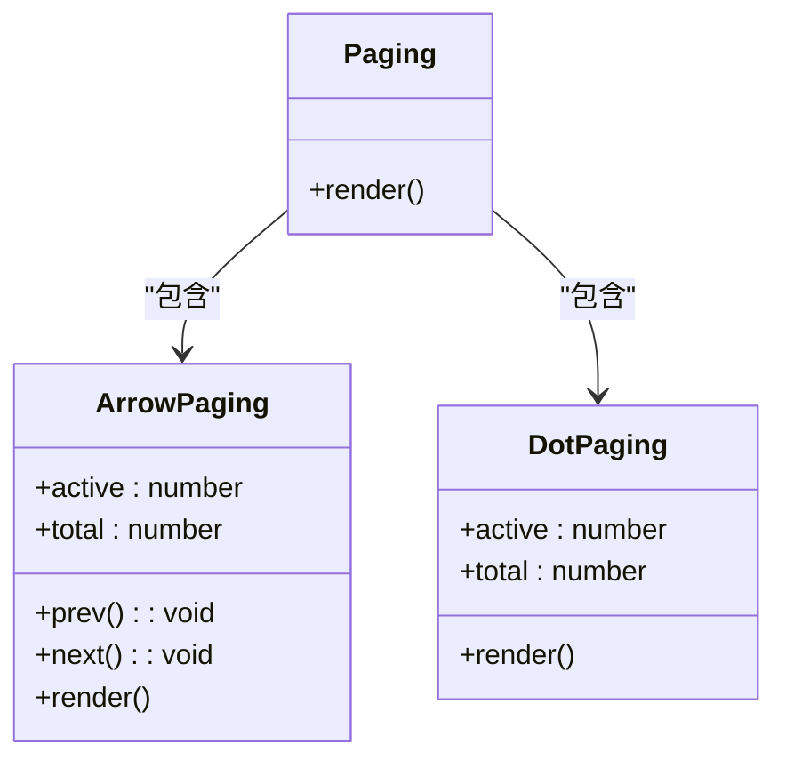

<cite>
**本文档中引用的文件**   
- [Paging.tsx](file://src/app/_components/Paging.tsx)
- [useMobile.ts](file://src/app/hooks/useMobile.ts)
</cite>

## 目录
1. [Paging 组件](#paging-组件)
2. [核心功能与响应式设计](#核心功能与响应式设计)
3. [组件角色与架构](#组件角色与架构)
4. [使用示例与回调函数](#使用示例与回调函数)
5. [扩展与自定义路径](#扩展与自定义路径)

## Paging 组件

`Paging` 组件是一个响应式分页指示器的抽象层，旨在根据设备类型为用户提供最优的导航体验。它通过条件渲染机制，智能地在桌面端和移动端之间切换不同的分页样式。

**Section sources**
- [Paging.tsx](file://src/app/_components/Paging.tsx#L8-L19)

## 核心功能与响应式设计

`Paging` 组件的核心功能是实现响应式分页指示器。其设计基于设备屏幕尺寸，利用 Tailwind CSS 的响应式断点类（`xs`）来控制不同组件的显示与隐藏。

具体实现如下：
- **桌面端 (Desktop)**：当屏幕宽度大于 768px 时，应用 `xs:hidden` 类，隐藏圆点指示器 (`DotPaging`)，同时显示箭头导航组件 (`ArrowPaging`)。
- **移动端 (Mobile)**：当屏幕宽度小于或等于 768px 时，应用 `hidden xs:block` 类，隐藏箭头导航，转而显示简洁的圆点指示器。

这种条件渲染策略确保了无论用户使用何种设备，都能获得符合该平台交互习惯的分页体验。桌面端用户习惯使用箭头进行精确的上一页/下一页操作，而移动端用户则更倾向于通过直观的圆点来感知当前所处的位置。

**Diagram sources**
- [Paging.tsx](file://src/app/_components/Paging.tsx#L8-L19)

**Section sources**
- [Paging.tsx](file://src/app/_components/Paging.tsx#L8-L19)

## 组件角色与架构

`Paging` 组件在架构中扮演着“调度者”或“适配器”的角色。它本身并不直接实现复杂的分页逻辑，而是作为一个抽象层，负责根据环境条件（设备类型）来调度和组合两个具体的实现组件：`ArrowPaging` 和 `DotPaging`。

- **`ArrowPaging`**：负责桌面端的分页逻辑。它接收 `prev` 和 `next` 回调函数，并渲染左右箭头按钮，允许用户通过点击进行翻页。同时，它会显示当前页码和总页数（例如 "2 / 5"）。
- **`DotPaging`**：负责移动端的分页逻辑。它不提供直接的上一页/下一页操作，而是通过一组圆点来可视化所有页面。当前激活的页面对应的圆点会以实心黑色和更宽的尺寸突出显示，为用户提供清晰的位置反馈。

这种架构遵循了“单一职责原则”，将设备适配逻辑与具体的UI渲染逻辑分离，使得代码更易于维护和扩展。

**Diagram sources**
- [Paging.tsx](file://src/app/_components/Paging.tsx#L8-L19)
- [Paging.tsx](file://src/app/_components/Paging.tsx#L22-L42)
- [Paging.tsx](file://src/app/_components/Paging.tsx#L44-L59)

**Section sources**
- [Paging.tsx](file://src/app/_components/Paging.tsx#L8-L59)

## 使用示例与回调函数

`Paging` 组件通过 `IProps` 接口定义了其输入参数，其中 `onPageChange` 这类回调函数的传递是通过 `prev` 和 `next` 属性实现的。

一个典型的使用示例如下：
1.  父组件维护当前页码 `currentPage` 和总页数 `totalPages`。
2.  父组件定义 `handlePrev` 和 `handleNext` 函数，用于更新 `currentPage` 的状态。
3.  将 `active`、`total`、`prev` 和 `next` 作为 `props` 传递给 `<Paging />` 组件。

当用户在桌面端点击箭头时，`ArrowPaging` 会调用传入的 `prev` 或 `next` 回调函数，从而触发父组件的状态更新，实现页面切换。在移动端，虽然 `DotPaging` 本身没有暴露点击事件，但其设计暗示了可以通过点击圆点来跳转，这需要在更高层级的组件中实现。

**Section sources**
- [Paging.tsx](file://src/app/_components/Paging.tsx#L1-L6)

## 扩展与自定义路径

当需要自定义分页样式时，建议遵循以下路径进行扩展：
1.  **直接修改现有组件**：如果需求变化不大，可以直接在 `ArrowPaging` 或 `DotPaging` 的源码中修改其样式（如颜色、尺寸、形状）或行为。
2.  **创建新组件**：对于更复杂的定制需求（例如，创建一个数字分页器或一个带有页码输入框的分页器），最佳实践是创建一个新的分页组件（例如 `NumberPaging`）。
3.  **扩展 Paging 调度逻辑**：在创建了新的分页组件后，可以修改 `Paging` 组件的条件渲染逻辑，根据不同的条件（如屏幕尺寸、用户偏好设置）来决定渲染 `ArrowPaging`、`DotPaging` 还是新的 `NumberPaging` 组件。

这种模块化的设计使得 `Paging` 组件成为一个可扩展的分页系统核心，能够轻松适应未来多样化的UI需求。

**Section sources**
- [Paging.tsx](file://src/app/_components/Paging.tsx#L8-L19)