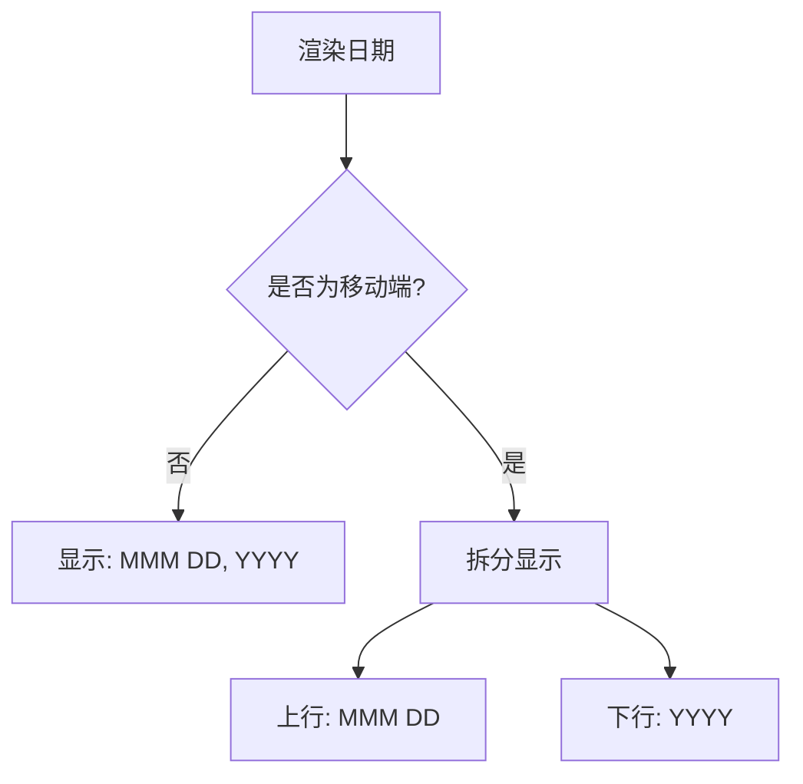
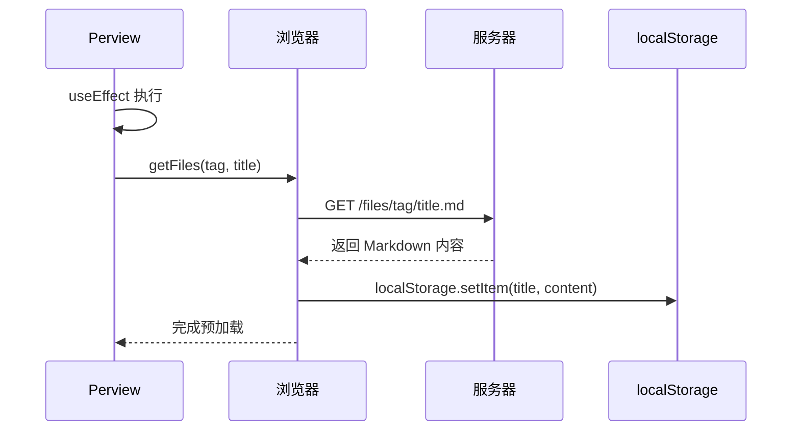

<cite>
**本文档中引用的文件**  
- [Perview.tsx](file://src/app/_components/Perview.tsx)
- [useMobile.ts](file://src/app/hooks/useMobile.ts)
- [type.d.ts](file://src/app/_components/type.d.ts)
</cite>

## 目录
1. [简介](#简介)
2. [核心组件分析](#核心组件分析)
3. [交互逻辑详解](#交互逻辑详解)
4. [响应式布局实现](#响应式布局实现)
5. [数据预加载机制](#数据预加载机制)
6. [扩展与自定义指南](#扩展与自定义指南)

## 简介
`Perview` 组件是文章预览项的核心 UI 组件，用于在列表中展示单篇文章的标题、标签、描述和日期等信息。该组件具备响应式设计，支持移动端与桌面端的不同交互模式，并通过状态管理实现选中项高亮、详情展开及路由跳转等功能。本文档将深入解析其结构、交互逻辑与可扩展性。

## 核心组件分析

`Perview` 是一个客户端组件（使用 `"use client"` 指令），接收 `data`、`index`、`onChoose` 回调和 `isActive` 状态作为属性。其主要职责是渲染文章预览项并处理用户交互。

组件依赖于 `dayjs` 进行日期格式化，利用 `useMobile` 钩子判断当前设备类型，并根据 `isActive` 状态决定是否显示“查看详情”按钮。整体结构采用 Flex 布局，结合 Tailwind CSS 实现动态样式与动画效果。

**Section sources**
- [Perview.tsx](file://src/app/_components/Perview.tsx#L1-L67)

## 交互逻辑详解

### 点击行为分支控制
当用户点击预览项时，触发 `onClick` 事件，调用传入的 `onChoose` 回调函数，通知父组件当前选中的文章及其索引。随后根据设备类型执行不同逻辑：

- **移动端**：点击后直接通过路由跳转至 `/detail/[id]` 页面。
- **桌面端**：若当前项被激活（`isActive` 为真），则显示“查看详情”按钮；点击该按钮时阻止事件冒泡，防止触发外层 `onClick`，从而避免重复调用 `onChoose`。

此设计确保了移动端操作简洁，桌面端可展开更多内容，提升用户体验。

### 事件冒泡阻止机制
“查看详情”链接使用 `onClick={(e) => e.stopPropagation()}` 明确阻止事件向上冒泡，防止触发父级 `div` 的 `onClick` 事件。这是实现桌面端“展开详情”而非“跳转页面”的关键。

```mermaid
sequenceDiagram
participant 用户
participant 查看详情按钮
participant 预览项容器
用户->>查看详情按钮 : 点击
查看详情按钮->>查看详情按钮 : e.stopPropagation()
查看详情按钮-->>用户 : 执行链接跳转(/detail/index)
预览项容器-->> : 不触发 onChoose
```

**Diagram sources**
- [Perview.tsx](file://src/app/_components/Perview.tsx#L40-L48)

**Section sources**
- [Perview.tsx](file://src/app/_components/Perview.tsx#L38-L48)

## 响应式布局实现

`Perview` 组件采用 Tailwind CSS 的响应式断点系统（`xs`）实现多端适配：

- **桌面端**：日期显示为一行，格式为 `MMM DD, YYYY`（如 "Oct 15, 2023"）。
- **移动端**：日期拆分为两行，上方显示 `MMM DD`，下方单独显示 `YYYY`，节省横向空间。

通过 `block` 与 `hidden` 类的组合控制元素在不同屏幕尺寸下的显示状态，确保信息清晰可读。



**Diagram sources**
- [Perview.tsx](file://src/app/_components/Perview.tsx#L25-L31)

**Section sources**
- [Perview.tsx](file://src/app/_components/Perview.tsx#L25-L31)

## 数据预加载机制

组件内部使用 `useEffect` 钩子，在 `tag` 或 `title` 变化时调用 `getFiles(tag, title)` 函数，预加载对应的文章内容。

`getFiles` 函数构造文件路径 `files/${tag}/${title}.md`，通过 `fetch` 获取 Markdown 内容，并将其存储到 `localStorage` 中，以便后续页面快速读取，减少重复请求，提升性能。



**Diagram sources**
- [Perview.tsx](file://src/app/_components/Perview.tsx#L17-L19)
- [Perview.tsx](file://src/app/_components/Perview.tsx#L57-L66)

**Section sources**
- [Perview.tsx](file://src/app/_components/Perview.tsx#L17-L19)
- [Perview.tsx](file://src/app/_components/Perview.tsx#L57-L66)

## 扩展与自定义指南

### 自定义样式
可通过修改 `className` 中的 Tailwind 类来自定义外观，例如更改字体颜色、间距或动画效果。例如，替换 `text-[#FF0000]` 以使用其他高亮颜色。

### 添加新字段
若需展示额外字段（如作者、阅读量），首先在 `type.d.ts` 中扩展 `DataType` 接口：

```ts
declare type DataType = {
  tag: string;
  desc: string;
  date: string;
  title: string;
  author?: string; // 新增字段
  views?: number;  // 新增字段
};
```

然后在 `Perview.tsx` 中解构并渲染新字段即可。

**Section sources**
- [type.d.ts](file://src/app/_components/type.d.ts#L1-L7)
- [Perview.tsx](file://src/app/_components/Perview.tsx#L14-L15)