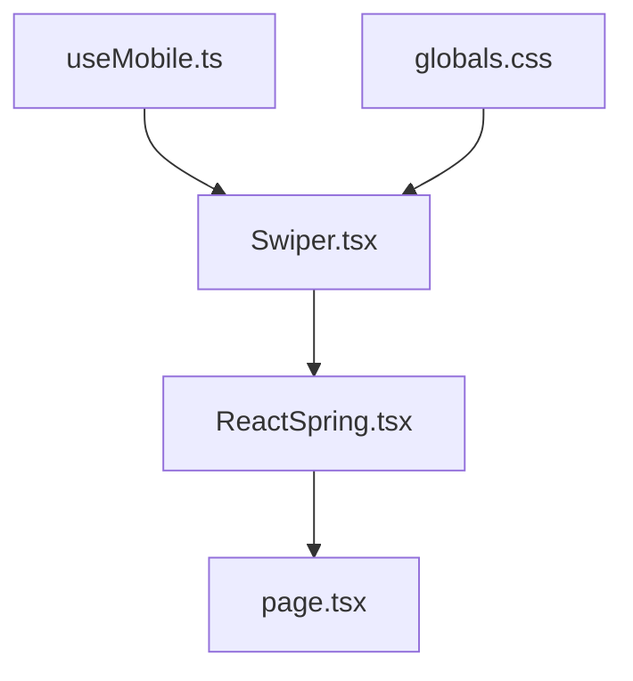
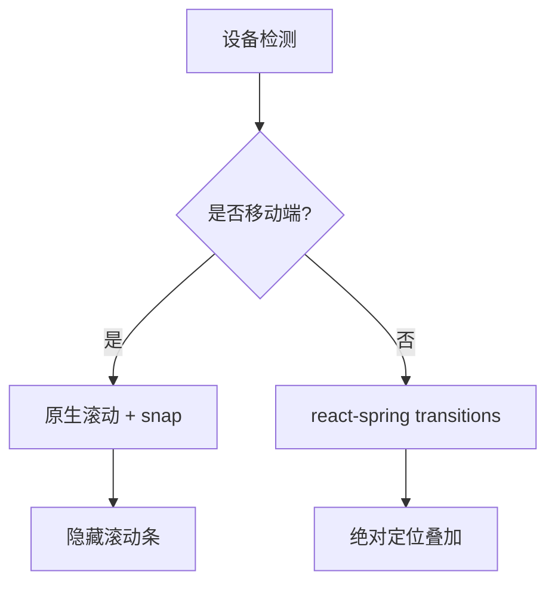
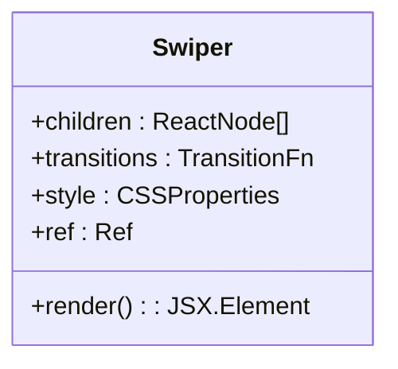
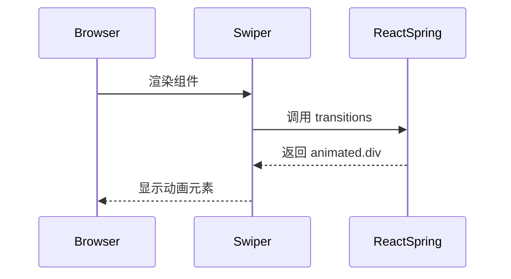
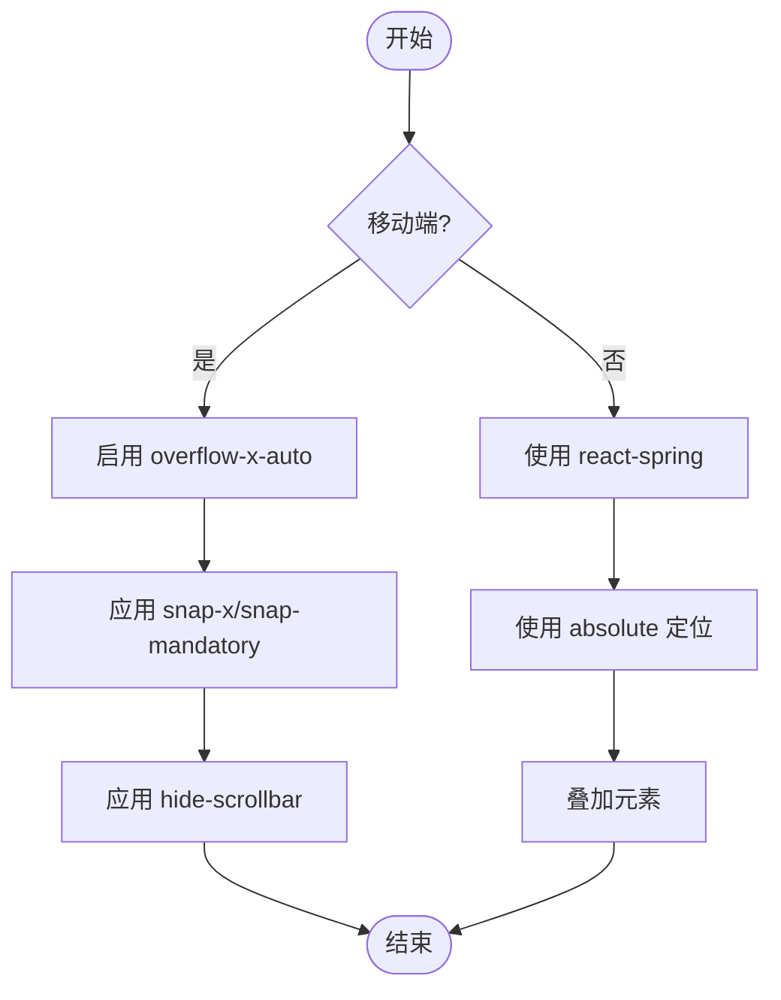
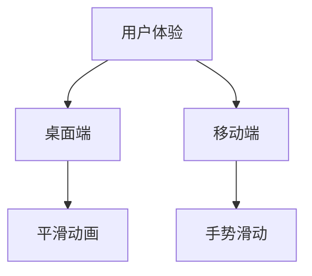
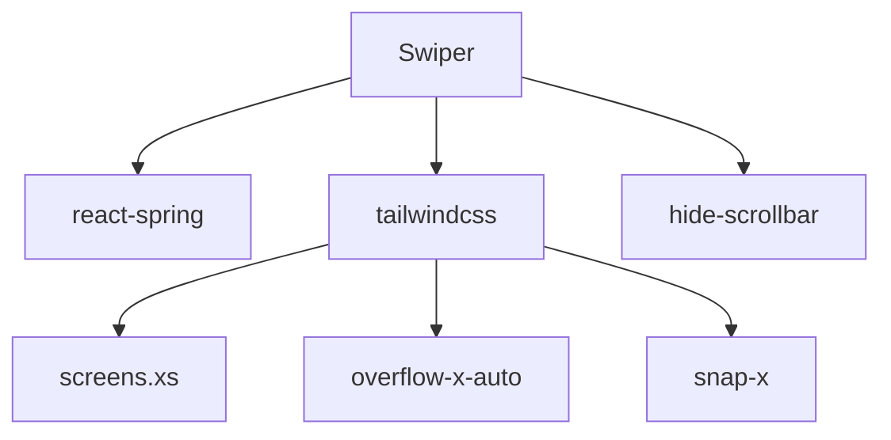

# Swiper 组件

<cite>
**本文档引用的文件**
- [Swiper.tsx](file://src/app/_components/Swiper.tsx)
- [useMobile.ts](file://src/app/hooks/useMobile.ts)
- [globals.css](file://src/app/globals.css)
- [ReactSpring.tsx](file://src/app/demo/_components/ReactSpring.tsx)
- [page.tsx](file://src/app/demo/page.tsx)
</cite>

## 目录
1. [简介](#简介)
2. [项目结构](#项目结构)
3. [核心组件](#核心组件)
4. [架构概述](#架构概述)
5. [详细组件分析](#详细组件分析)
6. [依赖分析](#依赖分析)
7. [性能考虑](#性能考虑)
8. [故障排除指南](#故障排除指南)
9. [结论](#结论)

## 简介
Swiper 组件是一个响应式轮播容器，支持双模式渲染机制。在桌面端使用 `react-spring` 的 `transitions` 实现平滑动画切换，通过 `animated.div` 绝对定位叠加子元素；而在移动端则采用原生滚动（`overflow-x-auto`）配合 `snap-x` 和 `snap-mandatory` 实现滑动手势支持。该组件通过 `ref` 支持外部控制滚动位置，并通过 `hide-scrollbar` 类隐藏滚动条同时保持滚动功能。

## 项目结构
Swiper 组件位于 `src/app/_components/Swiper.tsx`，被 `demo` 页面中的 `ReactSpring` 组件调用。`useMobile` 钩子用于检测设备类型，`globals.css` 定义了隐藏滚动条的样式。

**图示来源**
- [Swiper.tsx](file://src/app/_components/Swiper.tsx#L8-L40)
- [useMobile.ts](file://src/app/hooks/useMobile.ts#L2-L20)
- [globals.css](file://src/app/globals.css#L21-L26)

**本节来源**
- [Swiper.tsx](file://src/app/_components/Swiper.tsx#L1-L43)
- [useMobile.ts](file://src/app/hooks/useMobile.ts#L1-L21)
- [globals.css](file://src/app/globals.css#L20-L62)

## 核心组件
Swiper 组件接收 `children`、`transitions`、`style` 和 `ref` 等属性。`children` 是轮播的子元素数组，`transitions` 是 `react-spring` 的过渡函数，`style` 用于自定义样式，`ref` 用于外部控制滚动位置。

**本节来源**
- [Swiper.tsx](file://src/app/_components/Swiper.tsx#L8-L40)

## 架构概述
Swiper 组件根据设备类型选择不同的渲染模式。桌面端使用 `react-spring` 实现动画效果，移动端使用原生滚动实现滑动手势。`hide-scrollbar` 类通过 CSS 隐藏滚动条，同时保持滚动功能。

**图示来源**
- [Swiper.tsx](file://src/app/_components/Swiper.tsx#L8-L40)
- [globals.css](file://src/app/globals.css#L21-L26)

## 详细组件分析

### Swiper 组件分析
Swiper 组件通过 `xs:hidden` 和 `xs:flex` 类控制不同设备的显示模式。桌面端使用 `relative` 容器和 `absolute` 定位的 `animated.div` 实现动画叠加，移动端使用 `overflow-x-auto` 和 `snap-x` 实现滑动。

#### 对于响应式组件：

**图示来源**
- [Swiper.tsx](file://src/app/_components/Swiper.tsx#L8-L40)

#### 对于动画流程：

**图示来源**
- [Swiper.tsx](file://src/app/_components/Swiper.tsx#L8-L40)

#### 对于滚动处理：

**图示来源**
- [Swiper.tsx](file://src/app/_components/Swiper.tsx#L8-L40)
- [globals.css](file://src/app/globals.css#L21-L26)

**本节来源**
- [Swiper.tsx](file://src/app/_components/Swiper.tsx#L8-L40)
- [globals.css](file://src/app/globals.css#L21-L26)

### 概念概述
Swiper 组件的设计理念是根据不同设备特性选择最优的交互方式。桌面端注重动画流畅性，移动端注重手势自然性。

## 依赖分析
Swiper 组件依赖 `react-spring` 实现动画，依赖 `tailwindcss` 实现响应式布局和滚动捕捉，依赖自定义 CSS 类 `hide-scrollbar` 隐藏滚动条。

**图示来源**
- [Swiper.tsx](file://src/app/_components/Swiper.tsx#L8-L40)
- [tailwind.config.ts](file://tailwind.config.ts#L1-L40)
- [globals.css](file://src/app/globals.css#L21-L26)

**本节来源**
- [Swiper.tsx](file://src/app/_components/Swiper.tsx#L1-L43)
- [tailwind.config.ts](file://tailwind.config.ts#L1-L40)
- [globals.css](file://src/app/globals.css#L20-L62)

## 性能考虑
- 使用 `react-spring` 的 `transitions` 保证动画流畅性
- 移动端使用原生滚动提高性能
- `hide-scrollbar` 类避免滚动条重绘开销
- `flex-shrink-0` 防止子元素压缩

## 故障排除指南
- 如果滚动条未隐藏，检查 `hide-scrollbar` 类是否正确应用
- 如果动画不工作，检查 `transitions` 函数是否正确传递
- 如果滑动不流畅，检查 `snap-x` 和 `snap-mandatory` 是否正确设置
- 如果响应式不生效，检查 `tailwind.config.ts` 中的 `screens` 配置

**本节来源**
- [Swiper.tsx](file://src/app/_components/Swiper.tsx#L8-L40)
- [globals.css](file://src/app/globals.css#L21-L26)
- [tailwind.config.ts](file://tailwind.config.ts#L1-L40)

## 结论
Swiper 组件通过双模式渲染机制，在不同设备上提供最佳用户体验。桌面端使用 `react-spring` 实现精美动画，移动端使用原生滚动保证流畅手势。通过合理的 CSS 类和 React 属性设计，实现了高度可定制和易用的轮播组件。