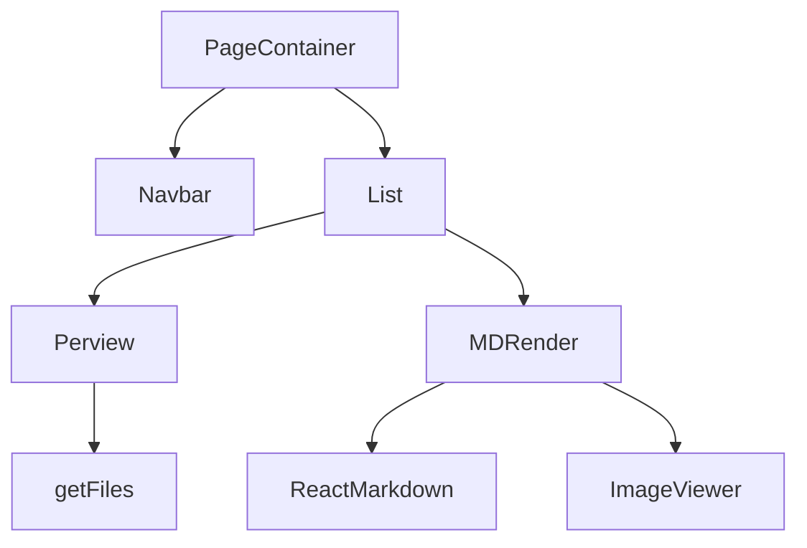
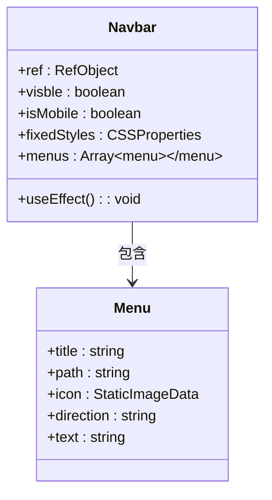
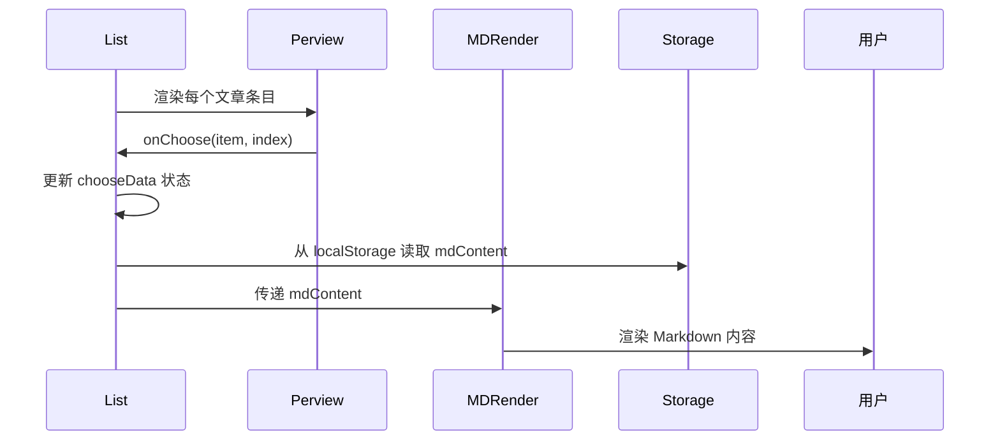
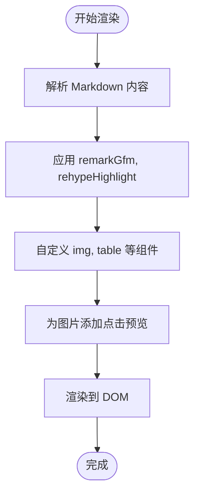
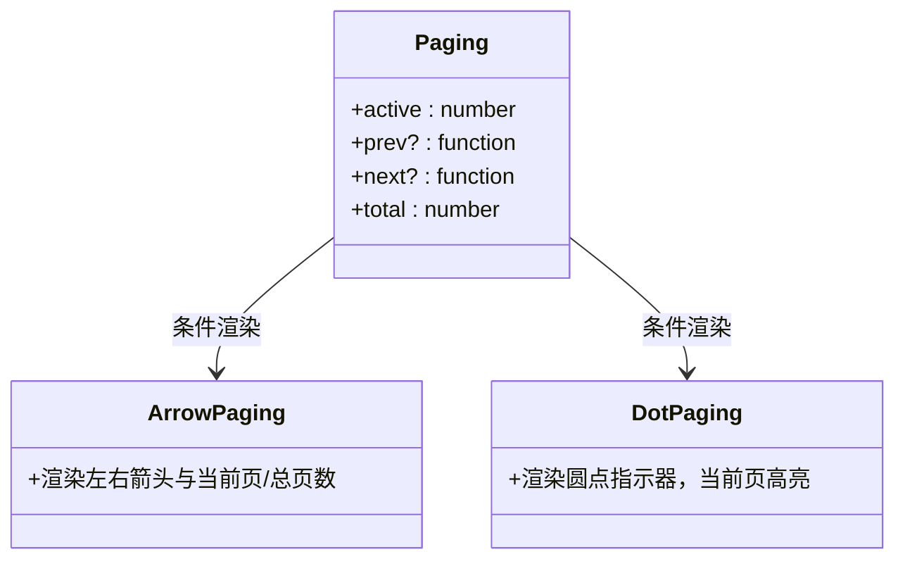
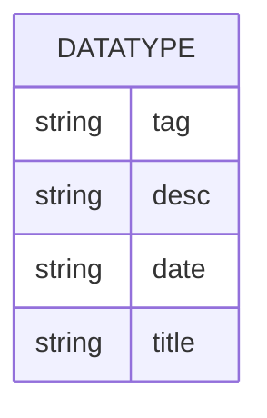

# 组件架构

<cite>
**本文档引用的文件**
- [Navbar.tsx](file://src/app/_components/Navbar.tsx)
- [List.tsx](file://src/app/_components/List.tsx)
- [MDRender.tsx](file://src/app/_components/MDRender.tsx)
- [Perview.tsx](file://src/app/_components/Perview.tsx)
- [Paging.tsx](file://src/app/_components/Paging.tsx)
- [type.d.ts](file://src/app/_components/type.d.ts)
- [page.tsx](file://src/app/page.tsx)
- [layout.tsx](file://src/app/layout.tsx)
</cite>

## 目录
1. [简介](#简介)
2. [项目结构](#项目结构)
3. 核心组件
4. 架构概览
5. 详细组件分析
6. 组件组合与依赖关系
7. 类型定义与规范
8. 使用示例与复用指南
9. 总结

## 简介
本文档深入分析项目中通用 UI 组件的设计与实现，涵盖 `Navbar`、`List`、`MDRender`、`Perview` 和 `Paging` 等核心组件。详细说明各组件职责、组合方式、props 传递模式及类型定义规范，并提供实际调用示例，指导如何复用这些组件构建新页面。

## 项目结构
项目采用基于 Next.js 的 App Router 架构，核心 UI 组件集中存放于 `src/app/_components` 目录下，遵循模块化与可复用设计原则。页面逻辑与组件分离，便于维护和扩展。

```mermaid
graph TB
subgraph "UI Components"
Navbar[Navbar.tsx]
List[List.tsx]
MDRender[MDRender.tsx]
Perview[Perview.tsx]
Paging[Paging.tsx]
Icon[Icon.tsx]
PageContainer[PageContainer.tsx]
end
subgraph "Pages"
Home[page.tsx]
Detail[detail/[id]/page.tsx]
Chat[chat/page.tsx]
Demo[demo/page.tsx]
end
Home --> Navbar
Home --> List
List --> Perview
List --> MDRender
Home --> PageContainer
```

**Diagram sources**
- [Navbar.tsx](file://src/app/_components/Navbar.tsx)
- [List.tsx](file://src/app/_components/List.tsx)
- [MDRender.tsx](file://src/app/_components/MDRender.tsx)
- [Perview.tsx](file://src/app/_components/Perview.tsx)
- [Paging.tsx](file://src/app/_components/Paging.tsx)
- [page.tsx](file://src/app/page.tsx)

**Section sources**
- [src/app/_components](file://src/app/_components)
- [src/app/page.tsx](file://src/app/page.tsx)

## 核心组件

本文档重点分析以下通用 UI 组件：

- `Navbar`：负责导航菜单展示与移动端适配
- `List`：管理文章列表渲染与详情展示逻辑
- `Perview`：文章条目预览组件
- `MDRender`：Markdown 内容渲染与语法高亮
- `Paging`：分页控制器，支持移动端与桌面端不同样式

**Section sources**
- [Navbar.tsx](file://src/app/_components/Navbar.tsx)
- [List.tsx](file://src/app/_components/List.tsx)
- [MDRender.tsx](file://src/app/_components/MDRender.tsx)
- [Perview.tsx](file://src/app/_components/Perview.tsx)
- [Paging.tsx](file://src/app/_components/Paging.tsx)

## 架构概览

系统采用组件化架构，通过组合模式构建复杂 UI。核心组件之间通过 props 传递数据与回调函数，实现松耦合与高内聚。



**Diagram sources**
- [page.tsx](file://src/app/page.tsx)
- [List.tsx](file://src/app/_components/List.tsx)
- [Perview.tsx](file://src/app/_components/Perview.tsx)
- [MDRender.tsx](file://src/app/_components/MDRender.tsx)

## 详细组件分析

### Navbar 分析
`Navbar` 组件实现响应式导航栏，支持桌面端与移动端不同交互模式。在移动端通过 `IntersectionObserver` 监听滚动位置，实现导航栏固定定位切换。



**Diagram sources**
- [Navbar.tsx](file://src/app/_components/Navbar.tsx#L16-L72)

**Section sources**
- [Navbar.tsx](file://src/app/_components/Navbar.tsx)

### List 分析
`List` 组件为核心内容展示容器，负责加载文章数据、管理选中状态，并协调 `Perview` 与 `MDRender` 组件的展示逻辑。



**Diagram sources**
- [List.tsx](file://src/app/_components/List.tsx#L8-L70)
- [Perview.tsx](file://src/app/_components/Perview.tsx#L11-L53)

**Section sources**
- [List.tsx](file://src/app/_components/List.tsx)

### MDRender 分析
`MDRender` 组件封装 `react-markdown`，支持 GitHub Flavored Markdown、代码语法高亮及原始 HTML 解析。集成图片预览功能，点击图片可放大查看。



**Diagram sources**
- [MDRender.tsx](file://src/app/_components/MDRender.tsx)

**Section sources**
- [MDRender.tsx](file://src/app/_components/MDRender.tsx)

### Perview 分析
`Perview` 组件用于展示单个文章预览信息，包含标题、描述、日期等。通过 `useEffect` 在组件挂载时预加载对应 Markdown 文件内容至 `localStorage`。

**Section sources**
- [Perview.tsx](file://src/app/_components/Perview.tsx)

### Paging 分析
`Paging` 组件提供分页功能，根据屏幕尺寸自动切换显示模式：桌面端显示箭头+页码，移动端显示圆点指示器。



**Diagram sources**
- [Paging.tsx](file://src/app/_components/Paging.tsx#L8-L19)

**Section sources**
- [Paging.tsx](file://src/app/_components/Paging.tsx)

## 组件组合与依赖关系

组件间通过 props 传递数据与回调函数，形成清晰的父子关系链：

- `List` 组合使用 `Perview` 和 `MDRender`
- `Perview` 接收 `onChoose` 回调，通知 `List` 更新状态
- `List` 根据状态控制 `MDRender` 的显示与内容
- `Paging` 可独立使用或集成到列表组件中

这种组合模式提高了组件复用性，新页面可通过组合现有组件快速构建。

**Section sources**
- [List.tsx](file://src/app/_components/List.tsx)
- [Perview.tsx](file://src/app/_components/Perview.tsx)
- [MDRender.tsx](file://src/app/_components/MDRender.tsx)

## 类型定义与规范

项目通过 `type.d.ts` 统一定义数据类型，确保类型安全与代码可维护性。



所有组件遵循 TypeScript 类型规范，明确声明 props 类型，如 `Perview` 的 `IProps` 接口。

**Diagram sources**
- [type.d.ts](file://src/app/_components/type.d.ts)

**Section sources**
- [type.d.ts](file://src/app/_components/type.d.ts)

## 使用示例与复用指南

### 创建新页面示例
```tsx
import PageContainer from "@/app/_components/PageContainer";
import List from "@/app/_components/List";
import Navbar from "@/app/_components/Navbar";

export default function NewPage() {
  return (
    <PageContainer>
      <Navbar />
      <List />
    </PageContainer>
  );
}
```

### 复用建议
- 新增文章类型时，只需更新 `data.json`，无需修改 `List` 或 `Perview`
- 可将 `MDRender` 用于任何需要渲染 Markdown 的场景
- `Paging` 可轻松集成到其他分页需求中

**Section sources**
- [page.tsx](file://src/app/page.tsx)
- [layout.tsx](file://src/app/layout.tsx)

## 总结
本项目通过精心设计的通用 UI 组件，实现了高效、可维护的前端架构。组件职责清晰、组合灵活、类型安全，为快速开发新页面提供了坚实基础。建议在新功能开发中优先复用现有组件，保持代码一致性与可维护性。