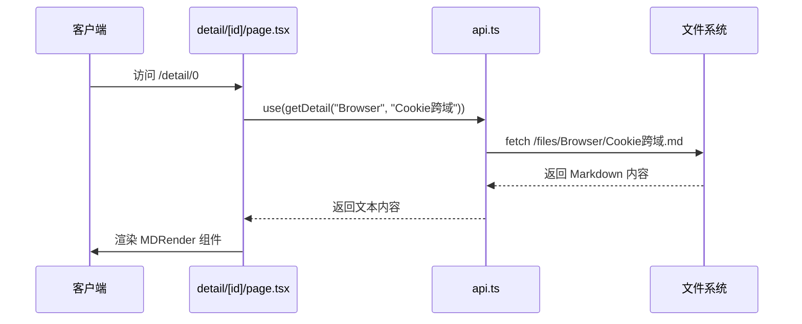
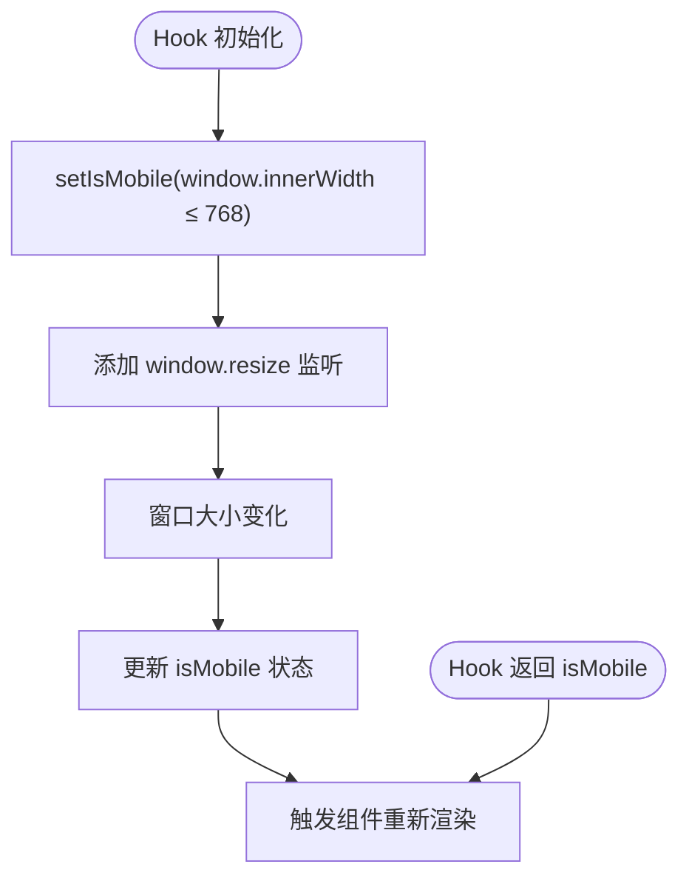
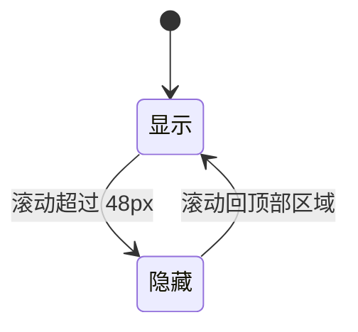

# 路由与导航

<cite>
**本文档引用文件**  
- [page.tsx](file://src/app/page.tsx)
- [detail/[id]/page.tsx](file://src/app/detail/[id]/page.tsx)
- [layout.tsx](file://src/app/layout.tsx)
- [useMobile.ts](file://src/app/hooks/useMobile.ts)
- [Navbar.tsx](file://src/app/_components/Navbar.tsx)
- [List.tsx](file://src/app/_components/List.tsx)
- [api.ts](file://src/app/common/api.ts)
</cite>

## 目录
1. [简介](#简介)
2. [项目结构与路由机制](#项目结构与路由机制)
3. [核心组件分析](#核心组件分析)
4. [架构概览](#架构概览)
5. [详细组件分析](#详细组件分析)
6. [依赖关系分析](#依赖关系分析)
7. [性能考量](#性能考量)
8. [故障排查指南](#故障排查指南)
9. [结论](#结论)

## 简介
本文档深入阐述基于 Next.js App Router 的文件系统路由机制，涵盖根页面、动态路由（`[id]`）的实现方式，以及 `layout.tsx` 在全局布局中的作用。同时分析 `useMobile` 自定义 Hook 如何通过 User-Agent 和视口宽度判断设备类型，并影响导航栏（`Navbar`）的行为逻辑。最后描述移动端与桌面端在路由跳转与内容展示上的差异处理流程。

## 项目结构与路由机制

Next.js 应用采用基于文件系统的路由设计，`src/app` 目录下的文件结构直接映射为应用的路由结构。每个文件夹代表一个路由段，`page.tsx` 文件定义该路径的页面内容。

```mermaid
graph TB
A[src/app] --> B[page.tsx]
A --> C[detail/[id]/page.tsx]
A --> D[layout.tsx]
A --> E[hooks/useMobile.ts]
A --> F[_components/Navbar.tsx]
A --> G[_components/List.tsx]
B --> |根路由 /| H[首页]
C --> |动态路由 /detail/:id| I[详情页]
D --> |全局布局| J[包裹所有页面]
E --> |设备检测| F
F --> |导航控制| B & C
G --> |内容列表| B
```

**Diagram sources**
- [page.tsx](file://src/app/page.tsx#L1-L24)
- [detail/[id]/page.tsx](file://src/app/detail/[id]/page.tsx#L1-L41)
- [layout.tsx](file://src/app/layout.tsx#L1-L31)

**Section sources**
- [page.tsx](file://src/app/page.tsx#L1-L24)
- [detail/[id]/page.tsx](file://src/app/detail/[id]/page.tsx#L1-L41)

## 核心组件分析

本节分析路由与导航相关的核心组件，包括页面入口、动态路由处理、布局封装、设备检测 Hook 及导航栏逻辑。

**Section sources**
- [page.tsx](file://src/app/page.tsx#L1-L24)
- [useMobile.ts](file://src/app/hooks/useMobile.ts#L1-L21)
- [Navbar.tsx](file://src/app/_components/Navbar.tsx#L1-L113)

## 架构概览

系统采用 Next.js App Router 架构，以组件化方式组织路由与 UI。`layout.tsx` 提供全局 HTML 结构与元数据，各 `page.tsx` 实现具体页面逻辑，`useMobile` 统一处理响应式判断，`Navbar` 根据设备类型动态调整行为。

```mermaid
graph TD
A[layout.tsx] --> B[包裹所有页面]
B --> C[page.tsx]
B --> D[detail/[id]/page.tsx]
E[useMobile.ts] --> F[Navbar.tsx]
F --> C
F --> D
G[List.tsx] --> C
H[api.ts] --> D
```

**Diagram sources**
- [layout.tsx](file://src/app/layout.tsx#L1-L31)
- [useMobile.ts](file://src/app/hooks/useMobile.ts#L1-L21)
- [Navbar.tsx](file://src/app/_components/Navbar.tsx#L1-L113)

## 详细组件分析

### 根页面与动态路由实现

根页面 `page.tsx` 作为应用入口，通过 `headers()` 获取 User-Agent 判断是否为移动设备，并渲染 `Navbar` 与 `List` 组件。动态路由 `/detail/[id]` 通过路径参数 `id` 从配置文件中读取对应内容，并调用 `getDetail` API 获取 Markdown 文件内容进行渲染。

#### 动态路由数据流


**Diagram sources**
- [detail/[id]/page.tsx](file://src/app/detail/[id]/page.tsx#L1-L41)
- [api.ts](file://src/app/common/api.ts#L1-L17)

**Section sources**
- [detail/[id]/page.tsx](file://src/app/detail/[id]/page.tsx#L1-L41)
- [api.ts](file://src/app/common/api.ts#L1-L17)

### layout.tsx 全局布局作用

`layout.tsx` 是整个应用的根布局组件，负责定义 HTML 文档结构、引入全局样式与元数据（metadata）。它通过 `children` prop 渲染所有子页面，确保页面切换时保持布局一致性，同时支持 SEO 优化。

**Section sources**
- [layout.tsx](file://src/app/layout.tsx#L1-L31)

### useMobile 自定义 Hook 分析

`useMobile` Hook 封装了设备类型判断逻辑，结合视口宽度（≤768px）动态返回布尔值。该 Hook 在组件挂载时绑定 `resize` 事件监听器，并在卸载时正确清理，避免内存泄漏。



**Diagram sources**
- [useMobile.ts](file://src/app/hooks/useMobile.ts#L2-L20)

**Section sources**
- [useMobile.ts](file://src/app/hooks/useMobile.ts#L1-L21)

### Navbar 导航栏行为逻辑

`Navbar` 组件依赖 `useMobile` 判断设备类型。在移动端，通过 `IntersectionObserver` 监听占位元素是否可见，动态切换导航栏的定位方式（`absolute` 或 `fixed`），实现“隐藏/显示”效果；在桌面端则始终固定显示。

#### 移动端导航栏状态切换


**Diagram sources**
- [Navbar.tsx](file://src/app/_components/Navbar.tsx#L16-L72)

**Section sources**
- [Navbar.tsx](file://src/app/_components/Navbar.tsx#L1-L113)

## 依赖关系分析

系统各组件间存在明确的依赖关系，`Navbar` 依赖 `useMobile` 判断设备类型，`List` 组件在移动端直接跳转至详情页，桌面端则内联展示内容，体现响应式设计思想。

```mermaid
graph LR
A[useMobile] --> B[Navbar]
A --> C[List]
B --> D[page.tsx]
B --> E[detail/[id]/page.tsx]
C --> D
F[api.ts] --> E
```

**Diagram sources**
- [useMobile.ts](file://src/app/hooks/useMobile.ts#L1-L21)
- [Navbar.tsx](file://src/app/_components/Navbar.tsx#L1-L113)
- [List.tsx](file://src/app/_components/List.tsx#L1-L73)

**Section sources**
- [useMobile.ts](file://src/app/hooks/useMobile.ts#L1-L21)
- [Navbar.tsx](file://src/app/_components/Navbar.tsx#L1-L113)
- [List.tsx](file://src/app/_components/List.tsx#L1-L73)

## 性能考量

- `useMobile` 使用 `useEffect` 正确管理事件监听，避免内存泄漏
- `IntersectionObserver` 替代频繁的 `scroll` 事件监听，提升滚动性能
- `MDRender` 使用 `react-markdown` 按需解析，结合 `rehype-highlight` 实现代码高亮
- 静态资源（如 Markdown 文件）通过 `fetch` 按需加载，减少初始加载体积

## 故障排查指南

- **导航栏不响应滚动**：检查 `ref` 是否正确绑定，`IntersectionObserver` 的 `rootMargin` 设置
- **移动端无法跳转详情页**：确认 `router.push` 是否在客户端执行，`isMobile` 状态是否正确
- **Markdown 内容未渲染**：检查 `getDetail` 返回内容是否为空，文件路径是否正确
- **布局错乱**：确认 `layout.tsx` 是否正确包裹所有页面，CSS 类名是否冲突

**Section sources**
- [Navbar.tsx](file://src/app/_components/Navbar.tsx#L1-L113)
- [List.tsx](file://src/app/_components/List.tsx#L1-L73)
- [api.ts](file://src/app/common/api.ts#L1-L17)

## 结论

本系统基于 Next.js App Router 实现了清晰的文件系统路由机制，通过 `layout.tsx` 统一管理全局布局，利用 `useMobile` Hook 实现设备类型判断，并在 `Navbar` 与 `List` 组件中差异化处理移动端与桌面端的交互逻辑。动态路由 `[id]` 结合配置文件与 API 调用，实现了灵活的内容展示机制，整体架构清晰、可维护性强。