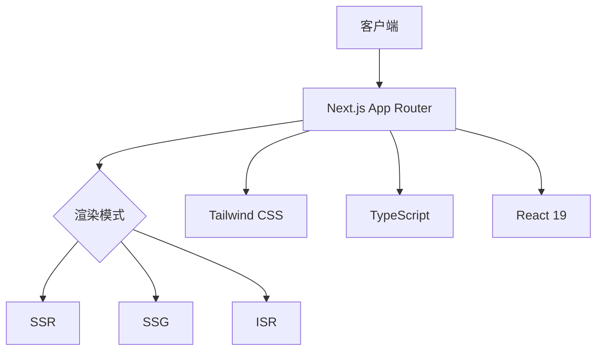
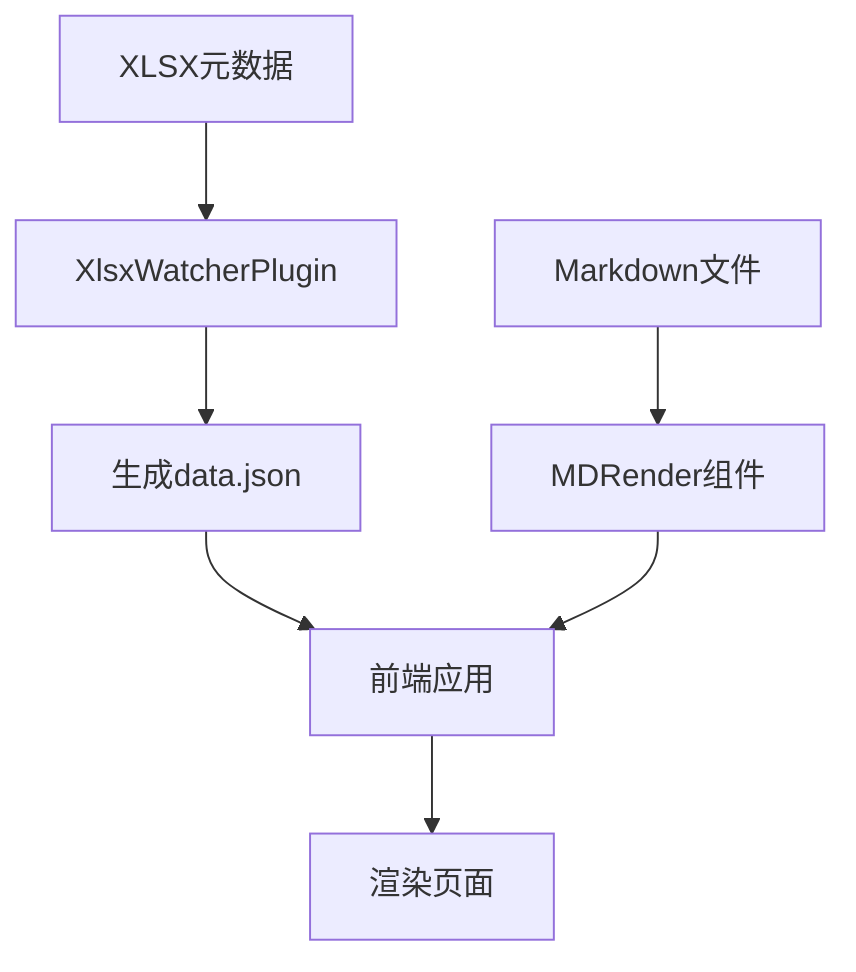
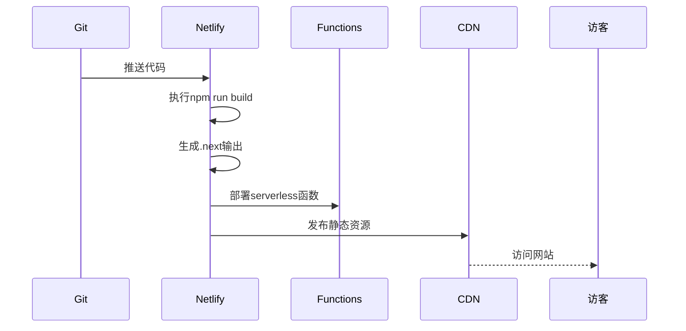

# 项目概述

<cite>
**本文档引用的文件**  
- [README.md](file://README.md)
- [next.config.ts](file://next.config.ts)
- [netlify.toml](file://netlify.toml)
- [data.json](file://src/config/data.json)
- [page.tsx](file://src/app/page.tsx)
- [MDRender.tsx](file://src/app/_components/MDRender.tsx)
- [chat/page.tsx](file://src/app/chat/page.tsx)
- [resume/page.tsx](file://src/app/resume/page.tsx)
- [demo/page.tsx](file://src/app/demo/page.tsx)
</cite>

## 目录
1. [简介](#简介)
2. [项目结构](#项目结构)
3. [核心功能](#核心功能)
4. [技术架构](#技术架构)
5. [内容驱动机制](#内容驱动机制)
6. [响应式设计实现](#响应式设计实现)
7. [部署流程](#部署流程)
8. [总结](#总结)

## 简介
个人技术博客平台 'personage' 是一个现代化的前端技术实践项目，旨在实现三大核心目标：技术知识沉淀、个人品牌展示与前沿前端技术集成。该项目不仅作为开发者技术成长的记录载体，更是一个展示工程化能力、交互设计与系统集成的综合性平台。通过结合 Markdown 内容管理、AI 聊天功能、交互式组件演示与简历展示，'personage' 构建了一个功能丰富且高度可扩展的技术博客系统。

**Section sources**  
- [README.md](file://README.md#L1-L36)

## 项目结构
项目采用标准的 Next.js 应用结构，结合模块化组织方式，清晰划分功能区域。核心目录包括：
- `src/app`：基于 Next.js App Router 的页面路由与组件
- `public/files`：存放所有 Markdown 技术文章，按主题分类组织
- `functions`：Netlify Serverless 函数，支持 AI 聊天等后端逻辑
- `plugins`：自定义 Webpack 插件，实现 XLSX 配置文件监听
- `scripts`：辅助脚本工具
- `src/config`：静态配置数据，如文章元信息

这种结构实现了内容、逻辑与配置的清晰分离，便于维护和扩展。

**Section sources**  
- [project_structure](file://project_structure#L1-L100)

## 核心功能
'personage' 平台集成了多个核心功能模块，满足技术博客的多样化需求：

### AI 聊天功能
通过 `/chat` 路由提供 AI 大模型交互界面，集成 serverless 函数 `ai-chat.js` 实现智能问答能力，为访客提供即时的技术咨询体验。

### 交互式组件演示
在 `/demo` 页面集成多个可交互组件，包括拖拽操作、标签页切换、短视频播放、壁纸展示及 React Spring 动画效果，直观展示前端技术实践成果。

### 简历展示系统
`/resume` 页面以结构化方式展示开发者个人履历，包含技能、工作经历、项目经验和教育背景，采用响应式设计确保移动端良好体验。

### 内容分类浏览
通过 `/tag` 和动态路由 `/detail/[id]` 实现文章分类与详情查看，结合 `List` 组件实现内容导航。

**Section sources**  
- [chat/page.tsx](file://src/app/chat/page.tsx#L1-L20)
- [demo/page.tsx](file://src/app/demo/page.tsx#L1-L36)
- [resume/page.tsx](file://src/app/resume/page.tsx#L1-L219)
- [page.tsx](file://src/app/page.tsx#L1-L25)

## 技术架构
项目基于 Next.js 15 和 React 19 构建，充分利用现代前端框架的先进特性。

### 渲染策略
采用混合渲染模式，结合服务端渲染（SSR）与静态生成（SSG）优势。通过 App Router 实现按需动态渲染，提升首屏加载性能与 SEO 效果。

### 样式与组件
使用 Tailwind CSS 实现原子化样式管理，结合 `globals.css` 进行全局样式配置。组件采用 TypeScript 开发，确保类型安全。

### 实验性功能
在 `next.config.ts` 中启用多项实验性优化：
- `optimizeCss`：CSS 优化
- `clientSegmentCache`：客户端分段缓存
- `optimizePackageImports`：包导入优化
- `isrFlushToDisk`：增量静态再生写入磁盘



**Diagram sources**  
- [next.config.ts](file://next.config.ts#L1-L66)
- [tailwind.config.ts](file://tailwind.config.ts#L1-L10)

**Section sources**  
- [next.config.ts](file://next.config.ts#L1-L66)

## 内容驱动机制
平台采用 Markdown + XLSX 的双源内容管理机制，实现灵活的内容组织与元数据管理。

### Markdown 内容存储
所有技术文章以 Markdown 格式存放在 `public/files` 目录下，按主题分类。通过 `MDRender.tsx` 组件进行渲染，支持：
- GitHub Flavored Markdown (GFM)
- 代码高亮（highlight.js）
- 原始 HTML 解析（rehype-raw）
- 图片点击预览

### XLSX 元数据管理
使用 `datalist.xlsx` 文件存储文章元信息（标题、标签、日期等），通过 `XlsxWatcherPlugin.js` Webpack 插件监听文件变化，自动转换为 `data.json` 供前端使用。



**Diagram sources**  
- [plugins/XlsxWatcherPlugin.js](file://plugins/XlsxWatcherPlugin.js#L1-L50)
- [src/app/_components/MDRender.tsx](file://src/app/_components/MDRender.tsx#L1-L85)
- [src/config/data.json](file://src/config/data.json#L1-L103)

**Section sources**  
- [src/app/_components/MDRender.tsx](file://src/app/_components/MDRender.tsx#L1-L85)
- [src/config/data.json](file://src/config/data.json#L1-L103)

## 响应式设计实现
项目采用移动优先的响应式设计理念，确保在不同设备上均有良好体验。

### 设备检测
在 `page.tsx` 中通过 `headers()` 获取 `user-agent`，判断是否为移动设备，动态调整布局：

```ts
const ua = get("user-agent") ?? "";
const isMobile = ua.includes("Mobile");
```

### 样式适配
在多个页面组件中使用 `xs:` 前缀的 Tailwind CSS 类，针对移动端进行样式覆盖，如：
- 移除内边距
- 调整字体大小
- 修改背景色
- 隐藏阴影效果

### 组件适配
`PageContainer`、`Navbar` 等基础组件均内置响应式逻辑，确保整体布局协调一致。

**Section sources**  
- [src/app/page.tsx](file://src/app/page.tsx#L1-L25)
- [src/app/resume/page.tsx](file://src/app/resume/page.tsx#L1-L219)

## 部署流程
项目通过 Netlify 实现自动化部署，配置文件 `netlify.toml` 定义了完整的构建与发布流程。

### 构建配置
- 构建命令：`npm run build`
- 发布目录：`.next`（Next.js 输出目录）
- 函数目录：`functions`（Serverless 函数）
- 缓存路径：`node_modules`

### 头部设置
配置 CORS 策略允许跨域访问函数接口，为静态资源设置长期缓存（1年）。

### 插件集成
使用 `@netlify/plugin-nextjs` 插件，自动处理 Next.js 特定的部署需求，如 SSR、ISR 和静态资源优化。



**Diagram sources**  
- [netlify.toml](file://netlify.toml#L1-L20)

**Section sources**  
- [netlify.toml](file://netlify.toml#L1-L20)

## 总结
'personage' 个人技术博客平台是一个功能完备、架构现代的前端实践项目。它不仅实现了技术知识的有效沉淀与个人品牌的全面展示，更在工程化实践上展现了高水平的技术集成能力。通过 Next.js 15 的先进特性、Markdown 内容驱动、AI 交互功能与 Netlify 无服务器部署的有机结合，该项目为前端开发者提供了一个可学习、可扩展的优秀范例。无论是初学者还是高级开发者，都能从中获得关于现代前端架构设计与实现的宝贵经验。